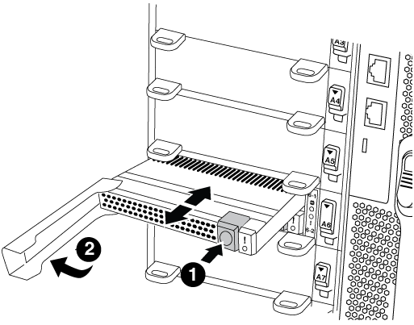
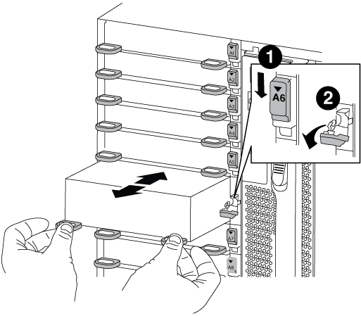
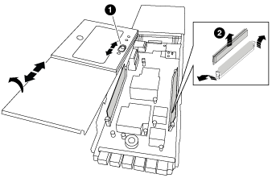

= Replace the NVRAM module or NVRAM DIMMs - AFF A700 and FAS9000
:icons: font
:imagesdir: ../media/

[.lead]
The NVRAM module consists of the NVRAM10 and DIMMs and up to two NVMe SSD Flash Cache modules (FlashCache or caching modules) per NVRAM module. You can replace a failed NVRAM module or the DIMMs inside the NVRAM module. To replace a failed NVRAM module, you must remove it from the chassis, remove the FlashCache module or modules from the NVRAM module, move the DIMMs to the replacement module, reinstall the FlashCache module or modules, and install the replacement NVRAM module into the chassis. Because the system ID is derived from the NVRAM module, if replacing the module, disks belonging to the system are reassigned to the new system ID.

*Before you begin*

* All disk shelves must be working properly.
* If your system is in an HA pair, the partner node must be able to take over the node associated with the NVRAM module that is being replaced.
* This procedure uses the following terminology:
 ** The _impaired_ node is the node on which you are performing maintenance.
 ** The _healthy_ node is the HA partner of the impaired node.
* This procedure includes steps for automatically or manually reassigning disks to the controller module associated with the new NVRAM module. You must reassign the disks when directed to in the procedure. Completing the disk reassignment before giveback can cause issues.
* You must replace the failed component with a replacement FRU component you received from your provider.
* You cannot change any disks or disk shelves as part of this procedure.

== Step 1: Shut down the impaired controller

[.lead]
Shut down or take over the impaired controller using one of the following options.

[role="tabbed-block"]
====

.Option 1: Most systems
--
[.lead]
include::../_include/shutdown_most_frus.adoc[]
--

.Option 2: Controller is in a Two-node MetroCluster
--
[.lead]
include::../_include/shutdown_2n_mcc.adoc[]
--

====

== Step 2: Replace the NVRAM module

[.lead]
To replace the NVRAM module, locate it in slot 6 in the chassis and follow the specific sequence of steps.

.Steps
. If you are not already grounded, properly ground yourself.
. Move the FlashCache module from the old NVRAM module to the new NVRAM module:
+

+
|===
a|
image:../media/legend_icon_01.png[] a|
Orange release button (gray on empty FlashCache modules)
a|
image:../media/legend_icon_02.png[]
a|
FlashCache cam handle
|===

 .. Press the orange button on the front of the FlashCache module.
+
NOTE: The release button on empty FlashCache modules is gray.

 .. Swing the cam handle out until the module begins to slide out of the old NVRAM module.
 .. Grasp the module cam handle and slide it out of the NVRAM module and insert it into the front of the new NVRAM module.
 .. Gently push the FlashCache module all the way into the NVRAM module, and then swing the cam handle closed until it locks the module in place.

. Remove the target NVRAM module from the chassis:
 .. Depress the lettered and numbered cam button.
+
The cam button moves away from the chassis.

 .. Rotate the cam latch down until it is in a horizontal position.
+
The NVRAM module disengages from the chassis and moves out a few inches.

 .. Remove the NVRAM module from the chassis by pulling on the pull tabs on the sides of the module face.
+

+
|===
a|
image:../media/legend_icon_01.png[] a|
Lettered and numbered I/O cam latch
a|
image:../media/legend_icon_02.png[]
a|
I/O latch completely unlocked
|===
. Set the NVRAM module on a stable surface and remove the cover from the NVRAM module by pushing down on the blue locking button on the cover, and then, while holding down the blue button, slide the lid off the NVRAM module.
+

+
|===
a|
image:../media/legend_icon_01.png[] a|
Cover locking button
a|
image:../media/legend_icon_02.png[]
a|
DIMM and DIMM ejector tabs
|===

. Remove the DIMMs, one at a time, from the old NVRAM module and install them in the replacement NVRAM module.
. Close the cover on the module.
. Install the replacement NVRAM module into the chassis:
 .. Align the module with the edges of the chassis opening in slot 6.
 .. Gently slide the module into the slot until the lettered and numbered I/O cam latch begins to engage with the I/O cam pin, and then push the I/O cam latch all the way up to lock the module in place.

== Step 3: Replace a NVRAM DIMM

[.lead]
To replace NVRAM DIMMs in the NVRAM module, you must remove the NVRAM module, open the module, and then replace the target DIMM.

.Steps
. If you are not already grounded, properly ground yourself.
. Remove the target NVRAM module from the chassis:
 .. Depress the lettered and numbered cam button.
+
The cam button moves away from the chassis.

 .. Rotate the cam latch down until it is in a horizontal position.
+
The NVRAM module disengages from the chassis and moves out a few inches.

 .. Remove the NVRAM module from the chassis by pulling on the pull tabs on the sides of the module face.
+

+
|===
a|
image:../media/legend_icon_01.png[] a|
Lettered and numbered I/O cam latch
a|
image:../media/legend_icon_02.png[]
a|
I/O latch completely unlocked
|===
. Set the NVRAM module on a stable surface and remove the cover from the NVRAM module by pushing down on the blue locking button on the cover, and then, while holding down the blue button, slide the lid off the NVRAM module.
+

+
|===
a|
image:../media/legend_icon_01.png[] a|
Cover locking button
a|
image:../media/legend_icon_02.png[]
a|
DIMM and DIMM ejector tabs
|===

. Locate the DIMM to be replaced inside the NVRAM module, and then remove it by pressing down on the DIMM locking tabs and lifting the DIMM out of the socket.

. Install the replacement DIMM by aligning the DIMM with the socket and gently pushing the DIMM into the socket until the locking tabs lock in place.
. Close the cover on the module.
. Install the replacement NVRAM module into the chassis:
 .. Align the module with the edges of the chassis opening in slot 6.
 .. Gently slide the module into the slot until the lettered and numbered I/O cam latch begins to engage with the I/O cam pin, and then push the I/O cam latch all the way up to lock the module in place.

== Step 4: Reboot the controller after FRU replacement

[.lead]
After you replace the FRU, you must reboot the controller module.

.Step
. To boot ONTAP from the LOADER prompt, enter `bye`.

== Step 5: Reassign disks

[.lead]
Depending on whether you have an HA pair or two-node MetroCluster configuration, you must either verify the reassignment of disks to the new controller module or manually reassign the disks.

Select one of the following options for instructions on how to reassign disks to the new controller.

// start tabbed area

[role="tabbed-block"]
====

.Option 1: Verify ID (HA pair)
--
.Verify the system ID change on an HA system

[.lead]
You must confirm the system ID change when you boot the _replacement_ node and then verify that the change was implemented.

This procedure applies only to systems running ONTAP in an HA pair.

.Steps
. If the replacement node is in Maintenance mode (showing the `*>` prompt, exit Maintenance mode and go to the LOADER prompt: `halt`
. From the LOADER prompt on the replacement node, boot the node, entering `y` if you are prompted to override the system ID due to a system ID mismatch.
+
``boot_ontap bye``
+
The node will reboot, if autoboot is set.

. Wait until the `Waiting for giveback...` message is displayed on the _replacement_ node console and then, from the healthy node, verify that the new partner system ID has been automatically assigned: `storage failover show`
+
In the command output, you should see a message that the system ID has changed on the impaired node, showing the correct old and new IDs. In the following example, node2 has undergone replacement and has a new system ID of 151759706.
+
----
node1> `storage failover show`
                                    Takeover
Node              Partner           Possible     State Description
------------      ------------      --------     -------------------------------------
node1             node2             false        System ID changed on partner (Old:
                                                  151759755, New: 151759706), In takeover
node2             node1             -            Waiting for giveback (HA mailboxes)
----

. From the healthy node, verify that any coredumps are saved:
 .. Change to the advanced privilege level: `set -privilege advanced`
+
You can respond `Y` when prompted to continue into advanced mode. The advanced mode prompt appears (*>).

 .. Save any coredumps: `system node run -node _local-node-name_ partner savecore`
 .. Wait for the `savecore`command to complete before issuing the giveback.
+
You can enter the following command to monitor the progress of the savecore command: `system node run -node _local-node-name_ partner savecore -s`

 .. Return to the admin privilege level: `set -privilege admin`
. Give back the node:
 .. From the healthy node, give back the replaced node's storage: `storage failover giveback -ofnode _replacement_node_name_`
+
The _replacement_ node takes back its storage and completes booting.
+
If you are prompted to override the system ID due to a system ID mismatch, you should enter `y`.
+
NOTE: If the giveback is vetoed, you can consider overriding the vetoes.
+
http://mysupport.netapp.com/documentation/productlibrary/index.html?productID=62286[Find the High-Availability Configuration Guide for your version of ONTAP 9]

 .. After the giveback has been completed, confirm that the HA pair is healthy and that takeover is possible: `storage failover show`
+
The output from the `storage failover show` command should not include the `System ID changed on partner` message.
. Verify that the disks were assigned correctly: `storage disk show -ownership`
+
The disks belonging to the _replacement_ node should show the new system ID. In the following example, the disks owned by node1 now show the new system ID, 1873775277:
+
----
node1> `storage disk show -ownership`

Disk  Aggregate Home  Owner  DR Home  Home ID    Owner ID  DR Home ID Reserver  Pool
----- ------    ----- ------ -------- -------    -------    -------  ---------  ---
1.0.0  aggr0_1  node1 node1  -        1873775277 1873775277  -       1873775277 Pool0
1.0.1  aggr0_1  node1 node1           1873775277 1873775277  -       1873775277 Pool0
.
.
.
----

. If the system is in a MetroCluster configuration, monitor the status of the node: `metrocluster node show`
+
The MetroCluster configuration takes a few minutes after the replacement to return to a normal state, at which time each node will show a configured state, with DR Mirroring enabled and a mode of normal. The `metrocluster node show -fields node-systemid` command output displays the old system ID until the MetroCluster configuration returns to a normal state.

. If the node is in a MetroCluster configuration, depending on the MetroCluster state, verify that the DR home ID field shows the original owner of the disk if the original owner is a node on the disaster site.
+
This is required if both of the following are true:

 ** The MetroCluster configuration is in a switchover state.
 ** The _replacement_ node is the current owner of the disks on the disaster site.
+
https://docs.netapp.com/us-en/ontap-metrocluster/manage/concept_understanding_mcc_data_protection_and_disaster_recovery.html#disk-ownership-changes-during-ha-takeover-and-metrocluster-switchover-in-a-four-node-metrocluster-configuration[Disk ownership changes during HA takeover and MetroCluster switchover in a four-node MetroCluster configuration]

. If your system is in a MetroCluster configuration, verify that each node is configured: `metrocluster node show - fields configuration-state`
+
----
node1_siteA::> metrocluster node show -fields configuration-state

dr-group-id            cluster node           configuration-state
-----------            ---------------------- -------------- -------------------
1 node1_siteA          node1mcc-001           configured
1 node1_siteA          node1mcc-002           configured
1 node1_siteB          node1mcc-003           configured
1 node1_siteB          node1mcc-004           configured

4 entries were displayed.
----

. Verify that the expected volumes are present for each node: `vol show -node node-name`
. If you disabled automatic takeover on reboot, enable it from the healthy node: `storage failover modify -node replacement-node-name -onreboot true`

--

.Option 2: Reassign ID (MetroCluster config)
--
.Reassign the system ID in a two-node MetroCluster configuration

[.lead]
include::../_include/2n_mcc_reassign_sysid.adoc[]
--
====

== Step 6: Restore Storage and Volume Encryption functionality

[.lead]
include::../_include/restore_storage_encryption.adoc[]

== Step 7: Return the failed part to NetApp

[.lead]
include::../_include/complete_rma.adoc[]
