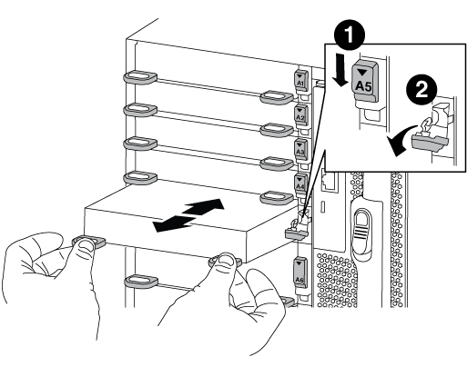

= Replace an I/O module - AFF A700 and FAS9000
:icons: font
:imagesdir: ../media/

To replace an I/O module, you must perform a specific sequence of tasks.

* You can use this procedure with all versions of ONTAP supported by your system
* All other components in the system must be functioning properly; if not, you must contact technical support.

== Step 1: Shut down the impaired controller

You can shut down or take over the impaired controller using different procedures, depending on the storage system hardware configuration.

[role="tabbed-block"]
====

.Option 1: Most configurations

--

include::../_include/shutdown_most_frus.adoc[]

--

.Option 2: Controller is in a two-node MetroCluster

--

include::../_include/shutdown_2n_mcc.adoc[]

--
====

== Step 2: Replace I/O modules

To replace an I/O module, locate it within the chassis and follow the specific sequence of steps.

.Steps
. If you are not already grounded, properly ground yourself.
. Unplug any cabling associated with the target I/O module.
+
Make sure that you label the cables so that you know where they came from.

. Remove the target I/O module from the chassis:
 .. Depress the lettered and numbered cam button.
+
The cam button moves away from the chassis.

.. Rotate the cam latch down until it is in a horizontal position.
+
The I/O module disengages from the chassis and moves about 1/2 inch out of the I/O slot.

.. Remove the I/O module from the chassis by pulling on the pull tabs on the sides of the module face.
+
Make sure that you keep track of which slot the I/O module was in.
+

+
[cols="1,3"]
|===
a|image:../media/legend_icon_01.png[]
a|Lettered and numbered I/O cam latch
a|image:../media/legend_icon_02.png[]
a|I/O cam latch completely unlocked
|===
. Set the I/O module aside.
. Install the replacement I/O module into the chassis by gently sliding the I/O module into the slot until the lettered and numbered I/O cam latch begins to engage with the I/O cam pin, and then push the I/O cam latch all the way up to lock the module in place.
. Recable the I/O module, as needed.

== Step 3: Reboot the controller after I/O module replacement

After you replace an I/O module, you must reboot the controller module.

NOTE: If the new I/O module is not the same model as the failed module, you must first reboot the BMC.

.Steps
. Reboot the BMC if the replacement module is not the same model as the old module:
.. From the LOADER prompt, change to advanced privilege mode: `priv set advanced`
.. Reboot the BMC: `sp reboot`
. From the LOADER prompt, reboot the node: `bye`
+
NOTE: This reinitializes the PCIe cards and other components and reboots the node.

. If your system is configured to support 10 GbE cluster interconnect and data connections on 40 GbE NICs or onboard ports, convert these ports to 10 GbE connections by using the `nicadmin convert` command from Maintenance mode.
+
NOTE: Be sure to exit Maintenance mode after completing the conversion.

. Return the node to normal operation:
`storage failover giveback -ofnode _impaired_node_name_`
. If automatic giveback was disabled, reenable it: `storage failover modify -node local -auto-giveback true`
+
NOTE: If your system is in a two-node MetroCluster configuration, you must switch back the aggregates as described in the next step.

== Step 4: Switch back aggregates in a two-node MetroCluster configuration

include::../_include/2n_mcc_switchback.adoc[]

== Step 5: Return the failed part to NetApp

include::../_include/complete_rma.adoc[]
