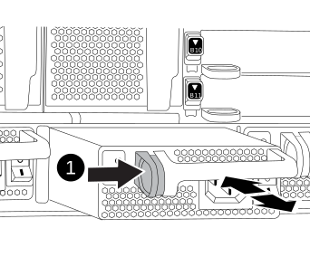

= Swap out a power supply - AFF A700 and FAS9000
:icons: font
:imagesdir: ../media/

[.lead]
Swapping out a power supply involves turning off, disconnecting, and removing the old power supply and installing, connecting, and turning on the replacement power supply.

All other components in the system must be functioning properly; if not, you must contact technical support.

* The power supplies are redundant and hot-swappable.
* This procedure is written for replacing one power supply at a time.
+
NOTE: It is a best practice to replace the power supply within two minutes of removing it from the chassis. The system continues to function, but ONTAP sends messages to the console about the degraded power supply until the power supply is replaced.

* The number of power supplies in the system depends on the model.
* Power supplies are auto-ranging.
+
IMPORTANT: Do not mix PSUs with different efficiency ratings. Always replace like for like.

.Steps
. Identify the power supply you want to replace, based on console error messages or through the LEDs on the power supplies.
. If you are not already grounded, properly ground yourself.
. Turn off the power supply and disconnect the power cables:
 .. Turn off the power switch on the power supply.
 .. Open the power cable retainer, and then unplug the power cable from the power supply.
 .. Unplug the power cable from the power source.
. Press and hold the orange button on the power supply handle, and then pull the power supply out of the chassis.
+
CAUTION: When removing a power supply, always use two hands to support its weight.
+

+
|===
a|
image:../media/legend_icon_01.png[] a|
Locking button
|===

. Make sure that the on/off switch of the new power supply is in the Off position.
. Using both hands, support and align the edges of the power supply with the opening in the system chassis, and then gently push the power supply into the chassis until it locks into place.
+
The power supplies are keyed and can only be installed one way.
+
NOTE: Do not use excessive force when sliding the power supply into the system. You can damage the connector.

. Reconnect the power supply cabling:
 .. Reconnect the power cable to the power supply and the power source.
 .. Secure the power cable to the power supply using the power cable retainer.

+
Once power is restored to the power supply, the status LED should be green.
. Turn on the power to the new power supply, and then verify the operation of the power supply activity LEDs.
+
The green power LED lights when the PSU is fully inserted into the chassis and the amber attention LED flashes initially, but turns off after a few moments.

include::../_include/complete_rma_step.adoc[]
