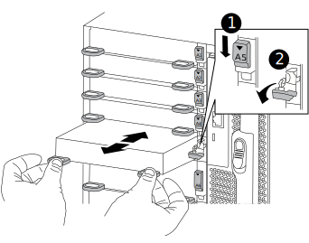

= Add an X91148A storage module in a system with no open slots - AFF A700 and FAS9000
:icons: font
:imagesdir: ../media/

[.lead]
You must remove one more or more existing NIC or storage modules in your system in order to install one or more X91148A storage modules into your fully-populated system.

* Your system must be running ONTAP 9.8 and later.
* To non-disruptively add the X91148A module, you must takeover the target controller, add the module, and then giveback the target controller.
* If you are adding the X91148A module as a storage adapter, you must install the module in slots 3 and/or 7.
* If you are adding the X91148A module as a 100GbE NIC, you can use any open slot. However, by default, slots 3 and 7 are set as storage slots. If you wish to use those slots as network slots and will not add NS224 shelves, you must modify the slots for networking use with the storage port modify -node <node name> -port <port name> -mode network command for each port. See the Hardware Universe for other slots that can be used by the X91148A module for networking.
+
https://hwu.netapp.com[NetApp Hardware Universe]

* All other components in the system must be functioning properly; if not, you must contact technical support.

== Option 1: Add an X91148A module as a NIC module in a system with no open slots

[.lead]
You must remove one or more existing NIC or storage modules in your system in order to install one or more X91148A NIC modules into your fully-populated system.

.Steps
. If you are adding an X91148A module into a slot that contains a NIC module with the same number of ports as the X91148A module, the LIFs will automatically migrate when its controller module is shut down. If the NIC module being replaced has more ports than the X91148A module, you must permanently reassign the affected LIFs to a different home port. See https://docs.netapp.com/ontap-9/topic/com.netapp.doc.onc-sm-help-960/GUID-208BB0B8-3F84-466D-9F4F-6E1542A2BE7D.html[Migrating a LIF] for information about using System Manager to permanently move the LIFs
. Shut down controller A:
 .. Disable automatic giveback: `storage failover modify -node local -auto-giveback false`
 .. Take over the target node: `storage failover takeover -ofnode target_node_name`
+
The console connection shows that the node drops to the LOADER prompt when the takeover is complete.
. If you are not already grounded, properly ground yourself.
. Unplug any cabling on the target I/O module.
. Remove the target I/O module from the chassis:
 .. Depress the lettered and numbered cam button.
+
The cam button moves away from the chassis.

 .. Rotate the cam latch down until it is in a horizontal position.
+
The I/O module disengages from the chassis and moves about 1/2 inch out of the I/O slot.

 .. Remove the I/O module from the chassis by pulling on the pull tabs on the sides of the module face.
+
Make sure that you keep track of which slot the I/O module was in.
+

+
|===
a|
image:../media/legend_icon_01.gif[] a|
Lettered and numbered I/O cam latch
a|
image:../media/legend_icon_02.gif[]
a|
I/O cam latch completely unlocked
|===
. Install the X91148A module into the target slot:
 .. Align the X91148A module with the edges of the slot.
 .. Slide the X91148A module into the slot until the lettered and numbered I/O cam latch begins to engage with the I/O cam pin.
 .. Push the I/O cam latch all the way up to lock the module in place.
. Repeat the remove and install steps to replace additional modules for controller A.
. Cable the module or modules to the data switches.
. Reboot controller A. `boot_ontap`
. Giveback the node from the partner node. `storage failover giveback -ofnode target_node_name`
. Enable automatic giveback if it was disabled: `storage failover modify -node local -auto-giveback true`
. If you added the X91148A module as a NIC module in slots 3 or 7, for networking, use the storage port modify -node <node name> -port <port name> -mode network command for each port.
. Repeat these steps for controller B.

== Option 2: Adding an X91148A module as a storage module in a system with no open slots

[.lead]
You must remove one or more existing NIC or storage modules in your system in order to install one or more X91148A storage modules into your fully-populated system.

* This procedure presumes you re installing the X91148A module into slots 3 and/or 7.

.Steps
. If you are adding an X91148A module as a storage module in slots 3 and/or 7 into a slot that has an existing NIC module in it, use System Manager to permanently migrate the LIFs to different home ports, as described in https://docs.netapp.com/ontap-9/topic/com.netapp.doc.onc-sm-help-960/GUID-208BB0B8-3F84-466D-9F4F-6E1542A2BE7D.html[Migrating a LIF].
. Shut down controller A:
 .. Disable automatic giveback: `storage failover modify -node local -auto-giveback false`
 .. Take over the target node: `storage failover takeover -ofnode target_node_name`
+
The console connection shows that the node drops to the LOADER prompt when the takeover is complete.
. If you are not already grounded, properly ground yourself.
. Unplug any cabling on the target I/O module.
. Remove the target I/O module from the chassis:
 .. Depress the lettered and numbered cam button.
+
The cam button moves away from the chassis.

 .. Rotate the cam latch down until it is in a horizontal position.
+
The I/O module disengages from the chassis and moves about 1/2 inch out of the I/O slot.

 .. Remove the I/O module from the chassis by pulling on the pull tabs on the sides of the module face.
+
Make sure that you keep track of which slot the I/O module was in.
+

+
|===
a|
image:../media/legend_icon_01.gif[] a|
Lettered and numbered I/O cam latch
a|
image:../media/legend_icon_02.gif[]
a|
I/O cam latch completely unlocked
|===
. Install the X91148A module into slot 3:
 .. Align the X91148A module with the edges of the slot.
 .. Slide the X91148A module into the slot until the lettered and numbered I/O cam latch begins to engage with the I/O cam pin.
 .. Push the I/O cam latch all the way up to lock the module in place.
 .. If you are installing a second X91148A module for storage, repeat the remove and install steps for the module in slot 7.
. Reboot controller A. `boot_ontap`
. Giveback the node from the partner node. `storage failover giveback -ofnode target_node_name`
. Enable automatic giveback if it was disabled: `storage failover modify -node local -auto-giveback true`
. Repeat these steps for controller B.
. Install and cable your NS224 shelves, as described in https://docs.netapp.com/platstor/topic/com.netapp.doc.hw-ds-nvme-hotadd/GUID-B215753F-F3E6-4FA0-A1E1-B9390B19AD94.html[Hot-adding an NS224 drive shelf].
