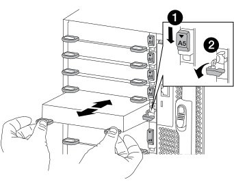

= Add an I/O module - FAS9500
:icons: font
:imagesdir: ../media/

[.lead]
You can add an I/O module to your system by either replacing a NIC or storage adapter with a new one in a fully-populated system, or by adding a new NIC or storage adapter into an empty chassis slot in your system.

.Before you begin
* Check the https://hwu.netapp.com/[NetApp Hardware Universe] to make sure that the new I/O module is compatible with your system and version of ONTAP you're running.
* If multiple slots are available, check the slot priorities in https://hwu.netapp.com/[NetApp Hardware Universe]  and use the best one available for your I/O module.
* To non-disruptively add an I/O module, you must take over the target controller, remove the slot blanking cover in the target slot or remove an existing I/O module, add the new or replacement I/O module, and then giveback the target controller.
* Make sure that all other components are functioning properly.

== Option 1: Add the I/O module to a system with open slots

You can add an I/O module into an empty module slot in your system as either a NIC or a storage module for the SAS storage shelves.

. Shutdown controller A:
.. Disable automatic giveback: `storage failover modify -node local -auto-giveback false`
.. Take over the target node: `storage failover takeover -ofnode target_node_name`
+
The console connection shows that the node drops to the LOADER prompt when the take over is complete.
. If you are not already grounded, properly ground yourself.
. Remove the target slot blanking cover:
.. Depress the lettered and numbered cam button.
.. Rotate the cam latch down until it is the open position.
.. Remove the blanking cover.
. Install the I/O module:
.. Align the I/O module with the edges of the slot.
.. Slide the I/O module into the slot until the lettered and numbered I/O cam latch begins to engage with the I/O cam pin.
.. Push the I/O cam latch all the way up to lock the module in place.
. If the replacement I/O module is a NIC, cable the module to the data switches.
+
NOTE: Make sure that any unused I/O slots have blanks installed to prevent possible thermal issues.

. Reboot the node from the LOADER prompt: _bye_
. Give back the node from the partner node. `storage failover giveback -ofnode target_node_name`
. Enable automatic giveback if it was disabled: `storage failover modify -node local -auto-giveback true`
. If you are using slots 3 and/or 7 for networking, use the `storage port modify -node __<node name>__ -port __<port name>__ -mode network` command to convert the slot for networking use.
. Repeat these steps for controller B.
. If you installed a storage I/O module, install and cable your SAS shelves, as described in https://docs.netapp.com/us-en/ontap-systems/sas3/install-hot-add-shelf.html[Hot-adding a SAS shelf^].

== Option 2: Add an I/O module in a system with no open slots

You must remove one or more existing NIC or storage modules in your system in order to install one or more I/O modules into your fully-populated system.

. If you are:
+
[options="header" cols="1,2"]
|===
| Replacing a...| Then...
a|
NIC I/O module with the same the same number of ports
a|
The LIFs will automatically migrate when its controller module is shut down.
a|
NIC I/O module with fewer ports
a|
Permanently reassign the affected LIFs to a different home port. See https://docs.netapp.com/ontap-9/topic/com.netapp.doc.onc-sm-help-960/GUID-208BB0B8-3F84-466D-9F4F-6E1542A2BE7D.html[Migrating a LIF^] for information about using System Manager to permanently move the LIFs.
a|
NIC I/O module with a storage I/O module
a|
Use System Manager to permanently migrate the LIFs to different home ports, as described in https://docs.netapp.com/ontap-9/topic/com.netapp.doc.onc-sm-help-960/GUID-208BB0B8-3F84-466D-9F4F-6E1542A2BE7D.html[Migrating a LIF^].
|===

. Shut down controller A:
.. Disable automatic giveback: `storage failover modify -node local -auto-giveback false`
.. Take over the target node: `storage failover takeover -ofnode target_node_name`
+
The console connection shows that the node drops to the LOADER prompt when the take over is complete.
. If you are not already grounded, properly ground yourself.
. Unplug any cabling on the target I/O module.
. Remove the target I/O module from the chassis:
.. Depress the lettered and numbered cam button.
+
The cam button moves away from the chassis.
.. Rotate the cam latch down until it is in a horizontal position.
+
The I/O module disengages from the chassis and moves about 1/2 inch out of the I/O slot.
.. Remove the I/O module from the chassis by pulling on the pull tabs on the sides of the module face.
+
Make sure that you keep track of which slot the I/O module was in.
+
video::0903b1f9-187b-4bb8-9548-ae9b0012bb21[panopto, title="Animation - Replace an I/O module"]
+

+
[cols="20%,80%"]
|===
a|
image::../media/legend_icon_01.svg[width=20]
a|
Lettered and numbered I/O cam latch
a|

a|
I/O cam latch completely unlocked
|===

. Install the I/O module into the target slot:
.. Align the I/O module with the edges of the slot.
.. Slide the I/O module into the slot until the lettered and numbered I/O cam latch begins to engage with the I/O cam pin.
.. Push the I/O cam latch all the way up to lock the module in place.
. Repeat the remove and install steps to replace additional modules for controller A.
. If the replacement I/O module is a NIC, cable the module or modules to the data switches.
. Reboot the node from the LOADER prompt: _bye_
. Give back the node from the partner node. `storage failover giveback -ofnode target_node_name`
. Enable automatic giveback if it was disabled: `storage failover modify -node local -auto-giveback true`

. If you added:
+
[options="header" cols="1,2"]
|===
| If I/O module is a...| Then...
a|
NIC module in slots 3 or 7,
a|
Use the `storage port modify -node *_<node name>__ -port *_<port name>__ -mode network` command for each port.
a|
Storage module
a|
Install and cable your SAS shelves, as described in
https://docs.netapp.com/us-en/ontap-systems/sas3/install-hot-add-shelf.html[Hot-adding a SAS shelf^].
a|

|===

. Repeat these steps for controller B.
