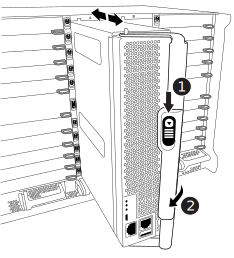
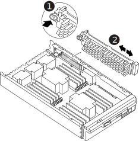
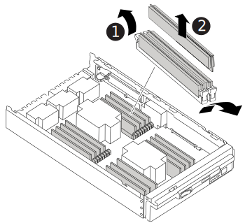

= Replace the controller module hardware - FAS9500
:icons: font
:imagesdir: ../media/

[.lead]
To replace the controller module hardware, you must remove the impaired node, move FRU components to the replacement controller module, install the replacement controller module in the chassis, and then boot the system to Maintenance mode.

The following animation shows the whole process of moving components from the impaired to the replacement controller.

++++

<iframe frameborder="1" height="400" scrolling="auto" src="https://netapp.hosted.panopto.com/Panopto/Pages/embed.aspx?id=dc8d4acb-e061-45dd-8a0e-ae78004b6974" width="711"> </iframe>

++++
ifdef::backend-pdf[]
https://netapp.hosted.panopto.com/Panopto/Pages/Viewer.aspx?id=dc8d4acb-e061-45dd-8a0e-ae78004b6974[Animation - Remove controller module]
endif::[]

== Step 1: Remove the controller module

To access components inside the controller, you must first remove the controller module from the system and then remove the cover on the controller module.

. If you are not already grounded, properly ground yourself.
. Unplug the cables from the impaired controller module, and keep track of where the cables were connected.
. Slide the terra cotta button on the cam handle downward until it unlocks.
+
++++

<iframe frameborder="1" height="400" scrolling="auto" src="https://netapp.hosted.panopto.com/Panopto/Pages/embed.aspx?id=5e029a19-8acc-4fa1-be5d-ae78004b365a" width="711"> </iframe>

++++
ifdef::backend-pdf[]
https://netapp.hosted.panopto.com/Panopto/Pages/embed.aspx?id=5e029a19-8acc-4fa1-be5d-ae78004b365a[Animation - Remove controller module]
endif::[]

+

+

[cols="20%,90%"]
|===
a|
image::../media/legend_icon_01.svg[width=20]
a|
Cam handle release button
a|
image::../media/legend_icon_02.svg[width=20]
a|
Cam handle

|===

. Rotate the cam handle so that it completely disengages the controller module from the chassis, and then slide the controller module out of the chassis.
+
Make sure that you support the bottom of the controller module as you slide it out of the chassis.

. Place the controller module lid-side up on a stable, flat surface, press the blue button on the cover, slide the cover to the back of the controller module, and then swing the cover up and lift it off of the controller module.
+

image::../media/drw_9500_PCM_open.svg[width=340]

[cols="20%,90%"]
|===
a|
image::../media/legend_icon_01.svg[width=20]
 a|
Controller module cover locking button

|===

== Step 2: Move the boot media

You must locate the boot media and follow the directions to remove it from the old controller and insert it in the new controller.

. Locate the boot media using the following illustration or the FRU map on the controller module:

+

+

[cols="20%,80%"]
|===
a|
image::../media/legend_icon_01.svg[width=20]
a|
Press release tab
a|
image::../media/legend_icon_02.svg[width=20]
a|
Boot media

|===
+

. Press the blue button on the boot media housing to release the boot media from its housing, and then gently pull it straight out of the boot media socket.
+

NOTE: Do not twist or pull the boot media straight up, because this could damage the socket or the boot media.

. Move the boot media to the new controller module, align the edges of the boot media with the socket housing, and then gently push it into the socket.
. Check the boot media to make sure that it is seated squarely and completely in the socket.
+
If necessary, remove the boot media and reseat it into the socket.

. Push the boot media down to engage the locking button on the boot media housing.

== Step 3: Move the system DIMMs

To move the DIMMs, locate and move them from the old controller into the replacement controller and follow the specific sequence of steps.

. If you are not already grounded, properly ground yourself.
. Locate the DIMMs on your controller module.
. Note the orientation of the DIMM in the socket so that you can insert the DIMM in the replacement controller module in the proper orientation.
. Eject the DIMM from its slot by slowly pushing apart the two DIMM ejector tabs on either side of the DIMM, and then slide the DIMM out of the slot.
+
IMPORTANT: Carefully hold the DIMM by the edges to avoid pressure on the components on the DIMM circuit board.

+

+
[cols="20%,80%"]
|===
a|
image::../media/legend_icon_01.svg[width=20]
 a|
DIMM ejector tabs
a|
image::../media/legend_icon_02.svg[width=20]
a|
DIMM

|===

. Locate the slot where you are installing the DIMM.
. Make sure that the DIMM ejector tabs on the connector are in the open position, and then insert the DIMM squarely into the slot.
+
The DIMM fits tightly in the slot, but should go in easily. If not, realign the DIMM with the slot and reinsert it.
+
IMPORTANT: Visually inspect the DIMM to verify that it is evenly aligned and fully inserted into the slot.

. Insert the DIMM squarely into the slot.
+
The DIMM fits tightly in the slot, but should go in easily. If not, realign the DIMM with the slot and reinsert it.
+
IMPORTANT: Visually inspect the DIMM to verify that it is evenly aligned and fully inserted into the slot.

. Push carefully, but firmly, on the top edge of the DIMM until the ejector tabs snap into place over the notches at the ends of the DIMM.
. Repeat these steps for the remaining DIMMs.

== Step 4: Install the controller

After you install the components into the replacement controller module, you must install the replacement controller module into the system chassis and boot the operating system.

For HA pairs with two controller modules in the same chassis, the sequence in which you install the controller module is especially important because it attempts to reboot as soon as you completely seat it in the chassis.

NOTE: The system might update system firmware when it boots. Do not abort this process. The procedure requires you to interrupt the boot process, which you can typically do at any time after prompted to do so. However, if the system updates the system firmware when it boots, you must wait until after the update is complete before interrupting the boot process.

. If you are not already grounded, properly ground yourself.
. If you have not already done so, replace the cover on the controller module.
. Align the end of the controller module with the opening in the chassis, and then gently push the controller module halfway into the system.
+
++++

<iframe frameborder="1" height="400" scrolling="auto" src="https://netapp.hosted.panopto.com/Panopto/Pages/embed.aspx?id=f2aa14b4-0d95-4109-b410-ae78004b35c9" width="711"> </iframe>

++++
ifdef::backend-pdf[]
https://netapp.hosted.panopto.com/Panopto/Pages/Viewer.aspx?id=f2aa14b4-0d95-4109-b410-ae78004b35c9[Animation - Install controller module]
endif::[]

+
image::../media/drw_9500_remove_PCM_source.svg[width=340]
+

[cols="20%,80%"]
|===
a|
image::../media/legend_icon_01.svg[width=20]
 a|
Cam handle release button
a|
image::../media/legend_icon_02.svg[width=20]
a|
Cam handle
|===

+
NOTE: Do not completely insert the controller module in the chassis until instructed to do so.

. Cable the management and console ports only, so that you can access the system to perform the tasks in the following sections.
+
NOTE: You will connect the rest of the cables to the controller module later in this procedure.

. Complete the reinstallation of the controller module:
 .. If you have not already done so, reinstall the cable management device.
 .. Firmly push the controller module into the chassis until it meets the midplane and is fully seated.
+
IMPORTANT: Do not use excessive force when sliding the controller module into the chassis to avoid damaging the connectors.
+
The controller module begins to boot as soon as it is fully seated in the chassis. Be prepared to interrupt the boot process.

 .. Rotate the controller module cam handle to the locked position.

 .. Interrupt the boot process by pressing `Ctrl-C` when you see Press Ctrl-C for Boot Menu.

.. Select the option to boot to LOADER.
