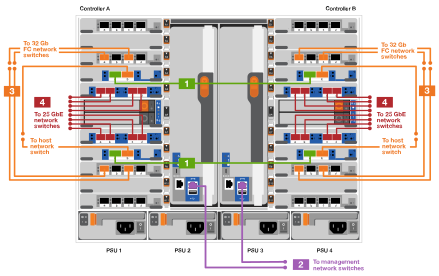

= Detailed steps - FAS9500
:icons: font
:imagesdir: ../media/

[.lead]
This article gives detailed step-by-step instructions for installing a typical NetApp system. Use this article if you want more detailed installation instructions.

== Step 1: Prepare for installation

To install your system, you need to create an account on the NetApp Support Site, register your system, and get license keys. You also need to inventory the appropriate number and type of cables for your system and collect specific network information.

You need to have access to the https://hwu.netapp.com[NetApp Hardware Universe^] for information about site requirements as well as additional information on your configured system.

.What you need
You might also want to have access to the http://mysupport.netapp.com/documentation/productlibrary/index.html?productID=62286[ONTAP 9 Release Notes^] for your version of ONTAP for more information about this system.

You need to provide the following at your site:

* Rack space for the storage system
* Phillips #2 screwdriver
* Additional networking cables to connect your system to your network switch and laptop or console with a Web browser

.Steps
. Unpack the contents of all boxes.
. Record the system serial number from the controllers.
+
image::../media/drw_ssn_label.svg[width=170px]

. Inventory and make a note of the number and types of cables you received.
+
The following table identifies the types of cables you might receive. If you receive a cable not listed in the table, see the Hardware Universe to locate the cable and identify its use.
+
https://hwu.netapp.com[NetApp Hardware Universe^]
+
[options="header" cols="1,2,1,2"]

|===
| Type of cable...| Part number and length| Connector type| For...
a|
25 GbE data Cable
a|
X66240A-05 (112-00639), 0.5m

X66240A-2 (112-00598), 2m

X66240A-5 (112-00600), 5m
|
image:../media/oie_cable_sfp_gbe_copper.svg[width=85px]
a|
Network cable
a|
32 Gb FC (SFP+ Op)
a|
X66250-2 (112-00342), 2m

X66250-5 (112-00344), 5m

X66250-15 (112-00346), 15m
a|
image::../media/oie_cable_sfp_gbe_copper.svg[width=85px]
a|
FC optical network cable
a|
40 GbE network cable
a|
X66100-1 (112-00542), 1m

X66100-3 (112-00543), 3m

X66100-5 (112-00544), 5m
a|
image::../media/oie_cable100_gbe_qsfp28.svg[width=85px]
a|
Ethernet data, cluster
network
a|
100 GbE cable
a|
X66211B-1 (112-00573), 1m

X66211B-2 (112-00574), 2m

X66211B-5 (112-00576), 5m
a|
image::../media/oie_cable100_gbe_qsfp28.svg[width=85px]
a|
Network,

Ethernet data,

cluster network
a|
Optical cables
a|
X66031A (112-00436), 1m

X66032A (112-00437), 2m

X66033A (112-00438), 3m
a|
image::../media/oie_cable_fiber_lc_connector.svg[width=85px]
a|
FC optical network
a|
Cat 6, RJ-45 (order dependent)
a|
Part numbers X6585-R6 (112-00291), 3m

X6562-R6 (112-00196), 5m
a|
image::../media/oie_cable_rj45.svg[width=85px]
a|
Management network and Ethernet data
a|
Storage
a|
X66031A (112-00436), 1m

X66032A (112-00437), 2m

X66033A (112-00438), 3m
a|
image::../media/oie_cable_mini_sas_hd_to_mini_sas_hd.svg[width=85px]
a|
Storage
a|
Micro-USB console cable
a|
Not applicable
a|
image::../media/oie_cable_micro_usb.svg[width=85px]
a|
Console connection during software setup on non-Windows or Mac laptop/console
a|
Power cables
a|
Not applicable
a|
image::../media/oie_cable_power.svg[width=85px]
a|
Powering up the system
|===

. Review the https://library.netapp.com/ecm/ecm_download_file/ECMLP2862613[ONTAP Configuration Guide^] and collect the required information listed in that guide.

== Step 2: Install the hardware

You need to install your system in a 4-post rack or NetApp system cabinet, as applicable.

. Install the rail kits, as needed.
. Install and secure your system using the instructions included with the rail kit.
+
NOTE: You need to be aware of the safety concerns associated with the weight of the system.
+
The label on the left indicates an empty chassis, while the label on the right indicates a fully-populated system.
+

. Attach cable management devices (as shown).
+

. Place the bezel on the front of the system.

== Step 3: Cable controllers to your network

You can cable the controllers to your network by using the two-node switchless cluster method or by using the cluster interconnect network.

[role="tabbed-block"]
====

.Option 1: Two-node switchless cluster
--

Management network, data network, and management ports on the controllers are connected to switches. The cluster interconnect ports are cabled on both controllers.

.Before you begin

You must have contacted your network administrator for information about connecting the system to the switches.

Be sure to check the direction of the cable pull-tabs when inserting the cables in the ports. Cable pull-tabs are up for all networking module ports.

image::../media/oie_cable_pull_tab_up.svg[width=200px]

NOTE: As you insert the connector, you should feel it click into place; if you do not feel it click, remove it, turn it over and try again.

. Use the animation or illustration to complete the cabling between the controllers and to the switches:
+
video::da08295f-ba8c-4de7-88c3-ae7c0170408d[panopto, title="Animation - Two-node switchless cluster cabling"]
+

+

[options="header" cols="20%,80%"]
|===
| Step| Perform on each controller
a|

image::../media/oie_legend_icon_1_lg.svg[width=30px]
a|
Cable cluster interconnect ports:

** Slot A4 and B4 (e4a)
** Slot A8 and B8 (e8a)

image::../media/oie_cable100_gbe_qsfp28.svg[width=85px]
a|
image::../media/oie_legend_icon_2_lp.svg[width=30px]
a|
Cable controller management (wrench) ports.

image::../media/oie_cable_rj45.svg[width=85px]
a|
image::../media/oie_legend_icon_3_o.svg[width=30px]
a|
Cable 32 Gb FC network switches:

Ports in slot A3 and B3 (e3a and e3c)
and slot A9 and B9 (e9a and e9c) to the
32 Gb FC network switches.

image::../media/oie_cable_sfp_gbe_copper.svg[width=85px]

40GbE host network switches:

Cable host‐side b ports in slot A4 and
B4 (e4b) and slot A8 and B8 (e8b) to
the host switch.

image::../media/oie_cable100_gbe_qsfp28.svg[width=85px]
a|
image::../media/oie_legend_icon_4_dr.svg[width=30px]
a|
Cable 25 GbE connections:

Cable ports in slot A5 and B5 (5a,
5b, 5c, and 5d) and slot A7 and B7
(7a, 7b, 7c, and 7d) to the
25 GbE network switches.

image::../media/oie_cable_sfp_gbe_copper.svg[width=85px]

|===

. Connect the power cables to the PSUs
and connect them to different power sources (not shown).
. Strap the cables to the cable
management arms (not shown).

. To cable your storage, see <<Step 4: Cable controllers to drive shelves>>.

--

.Option 2: Switched cluster
--

Management network, data network, and management ports on the controllers are connected to switches. The cluster interconnect and HA ports are cabled on to the cluster/HA switch.

.Before you begin

You must have contacted your network administrator for information about connecting the system to the switches.

Be sure to check the direction of the cable pull-tabs when inserting the cables in the ports. Cable pull-tabs are up for all networking module ports.

image::../media/oie_cable_pull_tab_up.svg[width=200px]

NOTE: As you insert the connector, you should feel it click into place; if you do not feel it click, remove it, turn it over and try again.

. Use the animation or illustration to complete the cabling between the controllers and to the switches:
+
video::3ad3f118-8339-4683-865f-ae7c0170400c[panopto, title="Animation - Switched cluster cabling"]
+
image::../media/drw_9500_switched_network_cabling.svg[align="center",width=500px]
+

[options="header" cols="20%,80%"]
|===

| Step| Perform on each controller
a|
image::../media/oie_legend_icon_1_lg.svg[width=30px]
a|
Cable cluster
interconnect a ports:

** Slot A4 and B4 (e4a) to the cluster network switch.
** Slot A8 and B8 (e8a) to the
cluster network switch.

image::../media/oie_cable100_gbe_qsfp28.svg[width=85px]
a|
image::../media/oie_legend_icon_2_lp.svg[width=30px]
a|
Cable controller management (wrench) ports.

image::../media/oie_cable_rj45.svg[width=85px]
a|
image::../media/oie_legend_icon_3_o.svg[width=30px]
a|
Cable 32 Gb FC network switches:

Ports in slot A3 and B3 (e3a and e3c)
and slot A9 and B9 (e9a and e9c) to the
32 Gb FC network switches.

image::../media/oie_cable_sfp_gbe_copper.svg[width=85px]

40GbE host network switches:

Cable host‐side b ports in slot A4 and
B4 (e4b) and slot A8 and B8 (e8b) to
the host switch.

image::../media/oie_cable100_gbe_qsfp28.svg[width=85px]
a|
image::../media/oie_legend_icon_4_dr.svg[width=30px]
a|
Cable 25 GbE connecions:

Cable ports in slot A5 and B5 (5a,
5b, 5c, and 5d) and slot A7 and B7
(7a, 7b, 7c, and 7d) to the
25 GbE network switches.

image::../media/oie_cable_sfp_gbe_copper.svg[width=85px]

|===

. Connect the power cables to the PSUs
and connect them to different power sources
(not shown).

. Strap the cables to the cable
management arms (not shown).

. To cable your storage, see <<Step 4: Cable controllers to drive shelves>>.

--
====

== Step 4: Cable controllers to drive shelves

You must cable the shelf-to-shelf connections, and then cable both controllers to the DS212C or DS224C drive shelves.

NOTE: For more SAS cabling information and worksheets, see https://docs.netapp.com/us-en/ontap-systems/sas3/overview-cabling-rules-examples.html[SAS cabling rules, worksheets, and examples overview - shelves with IOM12 modules^]

.Before you begin

* Complete the SAS cabling worksheet for your system.  See https://docs.netapp.com/us-en/ontap-systems/sas3/overview-cabling-rules-examples.html[SAS cabling rules, worksheets, and examples overview - shelves with IOM12 modules^].

* Be sure to check the illustration arrow for the proper cable connector pull-tab orientation. The cable pull-tab for the storage modules are up, while the pull tabs on the shelves are down.

image::../media/oie_cable_pull_tab_up.svg[width=200px]

image::../media/oie_cable_pull_tab_down.svg[width=200px]

NOTE: As you insert the connector, you should feel it click into place; if you do not feel it click, remove it, turn it over and try again.

. Use the following animation or drawings to cable your controllers to three (1 stack of one drive shelf and one stack of two drive shelves) DS224C drive shelves.
+
video::c958aae6-9d08-4d3d-a213-ae7c017040cd[panopto, title="Animation - Cable your drive shelves"]
+
image::../media/drw_9500_sas_shelf_cabling.svg[align="center",width=670px]
+

[options="header" cols="20%,80%"]
|===

|Step|Perform on each controller
a|
image::../media/oie_legend_icon_1_mb.svg[width=30px]
a|
Connect drive shelf stack one to the controllers, using the graphic for reference.

image::../media/oie_cable_mini_sas_hd_to_mini_sas_hd.svg[width=85px]

mini-SAS cable
a|
image::../media/oie_legend_icon_2_t.svg[width=30px]
a|
Connect drive shelf stack two to the controllers, using the graphic for reference.

image::../media/oie_cable_mini_sas_hd_to_mini_sas_hd.svg[width=85px]

mini-SAS cable

|===

. To complete setting up your system, see  <<Step 5: Complete system setup and configuration>>.

== Step 5: Complete system setup and configuration

You can complete the system setup and configuration using cluster discovery with only a connection to the switch and laptop, or by connecting directly to a controller in the system and then connecting to the management switch.

[role="tabbed-block"]
====

.Option 1: If network discovery is enabled
--

If you have network discovery enabled on your laptop, you can complete system setup and configuration using automatic cluster discovery.

. Use the following animation or drawing  to set one or more drive shelf IDs:
+
video::95a29da1-faa3-4ceb-8a0b-ac7600675aa6[panopto, title="Animation - Set your shelf ID's"]
+
image::../media/drw_power-on_set_shelf_ID_set.svg[width=500px]
+

[cols="20%,80%"]
|===
a|
image::../media/legend_icon_01.svg[width=20]
a|
Remove the end cap.
a|
image::../media/legend_icon_02.svg[width=20]
a|
Press and hold shelf ID button until first digit blinks, then push to advance to 0-9.

NOTE: The first digit continues to blink

a|
image::../media/legend_icon_03.svg[width=20]
a|
Press and hold shelf ID button until second digit blinks, then push to advance to 0-9.

NOTE: The first digit stops blinking, and the second digit continues to blink.

a|
image::../media/legend_icon_04.svg[width=20]
a|
Replace the end cap.
a|
image::../media/legend_icon_05.svg[width=20]
a|
Wait 10 seconds for the Amber LED (!) to appear, then power-cycle the drive
shelf to set shelf ID.

|===

. Plug the power cords into the controller power supplies, and then connect them to power sources on different circuits.
. Turn on the power switches to both nodes.
+
video::a905e56e-c995-4704-9673-adfa0005a891[panopto, title="Animation - Turn on the power to the controllers"]
+
image::../media/drw_9500_power-on.svg[width=500px]
+

NOTE: Initial booting may take up to eight minutes.

. Make sure that your laptop has network discovery enabled.
+
See your laptop's online help for more information.

. Use the following animation to connect your laptop to the Management switch.
+
video::d61f983e-f911-4b76-8b3a-ab1b0066909b[panopto, title="Animation - Connect your laptop to the Management switch"]
+

+

. Select an ONTAP icon listed to discover:
+
image::../media/drw_autodiscovery_controler_select.svg[width=500px]

.. Open File Explorer.
.. Click network in the left pane.
.. Right click and select refresh.
.. Double-click either ONTAP icon and accept any certificates displayed on your screen.
+
NOTE: XXXXX is the system serial number for the target node.
+
System Manager opens.

. Use System Manager guided setup to configure your system using the data you collected in the https://library.netapp.com/ecm/ecm_download_file/ECMLP2862613[ONTAP Configuration Guide^].

. Set up your account and download Active IQ Config Advisor:
 .. Log in to your existing account or create an account.
+
https://mysupport.netapp.com/eservice/public/now.do[NetApp Support Registration^]

 .. Register your system.
+
https://mysupport.netapp.com/eservice/registerSNoAction.do?moduleName=RegisterMyProduct[NetApp Product Registration^]

 .. Download Active IQ Config Advisor.
+
https://mysupport.netapp.com/site/tools/tool-eula/activeiq-configadvisor[NetApp Downloads: Config Advisor^]
. Verify the health of your system by running Config Advisor.
. After you have completed the initial configuration, go to the https://www.netapp.com/data-management/oncommand-system-documentation/[ONTAP & ONTAP System Manager Documentation Resources^] page for information about configuring additional features in ONTAP.
--

.Option 2: If network discovery is not enabled
--

If you are not using a Windows or Mac-based laptop or console or if auto discovery is not enabled, you must complete the configuration and setup using this task.

. Cable and configure your laptop or console:
 .. Set the console port on the laptop or console to 115,200 baud with N-8-1.
+
NOTE: See your laptop or console's online help for how to configure the console port.

 .. Connect the console cable to the laptop or console using the console cable that came with your system, and then connect the laptop to the switch on the management subnet.
+
image::../media/drw_9500_cable_console_switch_controller.svg[width=500px]

 .. Assign a TCP/IP address to the laptop or console, using one that is on the management subnet.
. Use the following animation to set one or more drive shelf IDs:
+
video::95a29da1-faa3-4ceb-8a0b-ac7600675aa6[panopto, title="Animation - Set your shelf ID's"]
+
image::../media/drw_power-on_set_shelf_ID_set.svg[width=500px]
+

[cols="20%,80%"]
|===
a|
image::../media/legend_icon_01.svg[width=20]
a|
Remove the end cap.
a|
image::../media/legend_icon_02.svg[width=20]
a|
Press and hold shelf ID button until first digit blinks, then push to advance to 0-9.

NOTE: The first digit continues to blink

a|
image::../media/legend_icon_03.svg[width=20]
a|
Press and hold shelf ID button until second digit blinks, then push to advance to 0-9.

NOTE: The first digit stops blinking, and the second digit continues to blink.

a|
image::../media/legend_icon_04.svg[width=20]
a|
Replace the end cap.
a|
image::../media/legend_icon_05.svg[width=20]
a|
Wait 10 seconds for the Amber LED (!) to appear, then power-cycle the drive
shelf to set shelf ID.

|===

. Plug the power cords into the controller power supplies, and then connect them to power sources on different circuits.
. Turn on the power switches to both nodes.
+
video::a905e56e-c995-4704-9673-adfa0005a891[panopto, title="Animation - Turn on the power to the controllers"]
+
image::../media/drw_9500_power-on.svg[width=500]
+
NOTE: Initial booting may take up to eight minutes.

. Assign an initial node management IP address to one of the nodes.
+
[options="header" cols="1,2"]
|===

| If the management network has DHCP...| Then...
a|
Configured
a|
Record the IP address assigned to the new controllers.
a|
Not configured
a|

 .. Open a console session using PuTTY, a terminal server, or the equivalent for your environment.
+
NOTE: Check your laptop or console's online help if you do not know how to configure PuTTY.

 .. Enter the management IP address when prompted by the script.

+
|===

. Using System Manager on your laptop or console, configure your cluster:
 .. Point your browser to the node management IP address.
+
NOTE: The format for the address is
+https://x.x.x.x+.

 .. Configure the system using the data you collected in the https://library.netapp.com/ecm/ecm_download_file/ECMLP2862613[ONTAP Configuration Guide^] .

. Set up your account and download Active IQ Config Advisor:
.. Log in to your existing account or create an account.
+
https://mysupport.netapp.com/eservice/public/now.do[NetApp Support Registration^]

 .. Register your system.
+
https://mysupport.netapp.com/eservice/registerSNoAction.do?moduleName=RegisterMyProduct[NetApp Product Registration^]

 .. Download Active IQ Config Advisor.
+
https://mysupport.netapp.com/site/tools/tool-eula/activeiq-configadvisor[NetApp Downloads: Config Advisor^]
. Verify the health of your system by running Config Advisor.
. After you have completed the initial configuration, go to the https://www.netapp.com/data-management/oncommand-system-documentation/[ONTAP & ONTAP System Manager Documentation Resources^] page for information about configuring additional features in ONTAP.
--

====
