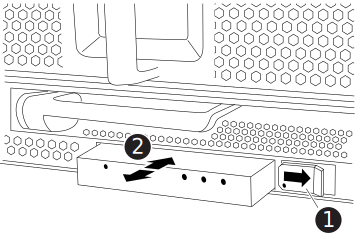

= Replace an LED USB module - FAS9500
:icons: font
:imagesdir: ../media/

[.lead]
The LED USB module provides connectivity to console ports and system status. Replacement of this module does not require tools and does not interrupt service.

== Step 1: Replace the LED USB module

.Steps
. Remove the old LED USB module:

+
++++

<iframe frameborder="1" height="400" scrolling="auto" src="https://netapp.hosted.panopto.com/Panopto/Pages/embed.aspx?id=bc46a3e8-6541-444e-973b-ae78004bf153" width="711"> </iframe>

++++

ifdef::backend-pdf[]
https://netapp.hosted.panopto.com/Panopto/Pages/Viewer.aspx?id=bc46a3e8-6541-444e-973b-ae78004bf153[Animation - Remove/install LED-USB module^]
endif::[]

+

+
[cols="20%,80%"]
|===
a|
image::../media/legend_icon_01.svg[width=20]
 a|
Locking button
a|
image:../media/legend_icon_02.png[]
a|
USB LED module
a|
|===

 .. With the bezel removed, locate the LED USB module at the front of the chassis, on the bottom left side.
 .. Slide the latch to partially eject the module.
 .. Pull the module out of the bay to disconnect it from the midplane. Do not leave the slot empty.

. Install the new LED USB module:
 .. Align the module to the bay with the notch in the corner of the module positioned near the slider latch on the chassis. The bay will prevent you from installing the module upside down.
 .. Push the module into the bay until it is fully seated flush with the chassis.
+
There is an audible click when the module is secure and connected to the midplane.

== Step 2: Return the failed component
include::../_include/complete_rma_step.adoc[]
