= Hot-add NS224 shelves
:icons: font
:imagesdir: ../media/

[.lead]
You can hot-add an NS224 drive shelf after your HA pair meets certain requirements, and after the preparation tasks applicable to your HA pair are completed.

== Requirements for a hot-add

[.lead]
Your HA pair must meet certain requirements before hot-adding an NS224 drive shelf.

* Your platform model and version of ONTAP must support the NS224 shelf and drives you are hot-adding.
+
https://hwu.netapp.com[NetApp Hardware Universe^]

* You must have the correct number and type of cables to connect the shelf.
+
https://hwu.netapp.com[NetApp Hardware Universe^]

* Your HA pair must have enough available RoCE-capable ports to support the number of shelves you are hot-adding.
+
For each shelf you are hot-adding, you need a minimum of two RoCE capable ports on each controller. These ports can be on board the controllers, on RoCE-capable PCIe cards, a combination of both, or on RoCE-capable I/O modules, as supported by your platform model.
+
If your HA pair does not have enough available RoCE-capable ports, and your platform model supports the use of RoCE-capable PCIe cards or I/O modules, you must have installed the additional cards or I/O modules into the correct controller slots, as supported by your platform model.
+
https://hwu.netapp.com[NetApp Hardware Universe^]
+
[NOTE]
====
Non-dedicated RoCE-capable ports must be configured for storage use (not networking use).

<<Prepare non-dedicated RoCE-capable ports for a hot-add>>
====
* If you have an AFF A700 HA pair and you are hot-adding the initial NS224 drive shelf (no NS224 drive shelf exists in your HA pair), you must have installed a core dump module (X9170A, NVMe 1TB SSD) in each controller to support core dumps (store core files).
+
link:../fas9000/caching-module-and-core-dump-module-replace.html[Replace the caching module or add/replace a core dump module -- AFF A700 and FAS9000^]

* Your HA pair must have less than the maximum number of shelves supported, by at least the number of shelves you plan to hot-add.
+
You cannot have exceeded the maximum number of shelves supported by your HA pair after hot-adding shelves.
+
https://hwu.netapp.com[NetApp Hardware Universe^]

* If you are hot-adding a shelf to an HA pair that already has an NS224 shelf, your HA pair cannot have any storage cabling error messages, and it must be cabled as multipath HA.
+
You can run Active IQ Config Advisor to view any storage cabling error messages and the corrective actions you should take.
+
https://mysupport.netapp.com/site/tools/tool-eula/activeiq-configadvisor[NetApp Downloads: Config Advisor^]

* You need a paper clip with one side straightened or a narrow-tipped ballpoint pen.
+
To change the shelf ID, you use the paper clip or ballpoint pen to access the shelf ID button behind the Operator Display Panel (ODP).

== Considerations for a hot-add

[.lead]
You should familiarize yourself with best practices and aspects about this procedure before hot-adding an NS224 drive shelf.

* If you have an ASA HA pair supporting NS224 shelves, you can use this procedure.

* *Best practice:* The best practice is to have the current version of the Disk Qualification Package (DQP) installed before hot-adding a shelf.
+
Having the current version of the DQP installed allows your system to recognize and use newly qualified drives. This avoids system event messages about having noncurrent drive information and prevention of drive partitioning because drives are not recognized. The DQP also notifies you of noncurrent drive firmware.
+
https://mysupport.netapp.com/NOW/download/tools/diskqual/[NetApp Downloads: Disk Qualification Package^]

* *Best practice:* The best practice is to run Active IQ Config Advisor before and after hot-adding a shelf.
+
Running Active IQ Config Advisor before hot-adding a shelf provides a snap shot of the existing shelf Ethernet (ENET) connectivity, verifies NVMe shelf module (NSM) firmware versions, and allows you to verify a shelf ID already in use in the HA pair. Running Active IQ Config Advisor after hot-adding a shelf allows you to verify shelves are cabled correctly and that shelf IDs are unique within the HA pair.
+
https://mysupport.netapp.com/site/tools/tool-eula/activeiq-configadvisor[NetApp Downloads: Config Advisor^]

* *Best practice:* The best practice is to have current versions of NVMe shelf module (NSM) firmware and drive firmware on your system before adding a new shelf.
+
https://mysupport.netapp.com/site/downloads/firmware/disk-shelf-firmware[NetApp Downloads: Disk Shelf Firmware^]
+
https://mysupport.netapp.com/site/downloads/firmware/disk-drive-firmware[NetApp Downloads: Disk Drive Firmware^]
+
NOTE: Do not revert firmware to a version that does not support your shelf and its components.

* After you have cabled a hot-added shelf, ONTAP recognizes the shelf:
 ** Drive ownership is assigned if automatic drive assignment is enabled.
 ** NSM shelf firmware and drive firmware should be updated automatically, if needed.
+
NOTE: Firmware updates can take up to 30 minutes.

== Prepare for a hot-add

[.lead]
You must complete the preparation tasks applicable to your HA pair before hot-adding an NS224 drive shelf.

=== Prepare non-dedicated RoCE-capable ports for a hot-add

If your HA pair has non-dedicated RoCE-capable ports that you are using to hot-add an NS224 drive shelf, you must make sure the ports are configured for storage use (not networking use). Depending on your platform model, the RoCE-capable ports are on board the controllers, on RoCE-capable PCIe cards, a combination of both, or on RoCE-capable I/O modules.

.Before you begin

You must have met the system requirements.

<<Requirements for a hot-add>>

.About this task

* For some platform models, when a RoCE-capable PCIe card or I/O module is installed in a supported slot on a controller, the ports automatically default to storage use (instead of networking); however, it is recommended that you complete this procedure to verify the RoCE-capable ports are configured for storage use.
* If you determine that the non-dedicated RoCE-capable ports in your HA pair are not configured for storage use, it is a nondisruptive procedure to configure them.
+
NOTE: If your HA pair is running a version of ONTAP 9.6, you need to reboot the controllers, one at a time.
+
NOTE: If your HA pair is running ONTAP 9.7 or later, you do not need to reboot the controllers, unless one or both controllers are in maintenance mode. This procedure assumes that neither controller is in maintenance mode.

.Steps

. Verify if the non-dedicated ports in the HA pair are configured for storage use: `storage port show`
+
You can enter the command on either controller module.
+
If your HA pair is running ONTAP 9.8 or later, the non-dedicated ports display `storage` in the `Mode` column.
+
If your HA pair is running ONTAP 9.7 or 9.6, the non-dedicated ports, which display `false` in the `Is Dedicated?` column, also display `enabled` in the `State` column.

. If the non-dedicated ports are configured for storage use, you are done with this procedure.
+
Otherwise, you need to configure the ports by completing steps 3 through 6.
+
[NOTE]
====
When non-dedicated ports are not configured for storage use, the command output displays the following:

If your HA pair is running ONTAP 9.8 or later, the non-dedicated ports display `network` in the `Mode` column.

If your HA pair is running ONTAP 9.7 or 9.6, the non-dedicated ports, which display `false` in the `Is Dedicated?`` column, also display `disabled` in the `State` column.
====
. Configure the non-dedicated ports for storage use, on one of the controller modules:
+
You must repeat the applicable command for each port you are configuring.
+
[options="header" cols="1,3"]
|===
| If your HA pair is running...| Then...
a|
ONTAP 9.8 or later
a|
`storage port modify -node node name -port port name -mode storage`
a|
ONTAP 9.7 or 9.6
a|
`storage port enable -node node name -port port name`
|===

. If your HA pair is running ONTAP 9.6, reboot the controller module so that the port changes take effect: `system node reboot -node node name -reason reason for the reboot`
+
Otherwise, go to the next step.
+
NOTE: The reboot can take up to 15 minutes.

. Repeat steps for the second controller module:
+
[options="header" cols="1,3"]
|===
| If your HA pair is running...| Then...
a|
ONTAP 9.7 or later
a|

 .. Repeat step 3.
 .. Go to step 6.

a|
ONTAP 9.6
a|

 .. Repeat steps 3 and 4.
+
NOTE: The first controller must have already completed its reboot.

 .. Go to step 6.

+
|===

. Verify that the non-dedicated ports on both controller modules are configured for storage use: `storage port show`
+
You can enter the command on either controller module.
+
If your HA pair is running ONTAP 9.8 or later, the non-dedicated ports display `storage` in the `Mode` column.
+
If your HA pair is running ONTAP 9.7 or 9.6, the non-dedicated ports, which display `false` in the `Is Dedicated?` column, also display `enabled` in the `State` column.

=== Prepare an AFF A700, AFF A800, or AFF A400 HA pair to hot-add a second shelf

If you have an AFF A700, AFF A800, or AFF A400 HA pair with one NS224 drive shelf that is cabled to one set of RoCE-capable ports on each controller, you must recable the shelf (after you have installed the additional RoCE-capable PCIe cards or I/O modules) across both sets of ports on each controller, before hot-adding the second shelf.

.Before you begin

* You must have met the system requirements.
+
<<Requirements for a hot-add>>

* You must have enabled the ports on the RoCE-capable PCIe cards or I/O modules you installed.
+
<<Prepare non-dedicated RoCE-capable ports for a hot-add>>

.About this task

* Recabling port connections is a nondisruptive procedure when your shelf has multipath-HA connectivity.
+
You recable the first shelf across both sets of ports on each controller so that when you hot-add the second shelf, both shelves have more resilient connectivity.

* You move one cable at a time to maintain connectivity to the shelf at all times during this procedure.

.Steps

. Recable the existing shelf's connections across both sets of ports on each controller, as applicable to your platform model.
+
NOTE: Moving a cable does not require any wait time between unplugging the cable from one port and plugging it into another port.
+
[options="header" cols="1,3"]
|===
| If you have an...| Then...
a|
AFF A700 HA pair
a|
NOTE: The substeps assume the existing shelf is cabled to RoCE-capable I/O modules in slot 3 on each controller.

[NOTE]
====
If needed, you can reference cabling illustrations showing an existing single shelf and the recabled shelf, in a two shelf configuration.

<<Cable a hot-add shelf for an AFF A700 HA pair>>
====

 .. On controller A, move the cable from slot 3 port b (e3b) to slot 7 port b (e7b).
 .. Repeat the same cable move on controller B.

a|
AFF A800 HA pair
a|
NOTE: The substeps assume the existing shelf is cabled to RoCE-capable PCIe cards in slot 5 on each controller.

[NOTE]
====
If needed, you can reference cabling illustrations showing an existing single shelf and the recabled shelf, in a two shelf configuration.

<<Cable a hot-add shelf for an AFF A800 HA pair>>
====

 .. On controller A, move the cable from slot 5 port b (e5b) to slot 3 port b (e3b).
 .. Repeat the same cable move on controller B.

a|
AFF A400 HA pair
a|
[NOTE]
====
If needed, you can reference cabling illustrations showing an existing single shelf and the recabled shelf, in a two shelf configuration.

<<Cable a hot-add shelf for an AFF A400 HA pair>>
====

 .. On controller A, move the cable from port e0d to slot 5 Port b (e5b).
 .. Repeat the same cable move on controller B.

+
|===

. Verify that the recabled shelf is cabled correctly.
+
If any cabling errors are generated, follow the corrective actions provided.
+
https://mysupport.netapp.com/site/tools/tool-eula/activeiq-configadvisor[NetApp Downloads: Config Advisor^]

=== Prepare to manually assign drive ownership for a hot-add

If you are manually assigning drive ownership for the NS224 drive shelf you are hot-adding, then you need to disable automatic drive assignment if it is enabled.

.Before you begin

You must have met the system requirements.

<<Requirements for a hot-add>>

.About this task

You need to manually assign drive ownership if drives in the shelf will be owned by both controller modules in the HA pair.

.Steps

. Verify whether automatic drive assignment is enabled: `storage disk option show`
+
You can enter the command on either controller module.
+
If automatic drive assignment is enabled, the output shows `on` in the `Auto Assign` column (for each controller module).

. If automatic drive assignment is enabled, disable it: `storage disk option modify -node node_name -autoassign off`
+
You must disable automatic drive assignment on both controller modules.

== Install a drive shelf for a hot-add

[.lead]
Installing a new NS224 drive shelf involves installing the shelf into a rack or cabinet, connecting the power cords (which automatically powers on the shelf), and then setting the shelf ID.

.Before you begin

* You must have met the system requirements.
+
<<Requirements for a hot-add>>

* You must have completed the applicable preparation procedures.
+
<<Prepare for a hot-add>>

.Steps

. Install the rail-mount kit that came with your shelf by using the installation flyer that came in the kit box.
+
NOTE: Do not flange-mount the shelf.

. Install and secure the shelf onto the support brackets and rack or cabinet by using the installation flyer.
+
NOTE: A fully loaded NS224 shelf can weigh up to 66.78 lbs (30.29 kg) and requires two people to lift or use of a hydraulic lift. Avoid removing shelf components (from the front or rear of the shelf) to reduce the shelf weight, because shelf weight will become unbalanced.

. Connect the power cords to the shelf, secure them in with the power cord retainer, and then connect the power cords to different power sources for resiliency.
+
A shelf powers up when connected to a power source; it does not have power switches. When functioning correctly, a power supply's bicolored LED illuminates green.

. Set the shelf ID to a number that is unique within the HA pair:
+
More detailed instructions are available:
+
link:change-shelf-id.html[Change a shelf ID - NS224 shelves^]

 .. Remove the left end cap and locate the small hole to the right of the LEDs.
 .. Insert the end of a paper clip or similar tool into the small hole to reach the shelf ID button.
 .. Press and hold the button (for up to 15 seconds) until the first number on the digital display blinks, and then release the button.
+
NOTE: If the ID takes longer than 15 seconds to blink, press and hold the button again, making sure to press it in all the way.

 .. Press and release the button to advance the number until you reach the desired number from 0 to 9.
 .. Repeat substeps 4c and 4d to set the second number of the shelf ID.
+
It can take up to three seconds (instead of 15 seconds) for the number to blink.

 .. Press and hold the button until the second number stops blinking.
+
After about five seconds, both numbers start blinking and the amber LED on the ODP illuminates.

 .. Power-cycle the shelf to make the shelf ID take effect.
+
You must unplug both power cords from the shelf, wait 10 seconds, and then plug them back in.
+
When power is restored to the power supplies, their bicolored LEDs illuminate green.

== Cable a drive shelf for a hot-add

[.lead]
You cable each NS224 drive shelf you are hot-adding so that each shelf has two connections to each controller module in the HA pair. Depending on the number of shelves you are hot-adding and your platform model, you use RoCE-capable ports on board the controllers, on RoCE-capable PCIe cards, a combination of both, or on RoCE-capable I/O modules.

=== Considerations when cabling for a hot-add

Familiarizing yourself with proper cable connector orientation, and the location and labeling of ports on the NS224 NSM drive shelf modules can be helpful before cabling your hot-added shelf.

* Cables are inserted with the connector pull-tab facing up.
+
When a cable is inserted correctly, it clicks into place.
+
After you connect both ends of the cable, the shelf and controller port LNK (green) LEDs illuminate. If a port LNK LED does not illuminate, reseat the cable.
+
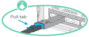

* You can use the following illustration to help you physically identify the shelf NSM ports, e0a and e0b:
+
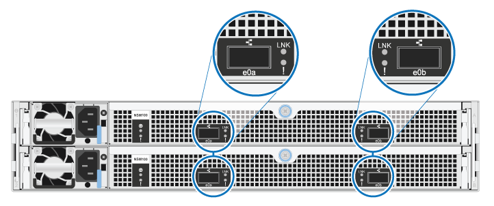

=== Cable a hot-add shelf for an AFF A900 HA pair

When additional storage is needed, you can hot-add up to three additional NS224 drive shelves (for a total of four shelves) to an AFF A900 HA pair.

.Before you begin

* You must have met the system requirements.
+
<<Requirements for a hot-add>>

* You must have completed the applicable preparation procedures.
+
<<Prepare for a hot-add>>

* You must have installed the shelves, powered them on, and set the shelf IDs.
+
<<Install a drive shelf for a hot-add>>

.About this task
* This procedure assumes that your HA pair has at least one existing NS224 shelf and that you are hot-adding up to three additional shelves.

* If your HA pair has only one existing NS224 shelf, this procedure assumes that the shelf is cabled across two RoCE-capable 100GbE I/O modules on each controller.

.Steps

. If the NS224 shelf you are hot-adding will be the second NS224 shelf in the HA pair, complete the following substeps.
+
Otherwise, go to the next step.
+
 .. Cable shelf NSM A port e0a to controller A slot 10 port a (e10a).
 .. Cable shelf NSM A port e0b to controller B slot 2 port b (e2b).
 .. Cable shelf NSM B port e0a to controller B slot 10 port a (e10a).
 .. Cable shelf NSM B port e0b to controller A slot 2 port b (e2b).
+
The following illustration shows the second shelf cabling (and the first shelf).
+
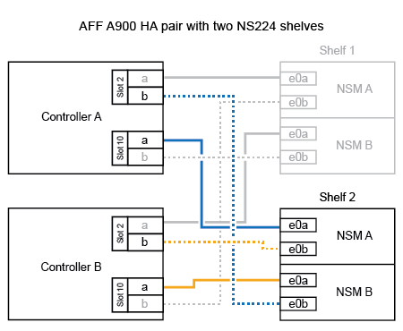

. If the NS224 shelf you are hot-adding will be the third NS224 shelf in the HA pair, complete the following substeps.
+
Otherwise, go to the next step.
+
.. Cable shelf NSM A port e0a to controller A slot 1 port a (e1a).
.. Cable shelf NSM A port e0b to controller B slot 11 port b (e11b).
.. Cable shelf NSM B port e0a to controller B slot 1 port a (e1a).
.. Cable shelf NSM B port e0b to controller A slot 11 port b (e11b).
+
The following illustration shows the third shelf cabling.
+
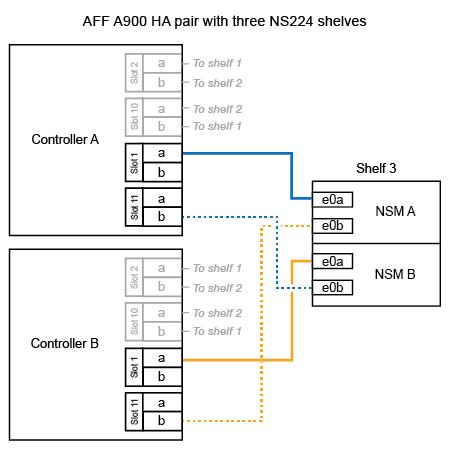

. If the NS224 shelf you are hot-adding will be the fourth NS224 shelf in the HA pair, complete the following substeps.
+
Otherwise, go to the next step.
+
.. Cable shelf NSM A port e0a to controller A slot 11 port a (e11a).
.. Cable shelf NSM A port e0b to controller B slot 1 port b (e1b).
.. Cable shelf NSM B port e0a to controller B slot 11 port a (e11a).
.. Cable shelf NSM B port e0b to controller A slot 1 port b (e1b).
+
The following illustration shows the fourth shelf cabling.
+
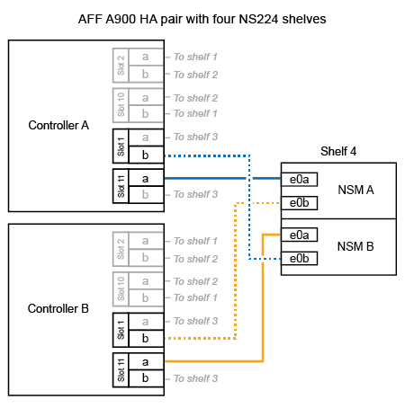

. Verify that the hot-added shelf is cabled correctly.
+
If any cabling errors are generated, follow the corrective actions provided.
+
https://mysupport.netapp.com/site/tools/tool-eula/activeiq-configadvisor[NetApp Downloads: Config Advisor]

. If you disabled automatic drive assignment as part of the preparation for this procedure, you need to manually assign drive ownership and then reenable automatic drive assignment, if needed.
+
Otherwise, you are done with this procedure.
+
<<Complete the hot-add>>

=== Cable a hot-add shelf for a FAS500f or AFF A250 HA pair

[.lead]
When additional storage is needed, you can hot-add an NS224 drive shelf to a FAS500f or AFF A250 HA pair.

.Before you begin

* You must have met the system requirements.
+
<<Requirements for a hot-add>>

* You must have completed the applicable preparation procedures.
+
<<Prepare for a hot-add>>

* You must have installed the shelves, powered them on, and set the shelf IDs.
+
<<Install a drive shelf for a hot-add>>

.About this task

When viewed from the rear of the platform chassis, the RoCE-capable card port on the left is port "a" (e1a) and the port on the right is port "b" (e1b).

.Steps

. Cable the shelf connections:
 .. Cable shelf NSM A port e0a to controller A slot 1 port a (e1a).
 .. Cable shelf NSM A port e0b to controller B slot 1 port b (e1b).
 .. Cable shelf NSM B port e0a to controller B slot 1 port a (e1a).
 .. Cable shelf NSM B port e0b to controller A slot 1 port b (e1b).
 +
The following illustration shows the shelf cabling when completed.
+
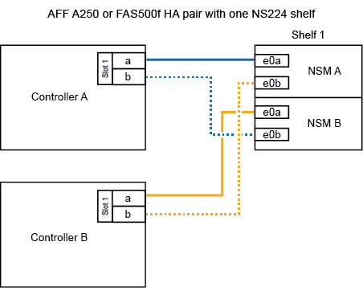
. Verify that the hot-added shelf is cabled correctly.
+
If any cabling errors are generated, follow the corrective actions provided.
+
https://mysupport.netapp.com/site/tools/tool-eula/activeiq-configadvisor[NetApp Downloads: Config Advisor^]

. If you disabled automatic drive assignment as part of the preparation for this procedure, you need to manually assign drive ownership and then reenable automatic drive assignment, if needed.
+
Otherwise, you are done with this procedure.
+
<<Complete the hot-add>>

=== Cable a hot-add shelf for an AFF A700 HA pair

How you cable an NS224 drive shelf in an AFF A700 HA pair, depends on the number of shelves you are hot-adding and the number of RoCE-capable port sets (one or two) you are using on the controller modules.

.Before you begin

* You must have met the system requirements.
+
<<Requirements for a hot-add>>

* You must have completed the applicable preparation procedures.
+
<<Prepare for a hot-add>>

* You must have installed the shelves, powered them on, and set the shelf IDs.
+
<<Install a drive shelf for a hot-add>>

.Steps

. If you are hot-adding one shelf using one set of RoCE-capable ports (one RoCE capable I/O module) on each controller module, and this is the only NS224 shelf in your HA pair, complete the following substeps.
+
Otherwise, go to the next step.
+
NOTE: This step assumes that you installed the RoCE-capable I/O module in slot 3, instead of slot 7, on each controller module.

 .. Cable shelf NSM A port e0a to controller A slot 3 port a.
 .. Cable shelf NSM A port e0b to controller B slot 3 port b.
 .. Cable shelf NSM B port e0a to controller B slot 3 port a.
 .. Cable shelf NSM B port e0b to controller A slot 3 port b.
+
The following illustration shows cabling for one hot-added shelf using one RoCE-capable I/O module in each controller module:
+
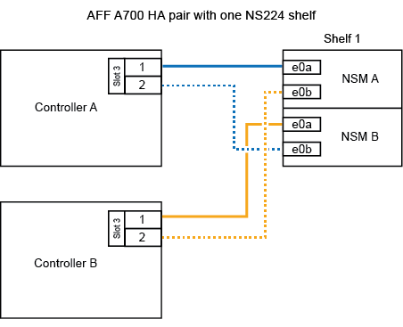

. If you are hot-adding one or two shelves using two sets of RoCE-capable ports (two RoCE-capable I/O modules) in each controller module, complete the applicable substeps.
+
[options="header" cols="1,3"]]
|===
| Shelves| Cabling
a|
Shelf 1
a|
NOTE: These substeps assume that you are beginning the cabling by cabling shelf port e0a to the RoCE-capable I/O module in slot 3, instead of slot 7.

 .. Cable NSM A port e0a to controller A slot 3 port a.
 .. Cable NSM A port e0b to controller B slot 7 port b.
 .. Cable NSM B port e0a to controller B slot 3 port a.
 .. Cable NSM B port e0b to controller A slot 7 port b.
 .. If you are hot-adding a second shelf, complete the "`Shelf 2`" substeps; otherwise, go to step 3.

a|
Shelf 2
a|
NOTE: These substeps assume that you are beginning the cabling by cabling shelf port e0a to the RoCE-capable I/O module in slot 7, instead of slot 3 (which correlates with the cabling substeps for shelf 1).

 .. Cable NSM A port e0a to controller A slot 7 port a.
 .. Cable NSM A port e0b to controller B slot 3 port b.
 .. Cable NSM B port e0a to controller B slot 7 port a.
 .. Cable NSM B port e0b to controller A slot 3 port b.
 .. Go to step 3.

+
|===
The following illustration shows cabling for the first and second hot-added shelves:
+
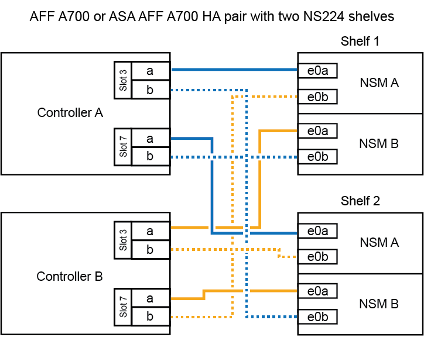

. Verify that the hot-added shelf is cabled correctly.
+
If any cabling errors are generated, follow the corrective actions provided.
+
https://mysupport.netapp.com/site/tools/tool-eula/activeiq-configadvisor[NetApp Downloads: Config Advisor^]

. If you disabled automatic drive assignment as part of the preparation for this procedure, you need to manually assign drive ownership and then reenable automatic drive assignment, if needed.
+
Otherwise, you are done with this procedure.
+
<<Complete the hot-add>>

=== Cable a hot-add shelf for an AFF A800 HA pair

How you cable an NS224 drive shelf in an AFF A800 HA pair depends on the number of shelves you are hot-adding and the number of RoCE-capable port sets (one or two) you are using on the controller modules.

.Before you begin

* You must have met the system requirements.
+
<<Requirements for a hot-add>>

* You must have completed the applicable preparation procedures.
+
<<Prepare for a hot-add>>

* You must have installed the shelves, powered them on, and set the shelf IDs.
+
<<Install a drive shelf for a hot-add>>

.Steps

. If you are hot-adding one shelf using one set of RoCE-capable ports (one RoCE-capable PCIe card) on each controller module, and this is the only NS224 shelf in your HA pair, complete the following substeps.
+
Otherwise, go to the next step.
+
NOTE: This step assumes you installed the RoCE-capable PCIe card in slot 5.

 .. Cable shelf NSM A port e0a to controller A slot 5 port a.
 .. Cable shelf NSM A port e0b to controller B slot 5 port b.
 .. Cable shelf NSM B port e0a to controller B slot 5 port a.
 .. Cable shelf NSM B port e0b to controller A slot 5 port b.
+
The following illustration shows cabling for one hot-added shelf using one RoCE-capable PCIe card on each controller module:
+
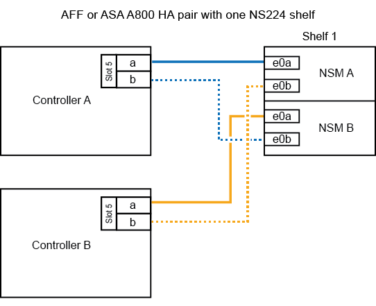

. If you are hot-adding one or two shelves using two sets of RoCE-capable ports (two RoCE-capable PCIe cards) on each controller module, complete the applicable substeps.
+
NOTE: This step assumes you installed the RoCE-capable PCIe cards in slot 5 and slot 3.
+
[options="header" cols="1,3"]
|===
| Shelves| Cabling
a|
Shelf 1
a|
NOTE: These substeps assume you are beginning the cabling by cabling shelf port e0a to the RoCE-capable PCIe card in slot 5, instead of slot 3.

 .. Cable NSM A port e0a to controller A slot 5 port a.
 .. Cable NSM A port e0b to controller B slot 3 port b.
 .. Cable NSM B port e0a to controller B slot 5 port a.
 .. Cable NSM B port e0b to controller A slot 3 port b.
 .. If you are hot-adding a second shelf, complete the "`Shelf 2`" substeps; otherwise, go to step 3.

a|
Shelf 2
a|
NOTE: These substeps assume you are beginning the cabling by cabling shelf port e0a to the RoCE-capable PCIe card in slot 3, instead of slot 5 (which correlates with the cabling substeps for shelf 1).

 .. Cable NSM A port e0a to controller A slot 3 port a.
 .. Cable NSM A port e0b to controller B slot 5 port b.
 .. Cable NSM B port e0a to controller B slot 3 port a.
 .. Cable NSM B port e0b to controller A slot 5 port b.
 .. Go to step 3.

+
|===
The following illustration shows cabling for two hot-added shelves:
+
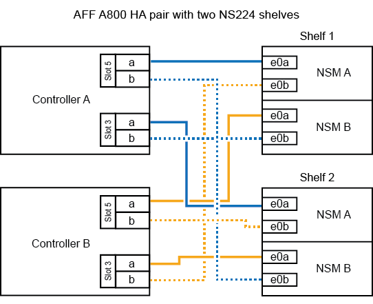

. Verify that the hot-added shelf is cabled correctly.
+
If any cabling errors are generated, follow the corrective actions provided.
+
https://mysupport.netapp.com/site/tools/tool-eula/activeiq-configadvisor[NetApp Downloads: Config Advisor^]

. If you disabled automatic drive assignment as part of the preparation for this procedure, you need to manually assign drive ownership and then reenable automatic drive assignment, if needed.
+
Otherwise, you are done with this procedure.
+
<<Complete the hot-add>>

=== Cable a hot-add shelf for an AFF A400 HA pair

How you cable an NS224 drive shelf in an AFF A400 HA pair, depends on the number of shelves you are hot-adding and the number of RoCE-capable port sets (one or two) you are using on the controller modules.

.Before you begin

* You must have met the system requirements.
+
<<Requirements for a hot-add>>

* You must have completed the applicable preparation procedures.
+
<<Prepare for a hot-add>>

* You must have installed the shelves, powered them on, and set the shelf IDs.
+
<<Install a drive shelf for a hot-add>>

.Steps

. If you are hot-adding one shelf using one set of RoCE-capable ports (onboard RoCE-capable ports) on each controller module, and this is the only NS224 shelf in your HA pair, complete the following substeps.
+
Otherwise, go to the next step.

 .. Cable shelf NSM A port e0a to controller A port e0c.
 .. Cable shelf NSM A port e0b to controller B port e0d.
 .. Cable shelf NSM B port e0a to controller B port e0c.
 .. Cable shelf NSM B port e0b to controller A port e0d.
+
The following illustration shows cabling for one hot-added shelf using one set of RoCE-capable ports on each controller module:
+
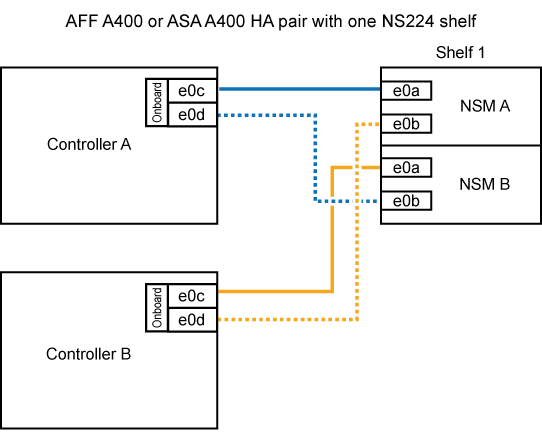

. If you are hot-adding one or two shelves using two sets of RoCE-capable ports (on board and PCIe card RoCE-capable ports) on each controller module, complete the following substeps.
+
[options="header" cols="1,3"]
|===
| Shelves| Cabling
a|
Shelf 1
a|

 .. Cable NSM A port e0a to controller A port e0c.
 .. Cable NSM A port e0b to controller B slot 5 port b.
 .. Cable NSM B port e0a to controller B port e0c.
 .. Cable NSM B port e0b to controller A slot 5 port b.
 .. If you are hot-adding a second shelf, complete the "`Shelf 2`" substeps; otherwise, go to step 3.

a|
Shelf 2
a|

 .. Cable NSM A port e0a to controller A slot 5 port a.
 .. Cable NSM A port e0b to controller B port e0d.
 .. Cable NSM B port e0a to controller B slot 5 port a.
 .. Cable NSM B port e0b to controller A port e0d.
 .. Go to step 3.

+
|===
The following illustration shows cabling for two hot-added shelves:
+
image::../media/drw_ns224_a400_2shelves.png[]

. Verify that the hot-added shelf is cabled correctly.
+
If any cabling errors are generated, follow the corrective actions provided.
+
https://mysupport.netapp.com/site/tools/tool-eula/activeiq-configadvisor[NetApp Downloads: Config Advisor^]

. If you disabled automatic drive assignment as part of the preparation for this procedure, you need to manually assign drive ownership and then re enable automatic drive assignment, if needed.
+
Otherwise, you are done with this procedure.
+
<<Complete the hot-add>>

=== Cable a hot-add shelf for an AFF A320 HA pair

You cable a second NS224 drive shelf to an existing HA pair when additional storage is needed.

.Before you begin

* You must have met the system requirements.
+
<<Requirements for a hot-add>>

* You must have completed the applicable preparation procedures.
+
<<Prepare for a hot-add>>

* You must have installed the shelves, powered them on, and set the shelf IDs.
+
<<Install a drive shelf for a hot-add>>

.About this task

This procedure assumes that your AFF A320 HA pair has an existing NS224 shelf and that you are hot-adding a second shelf.

.Steps

. Cable the shelf to the controller modules.
 .. Cable NSM A port e0a to controller A port e0e.
 .. Cable NSM A port e0b to controller B port e0b.
 .. Cable NSM B port e0a to controller B port e0e.
 .. Cable NSM B port e0b to controller A port e0b.
 +
The following illustration shows cabling for the hot-added shelf (shelf 2):
+
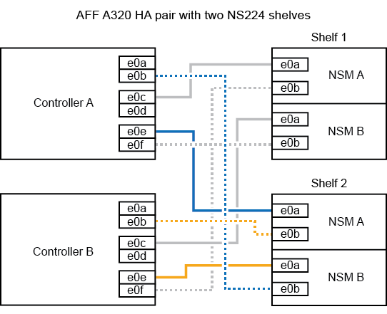
. Verify that the hot-added shelf is cabled correctly.
+
If any cabling errors are generated, follow the corrective actions provided.
+
https://mysupport.netapp.com/site/tools/tool-eula/activeiq-configadvisor[NetApp Downloads: Config Advisor^]

. If you disabled automatic drive assignment as part of the preparation for this procedure, you need to manually assign drive ownership and then re enable automatic drive assignment, if needed.
+
Otherwise, you are done with this procedure.
+
<<Complete the hot-add>>

== Complete the hot-add

[.lead]
If you disabled automatic drive assignment as part of the preparation for the NS224 drive shelf hot-add, you need to manually assign drive ownership and then reenable automatic drive assignment if needed.

.Before you begin

You must have already cabled your shelf as instructed for your HA pair.

<<Cable a drive shelf for a hot-add>>

.Steps

. Display all unowned drives: `storage disk show -container-type unassigned`
+
You can enter the command on either controller module.

. Assign each drive: `storage disk assign -disk disk_name -owner owner_name`
+
You can enter the command on either controller module.
+
You can use the wild card character to assign more than one drive at once.

. Reenable automatic drive assignment if needed: `storage disk option modify -node node_name -autoassign on`
+
You must reenable automatic drive assignment on both controller modules.
