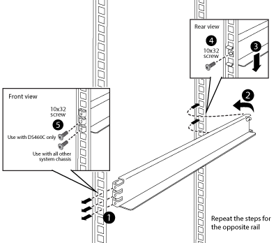
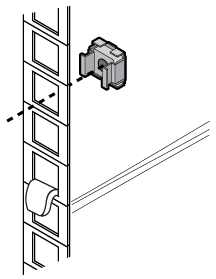

= Install additional support rails
:icons: font
:imagesdir: ../media/

[.lead]
Your system cabinet has some support rails already installed in it. If you need additional support rails for your system, you must install them before installing your system components.

This task applies to all controller and disk shelves except the DS212C and the DE212C disk shelves. Use the instructions in the rail kit flyer applicable to those two disk shelves.

https://library.netapp.com/ecm/ecm_download_file/ECMLP2484194[Installing a DE212C or DS212C Shelf in a Two-Post or Four-Post Rack]

. Determine how much space your equipment requires.
+
Calculate the amount of U space (1.75 inches per U) the equipment requires, based on the equipment height, and then determine where the equipment will be installed in the system cabinet based on available space.

. Locate where you need to install the support rails, and then install them using the following illustration for reference:
+

. If your equipment mounting flanges extend beyond the screw holes in the support rail, install cage nuts above the support rail, where needed.
+

