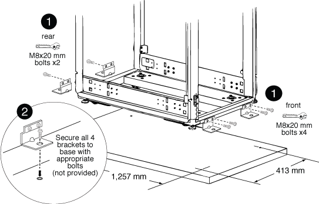

= Install the bolt-down kit
:icons: font
:imagesdir: ../media/

[.lead]
You can secure the system cabinet to the floor by installing the optional bolt-down kit. Installing the kit prevents the system cabinets from being rolled out of position.

You must supply the appropriate anchor bolt for your floor for each bolt-down bracket.

. Mark the area on your floor where the system cabinet will be installed, and then roll the cabinet into place.
+

+
|===
a|
image:../media/legend_icon_01.png[]
a|
Front and rear bolt-down brackets
a|
image:../media/legend_icon_02.png[]
a|
Location of floor anchor point on the bracket
|===

. Mark the anchoring points where the rear bolt-down brackets will be anchored to the floor, and then drill the holes for the brackets.
+
Be sure to use the appropriate bolt sizes and type for your floor.

. If the bolt-down brackets are too low to align with the mount points on the system cabinet frame, place a spacer bracket over the hole in the floor.
. Loosely bolt the rear brackets to the floor, and then using the kit bolts, bolt the brackets to the cabinet frame.
. Mark the anchoring points where the front bolt-down brackets will be anchored to the floor, and then drill the holes for the brackets.
. If the bolt-down brackets are too low to align with the mount points on the system cabinet frame, place a spacer bracket over the hole in the floor.
. Bolt the front brackets to the floor, and then using the kit bolts, bolt the brackets to the cabinet frame.
. Lower the leveling feet as needed, and then tighten the rear bolt-down brackets to the floor.
