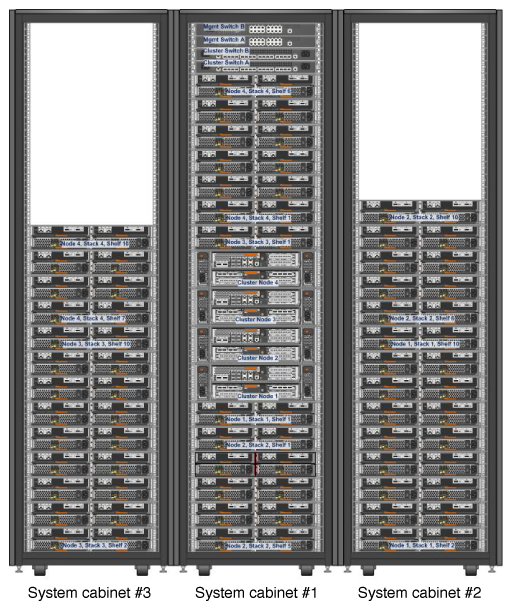
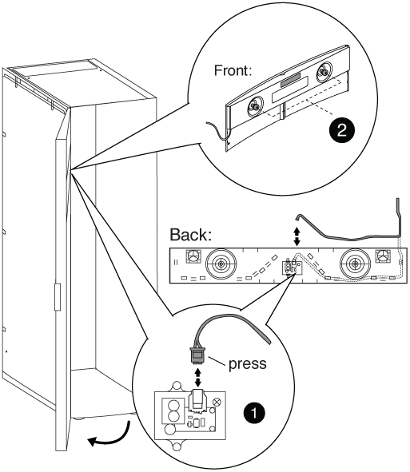
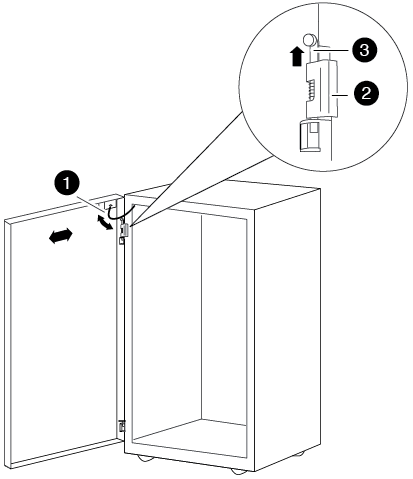
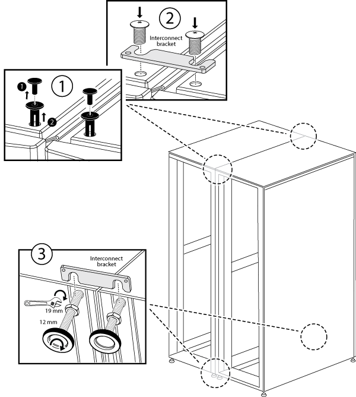
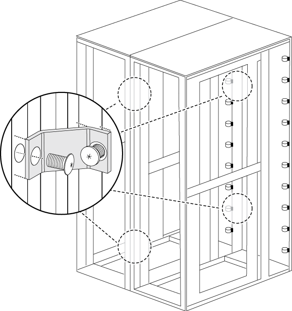

= Install the cabinet interconnect kit
:icons: font
:imagesdir: ../media/

[.lead]
You can connect system cabinets together by using the optional cabinet interconnect kit. It is recommended that you install the kit to prevent the cabinets from pulling apart and damaging system cables.

. Place the system cabinets close together.
+
The cabinets should be arranged similarly to the following illustration, with the cabinet with the controller modules in the middle, and the cabinets with additional disk shelves on either side. The sides of the cabinets should be close, but do not need to touch each other yet.
+

. If you are installing the interconnect kit with the side panels on as recommended, reinstall the side panels that were removed during unpacking:
 .. Lift the side panel, tilting it about 15 degrees away from the system cabinet bottom, and then hang it over the lip at the top of the system cabinet frame.
 .. Gently push the side panel against the cabinet frame, and then lock it in place with the key.
 .. Repeat these substeps for the remaining side panels.
. If you are installing the interconnect kit with the side panels removed, remove the front door whose hinges are on the edge where the cabinets meet:
 .. Unlock and open the front door that is being removed.
 .. Use the following illustration for reference to unplug the power to the illuminated bezel:
+

+
|===
a|
image:../media/legend_icon_01.png[]
a|
Illuminated bezel circuit board and cable
a|
image:../media/legend_icon_02.png[]
a|
Back panel and thumbscrews
|===

 .. Use the following illustration for reference to remove the front door:
+

+
|===
a|
image:../media/legend_icon_01.png[]
a|
Door grounding cable
a|
image:../media/legend_icon_02.png[]
a|
Door top hinge
a|
image:../media/legend_icon_03.png[]
a|
Hinge pin
|===
Make sure that you set the removed doors in a safe place so that they are not accidently damaged.
. Remove the rear door whose hinges are on the edge where the cabinets meet:
 .. Unlock and open the rear door that you are removing.
 .. Lift the top hinge pin until it clears the bottom of the hinge.
 .. Gently tip the top of the door away from the system cabinet frame, and then release the hinge pin.
 .. Lift the door off the bottom hinge, and then set the door aside.
. Move the system cabinets completely together, and then align and level them by adjusting the four leveling feet at the bottom of the system cabinets.
. Install the interconnect brackets.
 ** Use the following illustration for reference if you are installing the interconnect brackets with the system cabinet side panels on, as recommended:

+
|===
a|
image:../media/legend_icon_01.png[]
a|
Plastic push-in rivets on the system cabinet top
a|
image:../media/legend_icon_02.png[]
a|
Top interconnect bracket
a|
image:../media/legend_icon_03.png[]
a|
Bottom interconnect bracket
|===
 ** Use the following illustration for reference if you are installing the interconnect brackets with the system cabinet side panels off:

. Repeat the process for any remaining system cabinets.
. Tighten all interconnect bracket screws.
