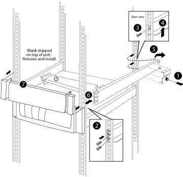

= Install equipment in the system cabinet
:icons: font
:imagesdir: ../media/

[.lead]
After you have installed any additional support rails into the system cabinet, you can add more system components to your prepopulated system cabinet or add your existing system components to an empty system cabinet.

. Unlock and open the rear doors of the system cabinet and the front door, if it is not already open.
. Install your equipment into the system cabinet as described in the installation instructions accompanying your equipment.
+
The storage controllers should be in the middle of the system cabinet. The disk shelves should be above and below the storage controllers. Any switches should be at the very top of the system cabinet.
+
NOTE: If your equipment mounting flanges extend beyond the screw holes in the support rail, install cage nuts above the support rail where needed to secure the equipment to the cabinet upright.

. Install blanking panels over any empty bays in the system cabinet.
+
If you receive the system cabinet with equipment already installed, you must remove the tie-down rails on top of the equipment that is directly below empty cabinet bays, as shown in the following illustration:
+

. Reinstall the front and rear system cabinet doors.
