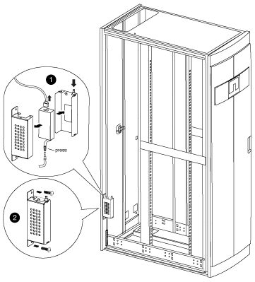
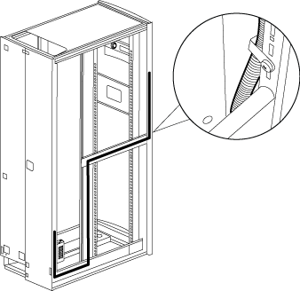
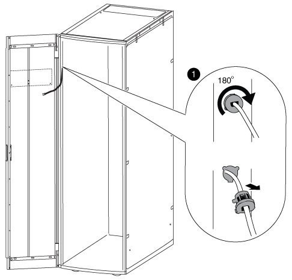

= Move the badge power supply and cabling
:icons: font
:imagesdir: ../media/

[.lead]
You must move the power supply and illuminated badge cabling to the opposite side of the system cabinet frame before you reverse the door and reinstall the illuminated badge.

You must have removed the system cabinet door and side panels.

You must move the illuminated badge power supply, power cable, and cabling conduit to the opposite side of the system cabinet when you reverse the system cabinet door. The assembly is designed so that the cable to the badge is on the side of the cabinet where the door hinge is installed.

. Open the power cable retaining clip, and then disconnect the power cable from the power supply.
. Remove the power supply housing and power supply, using the illustration for reference:
+

 .. Lift the retaining pin on the power supply housing, and then remove the housing cover by rotating it downward and lifting it off the rear power supply housing.
+
NOTE: The power supply is attached to the power supply housing with a hook and loop patch.

 .. Disconnect the power supply from the illuminated badge cable, and then set the power supply and power supply cover to the side.
 .. Remove the screws from the top and bottom of the power supply housing that is attached to the system cabinet frame, and then remove the power supply housing.

. Install the power supply and power supply housing on the opposite side of the system cabinet:
 .. Locate the two screw holes next to each other on the cabinet frame, and then attach the top of the power supply housing to the bottom-most of the two screw holes.
+
NOTE: You might need to remove the bottom cable retention strap, if present.

 .. Secure the bottom of the power supply housing to the system cabinet frame.
 .. Install the power supply cover and power supply by aligning the cover hooks with the power supply back, pulling the plunger up on the cover, rotating the plunger closed, and then releasing the plunger.
. Remove the bezel power supply conduit by removing the conduit retaining clips from the retaining clips, and then slide the conduit off the power cable.
+
Keep the retaining clips and screws for installing the conduit on the opposite side of the cabinet.
+

. Move the badge power cable to the other side of the cabinet:
+

 .. Rotate the rubber cable retainer on the cabinet upright 180° to the right, remove it from the system cabinet frame, and then gently pull the cable out of the system cabinet.
 .. Move the cable to the other side of the cabinet, and then thread it completely through the hole near the top of the cabinet upright.
 .. Align the rubber cable retainer with the hole in the frame, push it in as far as it will go, and then rotate the cable retainer 180° to the left to secure it.
 .. Run the cable along the cabinet frame to the back of the cabinet.

. Reinstall the cable conduit:
 .. Slide the conduit over the PDU power cable and route the conduit along the system cabinet frame to the PDU.
 .. Install the conduit retaining clips from the other side of the cabinet over the conduit to secure it to the cabinet frame.
. Plug the badge cable back into the power supply, but do not reconnect the power supply to the power source.
