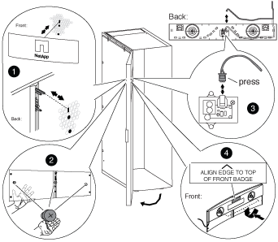

= Reinstall the door and illuminated badge
:icons: font
:imagesdir: ../media/

[.lead]
After you move the power supply and components to the other side of the system cabinet and moved the hinges and lock catch, you must reinstall the system cabinet door and the illuminated badge, and then reconnect the badge to the power source.

== Reinstall the system cabinet door

[.lead]
After you reverse the door hinge and door catch, you must reinstall the grounding wire and lug assembly and wire, and the system cabinet front door prior to reinstalling the illuminated badge.

. Rotate the door 180 degrees.
. Align the bottom of the door with the bottom hinge post, and then seat the door bottom on the hinge post.
. Lift the top hinge pin so that it clears the hinge housing.
. Tip the top of the door into the hinge housing so that the hinge pin and door hinge are aligned, and then release the hinge pin.
+
Make sure that the hinge pin is seated completely through the door hinge and the bottom of the door hinge housing.

. Reattach the grounding lug and wire assembly to the system cabinet frame on the same side of the newly reversed front door and reinstall the grounding lug with spade on the top of the system cabinet door.
. Reattach the grounding wire to the spade on the grounding lug assembly on the system cabinet door.
. Reinstall either the side panels or the interconnect brackets, as applicable:
 ** If your system cabinet is not connected to another system cabinet, reinstall the side panels.
 ** If your system cabinet is connected to another system cabinet with an interconnect kit, reinstall the interconnect brackets.

== Reinstall the illuminated badge

[.lead]
After the system cabinet door is installed, you need to install the illuminated badge to complete the door reversal process, and then close and lock the front door.

. Using the following illustration for reference, reinstall the illuminated badge on the front door of the system cabinet:
+

. Close and lock the front door.
