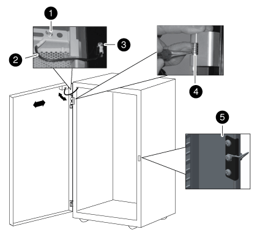

= Reverse the door hinge and lock catch
:icons: font
:imagesdir: ../media/

[.lead]
When reversing the system cabinet door, you must move the system cabinet door hinge and lock catch to the opposite front-side system cabinet upright.

You need the following tools:

* Phillips screwdriver
* 5 mm Allen wrench; magnetic Allen wrench is recommended
* Needle-nose pliers
* Step ladder so that you can easily access the Allen screws in the top hinge

. Remove the screws securing the top hinge from the system cabinet frame, and set the screws and hinge aside.
+
NOTE: Be careful when removing the Allen screws to avoid dropping them into the cabinet frame. Spare Allen screws are provided in the spares kit that shipped with your system cabinet.

. Remove the screws securing the bottom hinge from the system cabinet frame, and set the screws and hinge aside.
+

+
|===
a|
image:../media/legend_icon_01.png[]
a|
Door grounding screw with grounding wire spade
a|
image:../media/legend_icon_02.png[]
a|
Grounding wire
a|

a|
Frame grounding wire lug
a|

a|
Top front door hinge with hinge pin held by retaining clip
a|

a|
Lock catch
|===

. Reverse the hinge pin from the top hinge:
 .. Lift the hinge pin and expose the retaining clip on the hinge pin shaft.
 .. Using the needle-nose pliers, gently remove the retaining clip from the hinge pin shaft and set it aside.
 .. Slide the hinge pin and spring out of the hinge body.
 .. Rotate the hinge so that the thread holes are facing the opposite side of the hinge, and then install the hinge pin and spring back into the hinge.
 .. Install the hinge retaining clip onto the hinge pin.
+
Make sure that you push the retaining clip completely onto the hinge pin.
. Reinstall the hinges:
 .. Insert the top Allen screw through the system cabinet upright, aligning it with the top threaded hole on the top hinge, and then partially tighten the Allen screw.
+
Do not completely tighten the screw until after the second Allen screw is installed.

 .. Insert the bottom Allen screw through the system cabinet upright, aligning it with the bottom threaded hole on the top hinge, and then partially tighten the Allen screw.
 .. Tighten the top and bottom Allen screws.
 .. Repeat these steps for the bottom hinge.
. Remove the screws from the lock catch, and then move the lock catch to the opposite front-side system cabinet upright.
. Rotate the catch 180 degrees, and then secure it to the system cabinet upright.
