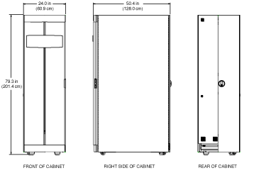
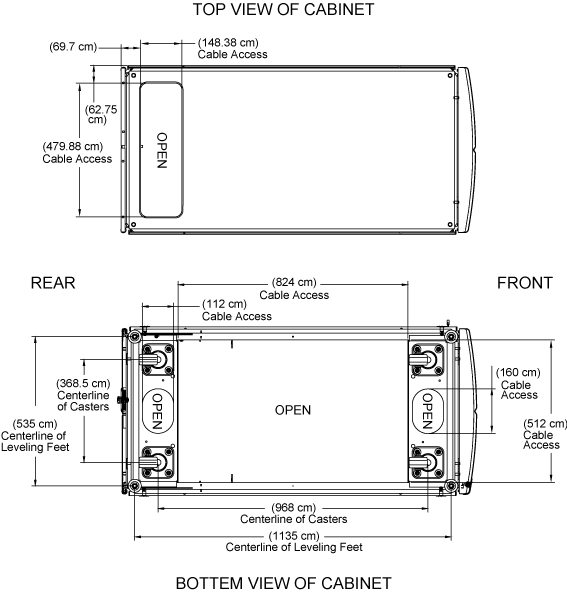

= Space requirements and system cabinet dimensions
:icons: font
:imagesdir: ../media/

[.lead]
When unpacking your system cabinet, you must make sure that you have enough room to remove the system cabinet from the packing material. Also make sure that the intended location for the system cabinet is large enough for you to move the cabinet into place.

== Required space for unpacking the system cabinet

The following table defines the requires space needed to unpack and install your system cabinet:

[options="header" cols="1,2"]
|===
| Dimensions| U.S.| Metric
a|
Shipping ramp length
a|
80 in.
a|
203.2 cm
a|
Clearance beyond the ramp for cabinet mobility
a|
72 in.
a|
182.9 cm
a|
Shipping pallet depth
a|
59 in.
a|
149.9 cm
a|
Shipping pallet width
a|
42 in.
a|
106.6 cm
a|
Shipping pallet and packaging height
a|
86 in.
a|
218.4 cm
a|
Total rack space, 42U
a|
73.5 in.
a|
186.7 cm
a|
Rail load capacity
a|
Supports all current systems
a|
Supports all current systems
a|
Empty weight
a|
~400 lbs (~181 kg) lbs
a|
~ 181 kg
a|
Fully loaded ship weight
a|
Up to 1,800 lbs
a|
Up to 816.5 kg
a|
Fully loaded static weight
a|
Up to 2,700 lbs
a|
Up to 1,224.7 kg
a|
Front service clearance
a|
47.2 in.
a|
120 cm
a|
Rear service clearance *Note:* The rear door is split. Actual minimum rear clearance is approximately 1/2 the recommendation.

a|
30 in.
a|
76.3 cm
a|
Minimum side clearance for panel removal
a|
24 in.
a|
61 cm
a|
Minimum top clearance
a|
12 in.
a|
30 cm
|===

== System cabinet exterior dimensions

The following illustration shows the front, rear, and side views of the system cabinet:

The following illustrations show top and bottom views of the system cabinet, and identify the openings through which you can run cable bundles from the floor of your data center into the system cabinet. The illustrations also show the location of the system cabinet casters and leveling feet.

CAUTION:

To prevent your system cabinet from falling through the data center floor, do not attempt to roll the system cabinet over a floor opening that is wider than the cable access opening at the bottom of the system cabinet.

