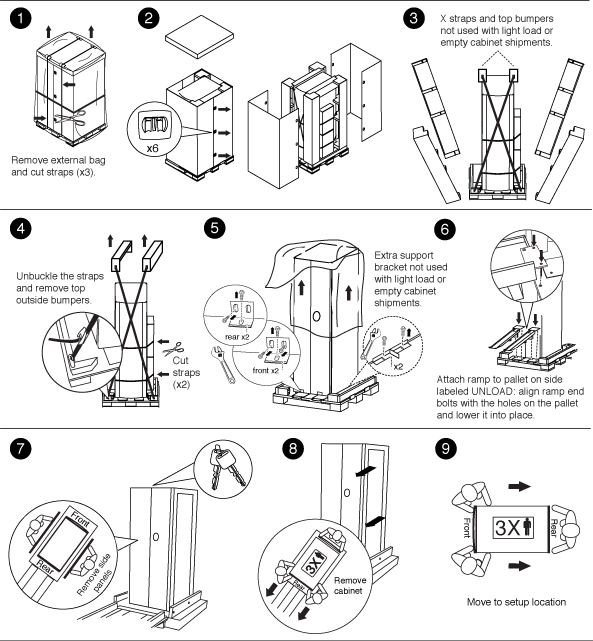

= Unpack the system cabinet
:icons: font
:imagesdir: ../media/

[.lead]
You must remove the packing material that surrounds your system cabinet before you move it into place. You should also recycle the packing material after the cabinet is unpacked.

