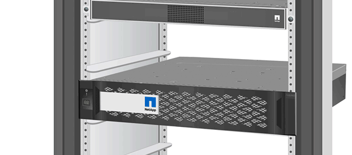
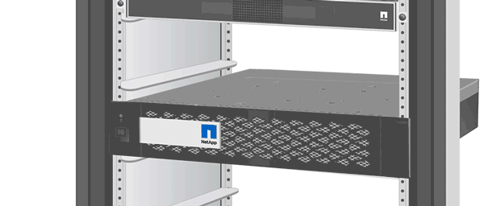

= Hot-swap a disk drive
:icons: font
:imagesdir: ../media/

[.lead]
When a disk drive fails, the platform logs a warning message to the system console indicating which disk drive has failed. In addition, both the fault LED on the operator display panel and the fault LED on the failed disk drive are illuminated. You can replace a failed drive nondisruptively while I/O is in progress.

* The replacement disk drive must be supported by your platform.
+
https://hwu.netapp.com[NetApp Hardware Universe]

* Identify the failed disk drive by running the `storage disk show -broken` command from the system console. The failed drive appears in the list of failed drives. If it does not, you should wait, and then run the command again.

How you hot-swap the disk depends on how the disk drive is being used. If SED authentication is enabled, you must use the SED replacement instructions in the ONTAP documentation. Instructions in the ONTAP documentation describe additional steps you must perform before and after replacing an SED.

https://docs.netapp.com/ontap-9/topic/com.netapp.doc.pow-nve/home.html[ONTAP 9 NetApp Encryption Power Guide]

When replacing several disk drives, you must wait one minute between the removal of each failed disk drive and the insertion of the replacement disk drive to allow the storage system to recognize the existence of each new disk.

NOTE: Always use two hands when removing, installing, or carrying a disk drive.

* *Best practice:* The best practice is to have the current version of the Disk Qualification Package (DQP) installed before hot-swapping a drive.
* Drive firmware is automatically updated (nondisruptively) on new drives that have non current firmware versions.
* When you unpack the replacement drive, save all packing materials for use when you return the failed drive.

. If you want to manually assign drive ownership for the replacement drive, you need to disable automatic drive assignment replacement drive, if it is enabled
+
NOTE: You manually assign drive ownership and then reenable automatic drive assignment later in this procedure.

 .. Verify whether automatic drive assignment is enabled: `storage disk option show`
+
You can enter the command on either controller module.
+
If automatic drive assignment is enabled, the output shows `on` in the "`Auto Assign`" column (for each controller module).

 .. If automatic drive assignment is enabled, disable it: `storage disk option modify -node node_name -autoassign off`
+
You must disable automatic drive assignment on both controller modules.

. Properly ground yourself.
. Gently remove the bezel from the front of the platform.
. Identify the failed disk drive from the system console warning message and the illuminated fault LED on the disk drive
. Press the release button on the disk drive face.
+
Depending on the storage system, the disk drives have the release button located at the top or on the left of the disk drive face.
+
For example, the following illustration shows a disk drive with the release button located on the top of the disk drive face:
+

+
The cam handle on the disk drive springs open partially and the disk drive releases from the midplane.

. Pull the cam handle to its fully open position to unseat the disk drive from the midplane.
+

. Slide out the disk drive slightly and allow the disk to safely spin down, which can take less than one minute, and then, using both hands, remove the disk drive from the disk shelf.
. With the cam handle in the open position, insert the replacement disk drive into the drive bay, firmly pushing until the disk drive stops.
+
NOTE: Wait a minimum of 10 seconds before inserting a new disk drive. This allows the system to recognize that a disk drive was removed.
+
NOTE: If your platform drive bays are not fully loaded with drives, it is important to place the replacement drive into the same drive bay from which you removed the failed drive.
+
NOTE: Use two hands when inserting the disk drive, but do not place hands on the disk drive boards that are exposed on the underside of the disk carrier.

. Close the cam handle so that the disk drive is fully seated into the midplane and the handle clicks into place.
+
Be sure to close the cam handle slowly so that it aligns correctly with the face of the disk drive..

. If you are replacing another disk drive, repeat Steps 4 through 9.
. Reinstall the bezel.
. If you disabled automatice drive assignment in Step 1, then, manually assign drive ownership and then reenable automatic drive assignment if needed.
 .. Display all unowned drives: `storage disk show -container-type unassigned`
+
You can enter the command on either controller module.

 .. Assign each drive: `storage disk assign -disk disk_name -owner owner_name`
+
You can enter the command on either controller module.
+
You can use the wildcard character to assign more than one drive at once.

 .. Reenable automatic drive assignment if needed: `storage disk option modify -node node_name -autoassign on`
+
You must reenable automatic drive assignment on both controller modules.
. Return the failed part to NetApp, as described in the RMA instructions shipped with the kit.
+
Contact technical support at https://mysupport.netapp.com/site/global/dashboard[NetApp Support], 888-463-8277 (North America), 00-800-44-638277 (Europe), or +800-800-80-800 (Asia/Pacific) if you need the RMA number or additional help with the replacement procedure.
