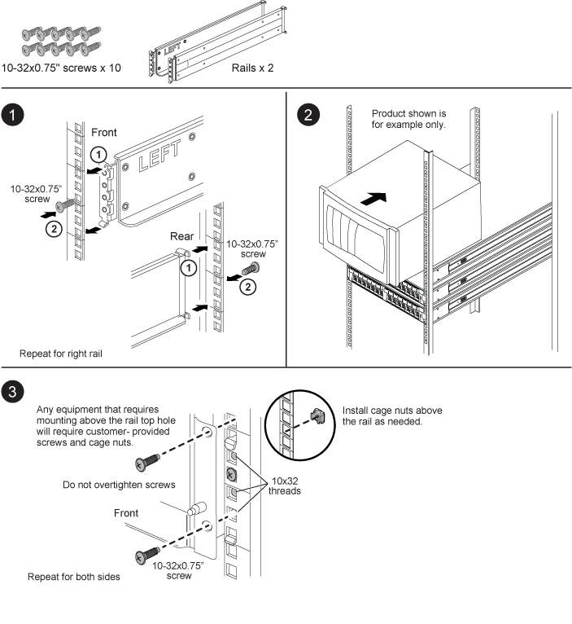
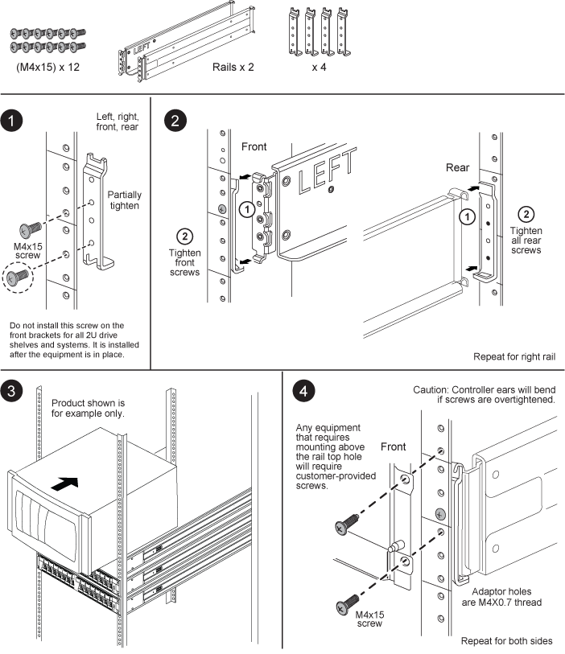

= SuperRail kit installation instructions
:icons: font
:imagesdir: ../media/

[.lead]
The SuperRail can be either installed on a standard square-hole four-post rack or a standard round-hole four-post rack by using the round-to-square hole adaptor brackets.

== Installing SuperRail to square-hole four-post rack

== Installing SuperRail to round-hole four-post rack

