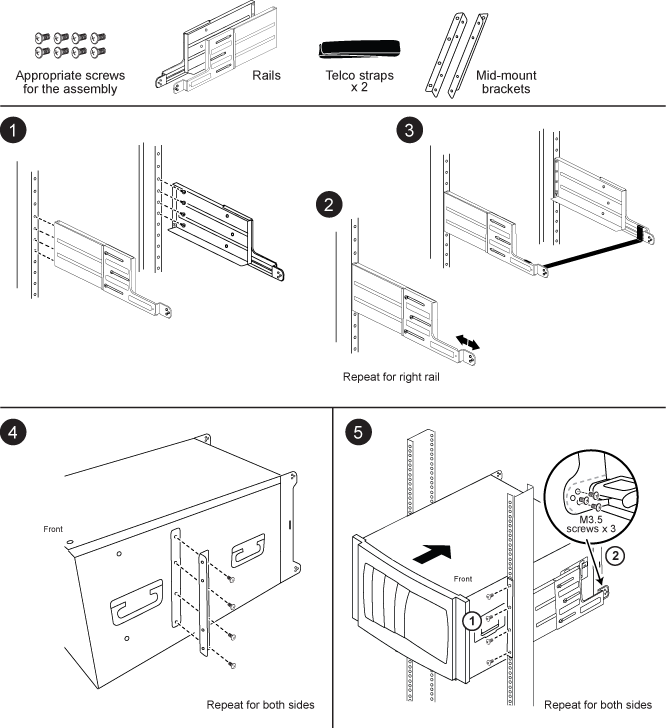
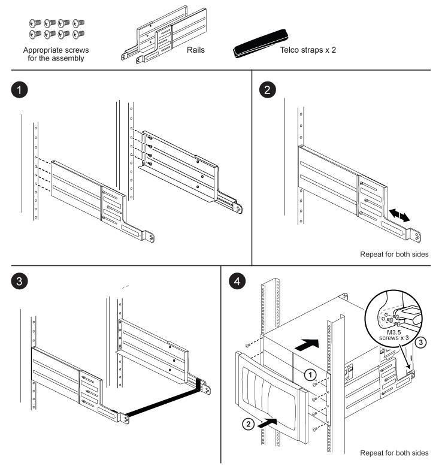

= Two-post support rail kit installation instructions - AFF A700 and FAS9000
:icons: font
:imagesdir: ../media/

[.lead]
There are two, two-post support rail kits that can be used with the FAS9000 and AFF A700 systems. One kit allows you to flush-mount your system in the two-post rack, and the other kit allows you to mid-mount your system in the two-post rack.

== Install the two-post mid-mount rail kit

== Install the two-post flush-mount rail kit

