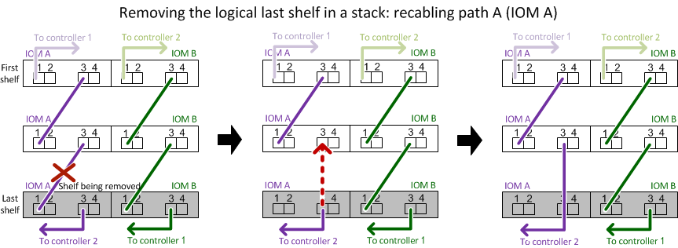
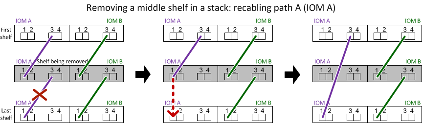

= Hot-remove a shelf - shelves with IOM12/IOM12B modules
:icons: font
:imagesdir: ../media/

[.lead]
You can hot-remove a disk shelf with IOM12/IOM12B modules (nondisruptively remove a disk shelf from a system that is powered on and I/O is in progress) when you need to move or replace a disk shelf. You can hot-remove one or more disk shelves from anywhere within a stack of disk shelves or remove a stack of disk shelves.

.Before you begin

* Your system must be a multipath HA, multipath, quad-path HA, or quad-path configuration.
+
For platforms with onboard storage, such as AFF A200, AFF A220, FAS2600 series and FAS2700 systems, the external storage must be cabled as multipath HA or multipath.
+
NOTE: For a FAS2600 series single-controller system that has the external storage cabled with multipath connectivity, the system is a mixed-path configuration because the internal storage uses single-path connectivity.

* Your system cannot have any SAS cabling error messages.
+
You can download and run Active IQ Config Advisor to view any SAS cabling error messages and the corrective actions you should take.
+
https://mysupport.netapp.com/site/tools/tool-eula/activeiq-configadvisor[NetApp Downloads: Config Advisor]

* HA pair configurations cannot be in a takeover state.
* You must have removed all aggregates from the disk drives (the disk drives must be spares) in the disk shelves you are removing.
+
NOTE: If you attempt this procedure with aggregates on the disk shelf you are removing, you could fail the system with a multidisk panic.
+
You can use the `storage aggregate offline -aggregate _aggregate_name_` command and then the `storage aggregate delete -aggregate _aggregate_name_` command.

* If you are removing one or more disk shelves from within a stack, you must have factored the distance to bypass the disk shelves you are removing; therefore, if the current cables are not long enough, you need to have longer cables available.

.About this task

* *Best practice:* The best practice is to remove disk drive ownership after you remove the aggregates from the disk drives in the disk shelves you are removing.
+
Removing ownership information from a spare disk drive allows the disk drive to be properly integrated into another node (as needed).

[NOTE]
====
The procedure for removing ownership from disk drives requires you to disable disk ownership automatic assignment. You reenable disk ownership automatic assignment at the end of this procedure.

https://docs.netapp.com/us-en/ontap/disks-aggregates/index.html[Disks and aggregates overview]
====

* For a clustered ONTAP system that is greater than two-nodes, best practice is to have reassigned epsilon to an HA pair other than the one that is undergoing planned maintenance.
+
Reassigning epsilon minimizes the risk of unforeseen errors impacting all nodes in a clustered ONTAP system. You can use the following steps to determine the node holding epsilon and reassign epsilon if needed:
+
. Set privilege level to advanced: `set -privilege advanced`
. Determine which node holds epsilon: `cluster show`
+
The node that holds epsilon shows `true` in the `Epsilon` column. (The nodes that do not hold epsilon show `false`.)
. If the node in the HA pair that is undergoing maintenance shows `true` (holds epsilon), then remove epsilon from the node: `cluster modify -node _node_name_ -epsilon false`
. Assign epsilon to a node in another HA pair: `cluster modify -node _node_name_ -epsilon true`
. Return to the admin privilege level: `set -privilege admin`

* If you are hot-removing a disk shelf from a stack (but keeping the stack), you recable and verify one path at a time (path A then path B) to bypass the disk shelf you are removing so that you always maintain single-path connectivity from the controllers to the stack.
+
NOTE: If you do not maintain single-path connectivity from the controllers to the stack when recabling the stack to bypass the disk shelf you are removing, you could fail the system with a multidisk panic.

* *Possible shelf damage:* If you are removing a DS460C shelf and you are moving it to a different part of the data center or transporting it to a different location, see the section, <<Move or transport DS460C shelves>> at the end of this procedure.

.Steps

. Verify that your system configuration is `Multi-Path HA`, `Multi-Path`, `Quad-path HA`, or `Quad-path`: `sysconfig`
+
You run this command from the nodeshell of either controller. It might take up to a minute for the system to complete discovery.
+
The configuration is listed in the `System Storage Configuration` field.
+
NOTE: For a FAS2600 series single-controller system that has the external storage cabled with multipath connectivity, the output is displayed as `mixed-path` because the internal storage uses single-path connectivity.

. Verify that the disk drives in the disk shelves you are removing have no aggregates (are spares) and ownership is removed:
 .. Enter the following command from the clustershell of either controller: `storage disk show -shelf _shelf_number_`
 .. Check the output to verify that there are no aggregates on the disk drives in the disk shelves you are removing.
+
Disk drives with no aggregates have a dash in the `Container Name` column.

 .. Check the output to verify that ownership is removed from the disk drives on the disk shelves you are removing.
+
Disk drives with no ownership have a dash in the `Owner` column.
+
NOTE: If you have failed disk drives in the shelf you are removing, they have broken in the `Container Type` column. (Failed disk drive do not have ownership.)

+
The following output shows disk drives on the disk shelf being removed (disk shelf 3) are in a correct state for removing the disk shelf. The aggregates are removed on all of the disk drives; therefore, a dash appears in the `Container Name` column for each disk drive. Ownership is also removed on all of the disk drives; therefore, a dash appears in the `Owner` column for each disk drive.

+
----
cluster::> storage disk show -shelf 3

           Usable           Disk   Container   Container
Disk         Size Shelf Bay Type   Type        Name       Owner
-------- -------- ----- --- ------ ----------- ---------- ---------
...
1.3.4           -     3   4 SAS    spare                -         -
1.3.5           -     3   5 SAS    spare                -         -
1.3.6           -     3   6 SAS    broken               -         -
1.3.7           -     3   7 SAS    spare                -         -
...
----
. Physically locate the disk shelves you are removing.
+
If needed, you can turn on the disk shelf's location (blue) LEDs to aid in physically locating the affected disk shelf: `storage shelf location-led modify -shelf-name _shelf_name_ -led-status on`
+
NOTE: A disk shelf has three location LEDs: one on the operator display panel and one on each IOM12 module. Location LEDs remain illuminated for 30 minutes. You can turn them off by entering the same command, but using the off option.

. If you are removing an entire stack of disk shelves, complete the following substeps; otherwise, go to the next step:
 .. Remove all SAS cables on path A (IOM A) and path B (IOM B).
+
This includes controller-to-shelf cables and shelf-to-shelf cables for all disk shelves in the stack you are removing.

 .. Go to step 9.
. If you are removing one or more disk shelves from a stack (but keeping the stack), recable the path A (IOM A) stack connections to bypass the disk shelves you are removing by completing the applicable set of substeps:
+
If you are removing more than one disk shelf in the stack, complete the applicable set of substeps one disk shelf at a time.
+
NOTE: Wait at least 10 seconds before connecting the port. The SAS cable connectors are keyed; when oriented correctly into a SAS port, the connector clicks into place and the disk shelf SAS port LNK LED illuminates green. For disk shelves, you insert a SAS cable connector with the pull tab oriented down (on the underside of the connector).
+
[cols="2*",options="header"]
|===
| If you are removing...| Then...
a|
A disk shelf from either end (logical first or last disk shelf) of a stack
a|

 .. Remove any shelf-to-shelf cabling from IOM A ports on the disk shelf you are removing and put them aside.
 .. Unplug any controller-to-stack cabling connected to IOM A ports on the disk shelf you are removing and plug them into the same IOM A ports on the next disk shelf in the stack.
+
The "`next`" disk shelf can be above or below the disk shelf you are removing depending on which end of the stack you are removing the disk shelf from.

a|
A disk shelf from the middle of the stack    A disk shelf in the middle of a stack is only connected to other disk shelves--not to any controllers.
a|

 .. Remove any shelf-to-shelf cabling from IOM A ports 1 and 2 or from ports 3 and 4 on the disk shelf you are removing and IOM A of the next disk shelf, and then put them aside.
 .. Unplug the remaining shelf-to-shelf cabling connected to IOM A ports on the disk shelf you are removing and plug them into the same IOM A ports on the next disk shelf in the stack.
 The "`next`" disk shelf can be above or below the disk shelf you are removing depending on which IOM A ports (1 and 2 or 3 and 4) you removed the cabling from.

+
|===
You can refer to the following cabling examples when removing a disk shelf from an end of a stack or the middle of a stack. Note the following about the cabling examples:

 ** The IOM12 modules are arranged side-by-side as in a DS224C or DS212C disk shelf; if you have a DS460C, the IOM12 modules are arranged one above the other.
 ** The stack in each example is cabled with standard shelf-to-shelf cabling, which is used in stacks cabled with multipath HA or multipath connectivity.
+
You can infer the recabling if your stack is cabled with quad-path HA or quad-path connectivity, which uses double-wide shelf-to-shelf cabling.

 ** The cabling examples demonstrate recabling one of the paths: path A (IOM A).
+
You repeat the recabling for path B (IOM B).

 ** The cabling example for removing a disk shelf from the end of a stack demonstrates removing the logical last disk shelf in a stack that is cabled with multipath HA connectivity.
+
You can infer the recabling if you are removing the logical first disk shelf in a stack or if your stack has multipath connectivity.
+

+

. Verify that you bypassed the disk shelves you are removing and reestablished the path A (IOM A) stack connections correctly: `storage disk show -port`
+
For HA pair configurations, you run this command from the clustershell of either controller. It might take up to a minute for the system to complete discovery.
+
The first two lines of output show disk drives with connectivity through both path A and path B. The last two lines of output show disk drives with connectivity through a single-path, path B.
+
----
cluster::> storage show disk -port

PRIMARY  PORT SECONDARY      PORT TYPE SHELF BAY
-------- ---- ---------      ---- ---- ----- ---
1.20.0   A    node1:6a.20.0  B    SAS  20    0
1.20.1   A    node1:6a.20.1  B    SAS  20    1
1.21.0   B    -              -    SAS  21    0
1.21.1   B    -              -    SAS  21    1
...
----

. The next step depends on the `storage disk show -port` command output:
+
[cols="2*",options="header"]
|===
| If the output shows...| Then...
a|
All disk drives in the stack are connected through path A and path B except for the ones in the disk shelves you disconnected, which are only connected through path B
a|
Go to the next step.

You successfully bypassed the disk shelves you are removing and reestablished path A on the remaining disk drives in the stack.
a|
Anything other than the above
a|
Repeat Step 5 and Step 6.

You must correct the cabling.
|===

. Complete the following substeps for the disk shelves (in the stack) you are removing:
 .. Repeat Step 5 through Step 7 for path B.
+
NOTE: When you repeat Step 7 and if you have recabled the stack correctly, you should only see all remaining disk drives connected through path A and path B.

 .. Repeat Step 1 to confirm that your system configuration is the same as before you removed one or more disk shelves from a stack.
 .. Go to the next step.
. If when you removed ownership from the disk drives (as part of the preparation for this procedure), you disabled disk ownership automatic assignment, reenable it by entering the following command; otherwise, go to the next step: `storage disk option modify -autoassign on`
+
For HA pair configurations, you run the command from the clustershell of both controllers.

. Power off the disk shelves you disconnected and unplug the power cords from the disk shelves.
. Remove the disk shelves from the rack or cabinet.
+
To make a disk shelf lighter and easier to maneuver, remove the power supplies and I/O modules (IOMs).
+
For DS460C disk shelves, a fully loaded shelf can weigh approximately 247 lbs (112 kg); therefore, exercise the following caution when removing a shelf from a rack or cabinet.
+
CAUTION: It is recommended that you use a mechanized lift or four people using the lift handles to safely move a DS460C shelf.
+
Your DS460C shipment was packaged with four detachable lift handles (two for each side). To use the lift handles, you install them by inserting the tabs of the handles into the slots in the side of the shelf and pushing up until they click into place. Then, as you slide the disk shelf onto the rails, you detach one set of handles at a time using the thumb latch. The following illustration shows how to attach a lift handle.
+
image::../media/drw_ds460c_handles.gif[]
+
If you are moving the DS460C shelf to a different part of the data center or transporting it to a different location, see the following section, <<Move or transport DS460C shelves>>.

.Move or transport DS460C shelves
[[ds460c]]
[.lead]
If you move a DS460C shelf to a different part of the data center or transport the shelf to a different location, you need to remove the drives from the drive drawers to avoid possible damage to the drive drawers and drives.

* If when you installed DS460C shelves as part of your new system installation or shelf hot-add, you saved the drive packaging materials, use these to repackage the drives before moving them.
+
If you did not save the packaging materials, you should place drives on cushioned surfaces or use alternate cushioned packaging. Never stack drives on top of each other.

* Before handling drives, wear an ESD wrist strap grounded to an unpainted surface on your storage enclosure chassis.
+
If a wrist strap is unavailable, touch an unpainted surface on your storage enclosure chassis before handling a drive.

* You should take steps to handle drives carefully:
+
** Always use two hands when removing, installing, or carrying a drive to support its weight.
+
CAUTION: Do not place hands on the drive boards exposed on the underside of the drive carrier.
+
** Be careful not to bump drives against other surfaces.
+
** Drives should be kept away from magnetic devices.
+
CAUTION: Magnetic fields can destroy all data on a drive and cause irreparable damage to the drive circuitry.
