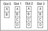
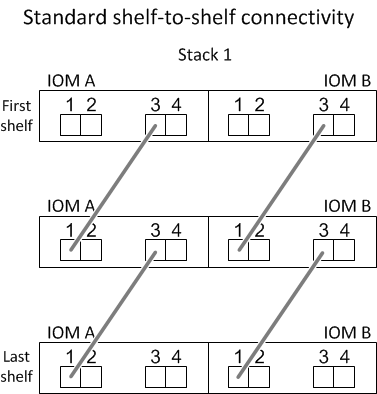
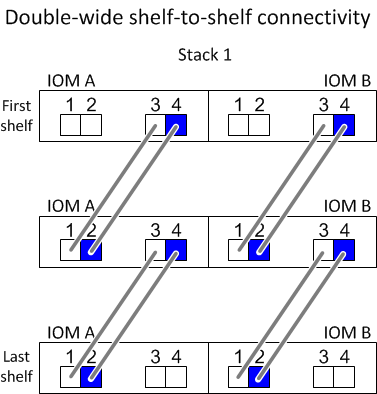
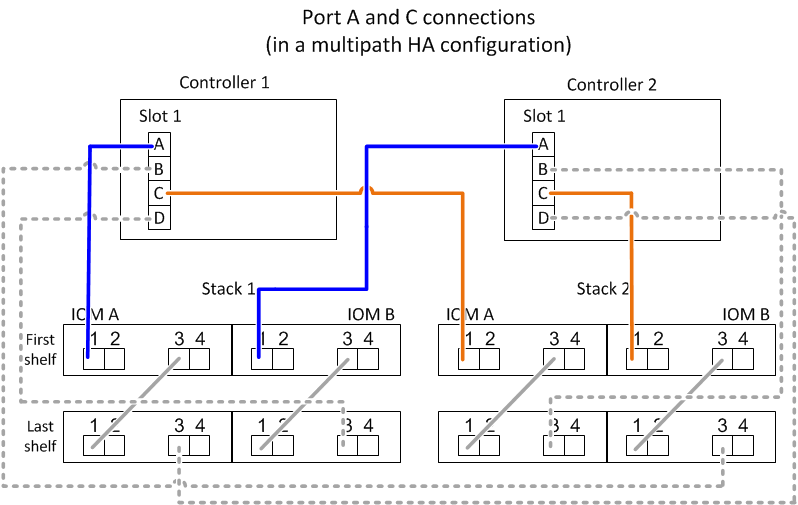
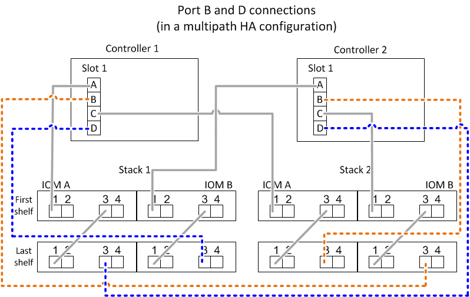
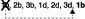
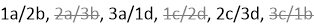
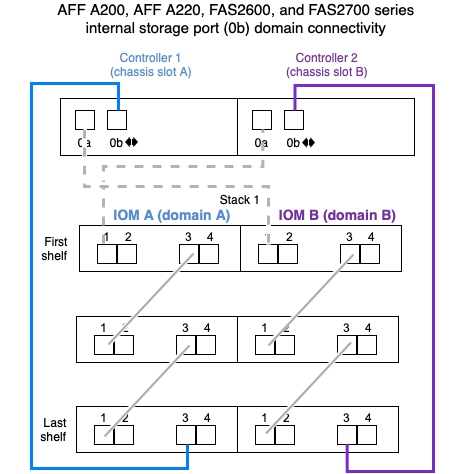

= SAS cabling rules - shelves with IOM12/IOM12B modules
:icons: font
:imagesdir: ../media/

[.lead]
Disk shelves with IOM12/IOM12B modules can be cabled in HA pair and single-controller configurations (for supported platforms) by applying the SAS cabling rules: configuration rules, controller slot numbering rules, shelf-to-shelf connection rules, controller-to-stack connection rules, and if applicable, mini-SAS HD SAS optical cable rules.

NOTE: The SAS cabling rules regarding controller slot numbering rules, shelf-to-shelf connection rules, and controller-to-stack connection rules described in this guide are the same rules that apply to all SAS disk shelves, whether they have IOM12/IOM12B, IOM6, or IOM3 modules. However, the information in this guide is specific to the unique characteristics of disk shelves with IOM12 modules and their use in supported configurations.

The SAS cabling rules regarding configuration rules and mini-SAS HD SAS optical cable rules described in this guide are specific to disk shelves with IOM12/IOM12B modules.

The SAS cabling rules described in this guide balance SAS cabling between the on-board SAS ports and host bus adapter SAS ports to provide highly available storage controller configurations and meet the following goals:

* Provide a single, easily understood universal algorithm for all SAS products and configurations
* Yield the same physical cabling when generating the Bill of Materials (BOM), followed in the factory, and in the field
* Are verifiable by configuration-checking software and tools
* Provide maximum possible resilience to maintain availability and minimize the reliance on controller takeovers

You should avoid deviating from the rules; deviations might reduce reliability, universality, and commonality.

== Configuration rules

[.lead]
Disk shelves with IOM12 modules are supported on specific types of HA pair and single-controller configurations.

NOTE: The FAS25XX platforms are not addressed in this content.

* HA pair configurations must be cabled as multipath HA or quad-path HA configurations with the following exceptions:
 ** Platforms with internal storage, including FAS2600 series, AFF A200, FAS2700 series, AFF A220, and later, can be cabled as single-path HA configurations to support connectivity to an external SAS tape backup device.
 ** Platforms with internal storage, including FAS2600 series, AFF A200, FAS2700 series, AFF A220, and later, do not support quad-path HA connectivity.
* Single-controller configurations must be cabled as multipath or quad-path configurations, with the following exceptions:
 ** FAS2600 series single-controller configurations (with external disk shelves) can be cabled as single-path configurations.
+
Because the internal storage uses single-path connectivity, ONTAP issues occasional warnings that mixed paths are detected. To avoid these warnings, you can use single-path connectivity to the external disk shelves. Additionally, you can use single-path connectivity when an external SAS tape backup device is used.

 ** FAS2600 series single-controller configurations do not support quad-path connectivity.

== Controller slot numbering rules

[.lead]
For the purpose of applying cabling rules across all supported HA pairs and single-controller configurations, a controller slot numbering convention is used.

* For all HA pairs and single-controller configurations, the following applies:
 ** A SAS HBA in a physical PCI slot is defined as occupying PCI slot 1, 2, 3, and so on regardless of the slot's physical label on a controller.
+
For example, if SAS HBAs occupied physical PCI slots 3, 5, and 7, they would be designated as slots 1, 2, and 3 for the purpose of applying the SAS cabling rules.

 ** An onboard SAS HBA is defined as occupying PCI slot 0 just as it is labeled on a controller.
 ** Each port in each slot is defined just as it is labeled on a controller.
For example, slot 0 with two ports is referred to as 0a and 0b. Slot 1 with four ports is referred to as 1a, 1b, 1c, and 1d.
+
In this document, slots and the slot ports are depicted as follows:
+

== Shelf-to-shelf connection rules

[.lead]
When you have more than one disk shelf in a stack of disk shelves, they connect to each other through each SAS domain (IOM A and IOM B) using the applicable "`standard`" or "`double-wide`" shelf-to-shelf cabling. Your use of "`standard`" or "`double-wide`" shelf-to-shelf cabling depends on the configuration you have.

=== Standard shelf-to-shelf connectivity

* Standard shelf-to-shelf connectivity is used in multipath HA, multipath, single-path HA, and single-path configurations.
* Standard shelf-to-shelf connectivity is what is being used in existing SAS storage configurations with IOM3 and IOM6 modules: one cable connection is needed between disk shelves in each domain--domain A (IOM A) and domain B (IOM B).
* Best practice is to use IOM ports 3 and 1 for standard shelf-to-shelf connectivity.
+
From the logical first shelf to the logical last shelf in a stack, you connect IOM port 3 to the next shelf's IOM port 1 in domain A and then domain B.

=== Double-wide shelf-to-shelf connectivity

* Double-wide shelf-to-shelf connectivity is used in quad-pathed (quad-path HA and quad-path) configurations.
* Double-wide shelf-to-shelf connectivity requires two cable connections between disk shelves in each domain--domain A (IOM A) and domain B (IOM B).
+
The first cable connection is cabled as standard shelf-to-shelf connectivity (using IOM ports 3 and 1); the second cable connection is cabled as double-wide shelf-to-shelf connectivity (using IOM ports 4 and 2).
+
From the logical first shelf to the logical last shelf in a stack, you connect IOM port 3 to the next shelf's IOM port 1 in domain A and then domain B. From the logical first shelf to the logical last shelf in a stack, you connect IOM port 4 to the next shelf's IOM port 2 in domain A and then domain B. (IOM ports cabled as double-wide connectivity are shown with blue.)

== Controller-to-stack connection rules

[.lead]
You can correctly cable the SAS connections from each controller to each stack in an HA pair or in a single-controller configuration by understanding that SAS disk shelves use software-based disk ownership, how controller ports A/C and B/D are connected to stacks, how controller ports A/C and B/D are organized into port pairs, and how platforms with internal storage have their controller ports connected to stacks.

=== SAS disk shelf software-based disk ownership rule

SAS disk shelves use software-based disk ownership (not hardware-based disk ownership). This means that disk drive ownership is stored on the disk drive rather than it being determined by the topology of the storage system's physical connections (as it is for hardware-based disk ownership). Specifically, disk drive ownership is assigned by ONTAP (automatically or by CLI commands), not by how you cable the controller-to-stack connections.

SAS disk shelves should never be cabled using the hardware-based disk ownership scheme.

=== Controller A and C port connection rules (for platforms without internal storage)

* A and C ports are always the primary paths to a stack.
* A and C ports always connect to the logical first disk shelf in a stack.
* A and C ports always connect to disk shelf IOM ports 1 and 2.
+
IOM port 2 is only used for quad-path HA and quad-path configurations.

* Controller 1 A and C ports always connect to IOM A (domain A).
* Controller 2 A and C ports always connect to IOM B (domain B).

The following illustration highlights how controller ports A and C connect in a multipath HA configuration with one quad-port HBA and two stacks of disk shelves. Connections to stack 1 are shown in blue. Connections to stack 2 are shown in orange.

=== Controller B and D port connection rules (for platforms without internal storage)

* B and D ports are always the secondary paths to a stack.
* B and D ports always connect to the logical last disk shelf in a stack.
* B and D ports always connect to disk shelf IOM ports 3 and 4.
+
IOM port 4 is only used for quad-path HA and quad-path configurations.

* Controller 1 B and D ports always connect to IOM B (domain B).
* Controller 2 B and D ports always connect to IOM A (domain A).
* B and D ports are connected to the stacks by offsetting the order of the PCI slots by one so that the first port on the first slot is cabled last.

The following illustration highlights how controller ports B and D connect in a multipath HA configuration with one quad-port HBA and two stacks of disk shelves. Connections to stack 1 are shown in blue. Connections to stack 2 are shown in orange.

=== Port pair connection rules (for platforms without internal storage)

Controller SAS ports A, B, C, and D are organized into port pairs using a method that leverages all of the SAS ports for system resiliency and consistency when cabling controller-to-stack connections in HA pair and single-controller configurations.

* Port pairs consist of a controller A or C SAS port and a controller B or D SAS port.
+
A and C SAS ports connect to the logical first shelf in a stack. B and D SAS ports connect to the logical last shelf in a stack.

* Port pairs use all SAS ports on each controller in your system.
+
You increase system resiliency by incorporating all SAS ports (on an HBA in a physical PCI slot [slot 1-N] and on board the controller [slot 0]) into port pairs. Do not exclude any SAS ports.

* Port pairs are identified and organized as follows:
 .. List A ports and then C ports in sequence of slots (0,1, 2, 3, and so on).
+
For example: 1a, 2a, 3a, 1c, 2c, 3c

 .. List B ports and then D ports in sequence of slots (0,1, 2, 3, and so on).
+
For example: 1b, 2b, 3b, 1d, 2d, 3d

 .. Rewrite the D and B port list so that the first port in the list is moved to the end of the list.
+
For example: 
+
Offsetting the order of the slots by one balances port pairs across multiple slots (physical PCI slots and on board slots) when more than one slot of SAS ports is available; therefore, preventing a stack from being cabled to a single SAS HBA.

 .. Pair the A and C ports (listed in step 1) to the D and B ports (listed in step 2) in the order that they are listed.
+
For example: 1a/2b, 2a/3b, 3a/1d,1c/2d, 2c/3d, 3c/1b.
+
NOTE: For an HA pair, the list of port pairs you identify for the first controller is also applicable to the second controller.
* When cabling your system, you can use port pairs in the order in which you identified them or you can skip port pairs:
 ** Use port pairs in the order in which you identified (listed) them when all port pairs are needed to cable the stacks in your system.
+
For example, if you identified six port pairs for your system and you have six stacks to cable as multipath, you cable the port pairs in the order in which you listed them:
+
1a/2b, 2a/3b, 3a/1d,1c/2d, 2c/3d, 3c/1b

 ** Skip port pairs (use every other port pair) when not all port pairs are needed to cable the stacks in your system.
+
For example, if you identified six port pairs for your system and you have three stacks to cable as multipath, you cable every other port pair in your list:
+

+
NOTE: When you have more port pairs than you need to cable the stacks in your system, the best practice is to skip port pairs to optimize the SAS ports on your system. By optimizing SAS ports, you optimize your system's performance.

Controller-to-stack cabling worksheets are convenient tools for identifying and organizing port pairs so that you can cable the controller-to-stack connections for your HA pair or single-controller configuration.

link:install-cabling-worksheet-template-multipath.html[Controller-to-stack cabling worksheet template for multipathed connectivity]

link:install-cabling-worksheet-template-quadpath.html[Controller-to-stack cabling worksheet template for quad-pathed connectivity]

=== Controller 0b and 0a port connection rules for platforms with internal storage

Platforms with internal storage, including FAS2600 series, AFF A200, FAS2700 series, AFF A220, and later, have a unique set of connection rules because each controller must maintain same domain connectivity between the internal storage (port 0b) and the stack. This means that when a controller is located in slot A of the chassis (controller 1) it is in domain A (IOM A) and therefore port 0b must connect to IOM A in the stack. When a controller is located in slot B of the chassis (controller 2) it is in domain B (IOM B) and therefore port 0b must connect to IOM B in the stack.

NOTE: FAS25XX platforms are not addressed in this content.

NOTE: If you do not connect the 0b port to the correct domain (cross-connect domains), you expose your system to resiliency issues that prevent you from performing nondisruptive procedures safely.

* Controller 0b port (internal storage port):
 ** Controller 1 0b port always connects to IOM A (domain A).
 ** Controller 2 0b port always connects to IOM B (domain B).
 ** Port 0b is always the primary path.
 ** Port 0b always connects to the logical last disk shelf in a stack.
 ** Port 0b always connect to disk shelf IOM port 3.
* Controller 0a port (internal HBA port):
 ** Controller 1 0a port always connects to IOM B (domain B).
 ** Controller 2 0a port always connects to IOM A (domain A).
 ** Port 0a is always the secondary path.
 ** Port 0a always connects to the logical first disk shelf in a stack.
 ** Port 0a always connect to disk shelf IOM port 1.

The following illustration highlights internal storage port (0b) domain connectivity for a FAS2600 series, AFF A200, FAS2700 series, AFF A220, and later multipath HA configuration:

== Mini-SAS HD SAS optical cable rules

[.lead]
You can use mini-SAS HD SAS optical cables--multimode active optical cable (AOC) cables with mini-SAS HD-to-mini-SAS HD connectors and multimode (OM4) breakout cables with mini-SAS HD-to-LC connectors--to achieve long distance SAS connectivity for certain configurations that have disk shelves with IOM12 modules.

* Your platform and version of ONTAP must support the use of mini-SAS HD SAS optical cables: multimode active optical cable (AOC) cables with mini-SAS HD-to-mini-SAS HD connectors and multimode (OM4) breakout cables with mini-SAS HD-to-LC connectors.
+
https://hwu.netapp.com[NetApp Hardware Universe]

* SAS optical multimode AOC cables with mini-SAS HD-to-mini-SAS HD connectors can be used for controller-to-stack and shelf-to-shelf connections, and are available in lengths up to 50 meters.
* If you are using SAS optical multimode (OM4) breakout cables with mini-SAS HD-to-LC connectors (for patch panels), the following rules apply:
 ** You can use these cables for controller-to-stack and shelf-to-shelf connections.
+
If you use multimode breakout cables for shelf-to-shelf connections, you can only use them once within a stack of disk shelves. You must use multimode AOC cables to connect the remaining shelf-to-shelf connections.
+
For quad-path HA and quad-path configurations, if you use multimode breakout cables for the shelf-to-shelf double-wide connections between two disk shelves, the best practice is to use identically paired breakout cables.

 ** You must connect all eight (four pairs) of the LC breakout connectors to the patch panel.
 ** You need to supply the patch panels and inter-panel cables.
+
The inter-panel cables must be the same mode as the breakout cable: OM4 multimode.

 ** Up to one pair of patch panels can be used in a path.
 ** The point-to-point (mini-SAS HD-to-mini-SAS HD) path of any multimode cable cannot exceed 100 meters.
+
The path includes the set of breakout cables, patch panels, and inter-panel cables.

 ** The total end-to-end path (sum of point-to-point paths from the controller to the last shelf) cannot exceed 300 meters.
+
The total path includes the set of breakout cables, patch panels, and inter-panel cables.
* The SAS cables can be SAS copper, SAS optical, or a mix.
+
If you are using a mix of SAS copper cables and SAS optical cables, the following rules apply:

 ** Shelf-to-shelf connections in a stack must be all SAS copper cables or all SAS optical cables.
 ** If the shelf-to-shelf connections are SAS optical cables, the controller-to-stack connections to that stack must also be SAS optical cables.
 ** If the shelf-to-shelf connections are SAS copper cables, the controller-to-stack connections to that stack can be SAS optical cables or SAS copper cables.
