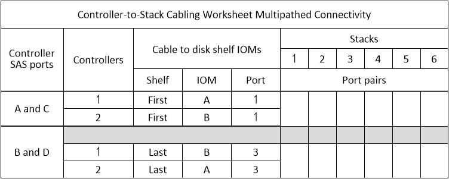
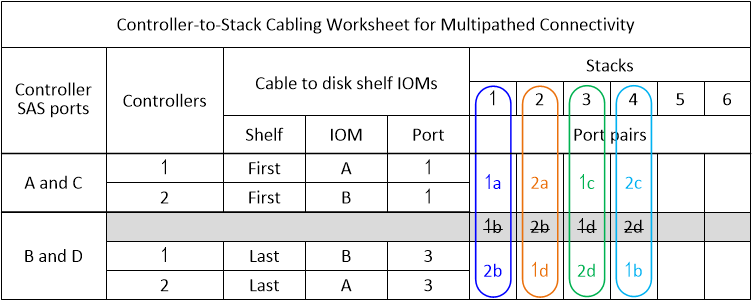
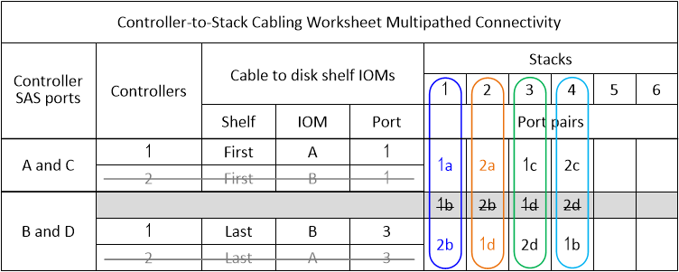

= Controller-to-stack cabling worksheet template for multipathed connectivity - shelves with IOM12/IOM12B modules
:icons: font
:imagesdir: ../media/

[.lead]
By completing the worksheet template, you can define the controller SAS port pairs you can use to cable controllers to stacks of disk shelves with IOM12/IOM12B modules to achieve multipathed connectivity in an HA pair or single-controller configuration. You can also use the completed worksheet to walk yourself through cabling the multipathed connections for your configuration.

.Before you begin

If you have a platform with internal storage, including FAS2600 series, AFF A200, FAS2700 series, AFF A220, and later, use the following (these platforms use a unique worksheet):

link:install-cabling-worksheets-examples-fas2600.html[Controller-to-stack cabling worksheets and cabling examples for platforms with internal storage]

.About this task

* This procedure and worksheet template is applicable to cabling multipathed connectivity for a multipath HA or multipath configuration with one or more stacks.
+
Examples of completed worksheets are provided for multipath HA and multipath configurations.
+
A configuration with two quad-port SAS HBAs and two stacks of disk shelves with IOM12/IOM12B modules is used for the worksheet examples.

* The worksheet template allows for up to six stacks; you need to add more columns if needed.
* If needed, you can refer to the link:install-cabling-rules.html[SAS cabling rules] for information about supported configurations, the controller slot numbering convention, shelf-to-shelf connectivity, and controller-to-shelf connectivity (including use of port pairs).
* If needed, after you complete the worksheet, you can refer to link:install-cabling-worksheets-how-to-read-multipath.html[How to read a worksheet to cable controller-to-stack connections for multipathed connectivity]

.Steps

. In the boxes above the gray boxes, list all SAS A ports on your system, and then all SAS C ports on your system in sequence of slots (0, 1, 2, 3, and so on).
+
For example: 1a, 2a, 1c, 2c

. In the gray boxes, list all SAS B ports on your system, and then all SAS D ports on your system in sequence of slots (0, 1, 2, 3 and so on).
+
For example: 1b, 2b, 1d, 2d

. In the boxes below the gray boxes, rewrite the D and B port list so that the first port in the list is moved to the end of the list.
+
For example: 2b, 1d, 2d, 1b

. Circle (designate) a port pair for each stack.
+
When all port pairs are being used to cable the stacks in your system, circle port pairs in the order in which they are defined (listed) in the worksheet.
+
For example, in a multipath HA configuration with eight SAS ports and four stacks, port pair 1a/2b is cabled to stack 1, port pair 2a/1d is cabled to stack 2, port pair 1c/2d is cabled to stack3, and port pair 2c/1b is cabled to stack 4.
+

+
When not all port pairs are needed to cable the stacks in your system, skip port pairs (use every other port pair).
+
For example, in a multipath HA configuration with eight SAS ports and two stacks, port pair 1a/2b is cabled to stack 1 and port pair 1c/2d is cabled to stack 2. If two additional stacks are hot-added later, port pair 2a/1d is cabled to stack 3 and port pair 2c/1b is cabled to stack 4.
+
NOTE: When you have more port pairs than you need to cable the stacks in your system, the best practice is to skip port pairs to optimize the SAS ports on your system. By optimizing SAS ports, you optimize your system's performance.
+
image::../media/drw_worksheet_mpha_skipped_template.gif[]
+
You can use your completed worksheet to cable your system.

. If you have a single-controller (multipath) configuration, cross out the information for controller 2.
+

+
You can use your completed worksheet to cable your system.
