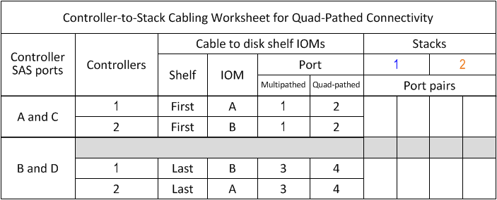
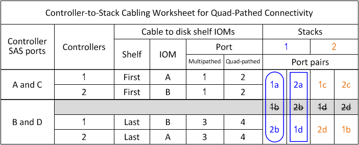
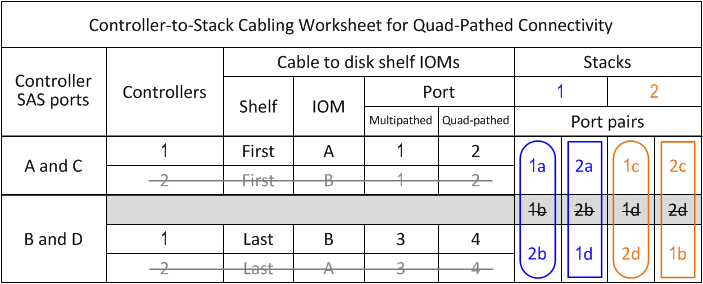

= Controller-to-stack cabling worksheet template for quad-pathed connectivity - shelves with IOM1/IOM12B2 modules
:icons: font
:imagesdir: ../media/

[.lead]
By completing the worksheet template, you can define the controller SAS port pairs you can use to cable controllers to stacks of disk shelves with IOM12/IOM12B modules to achieve quad-pathed connectivity in an HA pair or single-controller configuration. You can also use the completed worksheet to walk yourself through cabling the quad-pathed connections for your configuration.

.About his task

* This procedure and worksheet template is applicable to cabling quad-pathed connectivity for a quad-path HA or quad-path configuration with one or more stacks.
+
Examples of completed worksheets are provided for quad-path HA and quad-path configurations.
+
A configuration with two quad-port SAS HBAs and two stacks of disk shelves with IOM12/IOM12B modules is used for the worksheet examples.

* The worksheet template allows for up to two stacks; you need to add more columns if needed.
* Quad-pathed connectivity for controller-to-stack connections consists of two sets of multipathed cabling: the first set of cabling is referred to as "`multipathed`"; the second set of cabling is referred to as "`quad-pathed`".
+
The second set of cabling is referred to as "`quad-pathed`" because completing this set of cabling gives you the quad-pathed connectivity from a controller to a stack in an HA pair or single-controller configuration.

* Disk shelf IOM ports 1 and 3 are always used for multipathed cabling and IOM ports 2 and 4 are always used for quad-pathed cabling, as designated by the worksheet column headings.
* In the worksheet examples, port pairs are designated for multipathed cabling or quad-pathed cabling to the applicable stack.
+
Each port pair designated for multipathed cabling is encircled by an oval that is the color associated with the stack it is cabled to. Each port pair designated for quad-pathed cabling is encircled by a rectangle that is the color associated with the stack it is cabled to. Stack 1 is associated with the color blue; stack 2 is associated with the color orange.

* If needed, you can refer to link:install-cabling-rules.html[SAS cabling rules] for information about the controller slot numbering convention, shelf-to-shelf connectivity, and controller-to-shelf connectivity (including the use of port pairs).
* If needed, after you complete the worksheet, you can refer to link:install-cabling-worksheets-how-to-read-quadpath.html[How to read a worksheet to cable controller-to-stack connections for quad-pathed connectivity].

.Steps

. In the boxes above the gray boxes, list all SAS A ports on your system, and then all SAS C ports on your system in sequence of slots (0, 1, 2, 3, and so on).
+
For example: 1a, 2a, 1c, 2c

. In the gray boxes, list all SAS B ports on your system, and then all SAS D ports on your system in sequence of slots (0, 1, 2, 3 and so on).
+
For example: 1b, 2b, 1d, 2d

. In the boxes below the gray boxes, rewrite the D and B port list so that the first port in the list is moved to the end of the list.
+
For example: 2b, 1d, 2d, 1b

. Identify the two sets of port pairs to connect to stack 1 by drawing an oval around the first set of port pairs and a rectangle around the second set of port pairs.
+
Both sets of cabling are needed to achieve quad-pathed connectivity from each controller to stack 1 in your HA pair or single-controller configuration.
+
The following example uses port pair 1a/2b for the multipathed cabling and port pair 2a/1d for the quad-pathed cabling to stack 1.
+

. Identify the two sets of port pairs to connect to stack 2 by drawing an oval around the first set of port pairs and a rectangle around the second set of port pairs.
+
Both sets of cabling are needed to achieve quad-pathed connectivity from each controller to stack 1 in your HA pair or single-controller configuration.
+
The following example uses port pair 1c/2d for the multipathed cabling and port pair 2c/1b for the quad-pathed cabling to stack 2.
+
image::../media/drw_worksheet_qpha_slots_1_and_2_two_4porthbas_two_stacks_nau.gif[]

. If you have a quad-path (single-controller) configuration, cross out the information for controller 2; you only need controller 1 information to cable the controller-to-stack connections.
+
The following example shows that the information for controller 2 is crossed out.
+

