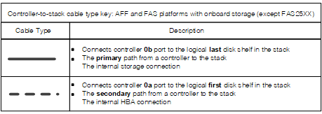
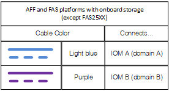
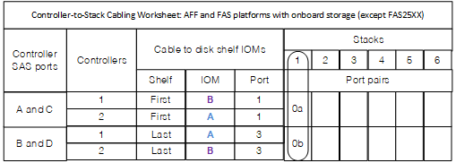
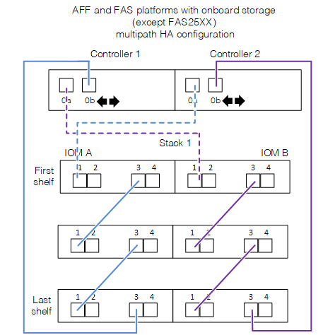
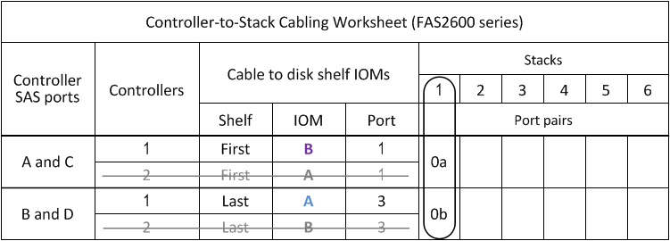
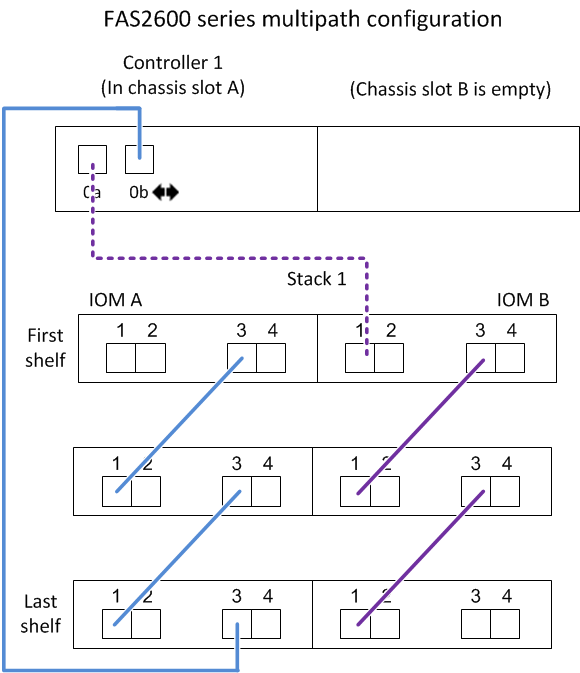
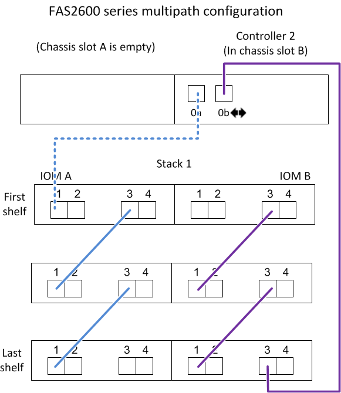

= Controller-to-stack cabling worksheets and cabling examples for AFF and FAS platforms with onboard storage - shelves with IOM12/IOM12B modules
:icons: font
:imagesdir: ../media/

[.lead]
You can use the completed controller-to-stack cabling worksheets and cabling examples to cable AFF and FAS platforms with onboard storage, such as but not limited to AFF A200, AFF A220, FAS2600 series and FAS2700 platforms. This information does not apply to FAS25XX platforms.

* If needed, you can refer to link:install-cabling-rules.html[SAS cabling rules] for information about supported configurations, shelf-to-shelf connectivity, and controller-to-shelf connectivity.
* Cabling examples show controller-to-stack cables as solid or dashed to distinguish controller 0b port connections from controller 0a port connections.
+

* Cabling examples show controller-to-stack connections and shelf-to-shelf connections in two different colors to distinguish connectivity through IOM A (domain A) and IOM B (domain B).
+

== AFF and FAS platforms with onboard storage in a multipath HA configuration with one multi-shelf stack

The following worksheet and cabling example uses port pair 0a/0b:

== FAS2600 series multipath configuration with one multi-shelf stack

The following worksheets and cabling examples use port pair 0a/0b.

In this example, the controller is installed in slot A of the chassis. When a controller is located in slot A of the chassis, its internal storage port (0b) is in domain A (IOM A); therefore, port 0b must connect to domain A (IOM A) in the stack.

In this example, the controller is installed in slot B of the chassis. When a controller is located in slot B of the chassis, its internal storage port (0b) is in domain B (IOM B); therefore, port 0b must connect to domain B (IOM B) in the stack.

image::../media/drw_fas2600_mp_slot_b_worksheet.png[]

