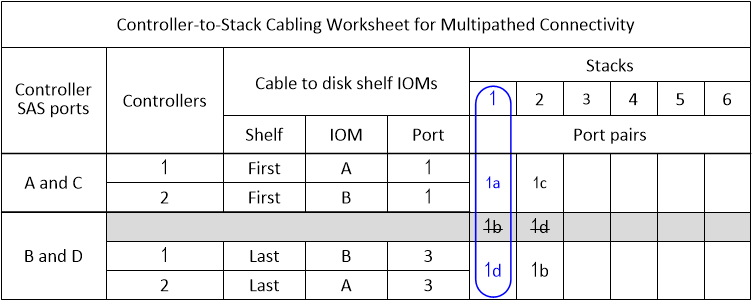
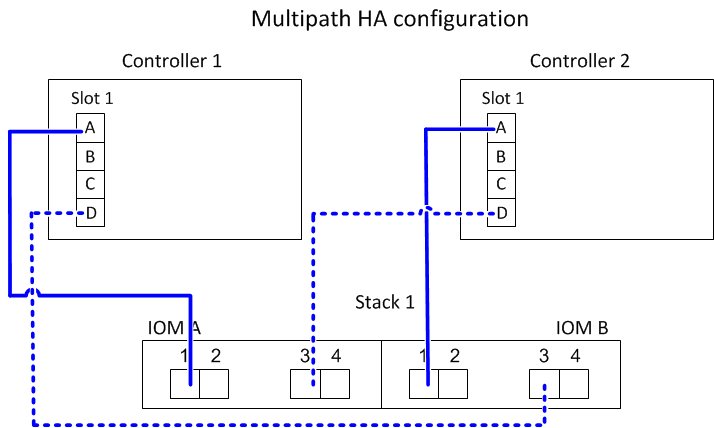
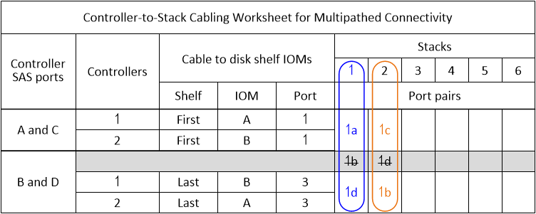
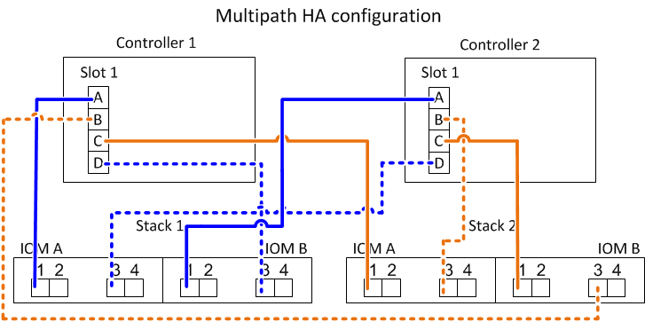
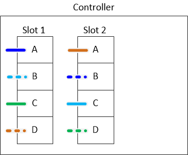
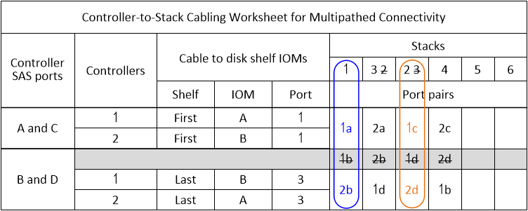
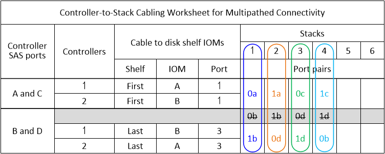
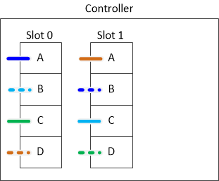
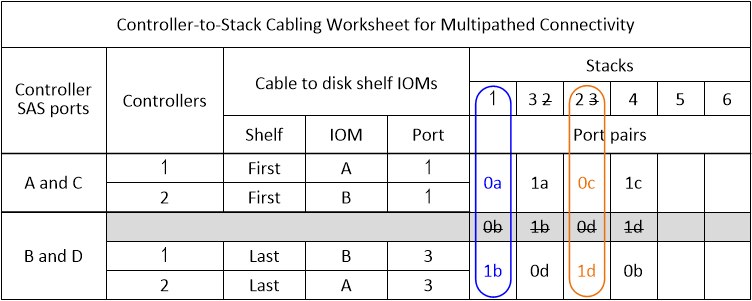
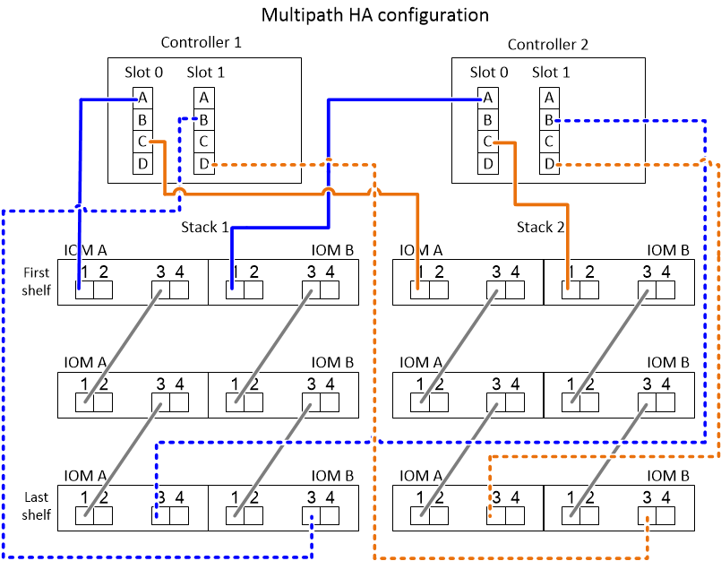

= Controller-to-stack cabling worksheets and cabling examples for common multipath HA configurations - shelves with IOM12/IOM12B modules
:icons: font
:imagesdir: ../media/

[.lead]
You can use the controller-to-stack cabling worksheets and cabling examples to cable your HA pair as a multipath HA configuration.

* If needed, you can refer to link:install-cabling-rules.html[SAS cabling rules] for information about supported configurations, the controller slot numbering convention, shelf-to-shelf connectivity, and controller-to-shelf connectivity (including the use of port pairs).
* If needed, you can refer to link:install-cabling-worksheets-how-to-read-multipath.html[How to read a worksheet to cable controller-to-stack connections for multipathed connectivity].
* Cabling examples show controller-to-stack cables as solid or dashed to distinguish controller A and C port connections from controller B and D port connections.
+
image::../media/drw_controller_to_stack_cable_type_key.gif[]

* Cables in the cabling examples and their corresponding port pairs in the worksheets are color-coded to distinguish connectivity to each stack in the HA pair.
+
image::../media/drw_controller_to_stack_cable_color_key_non2600_4stackcolors.gif[]

* Worksheets and cabling examples show cabling port pairs in the order in which they are listed in the worksheet.

== Controller-to-stack cabling worksheets and cabling examples for multipath HA configurations with quad-port SAS HBAs

[.lead]
You can use the completed controller-to-stack cabling worksheets and cabling examples to cable common multipath HA configurations that have quad-port SAS HBAs. These controllers do not have onboard SAS ports.

=== Multipath HA with one quad-port SAS HBA and one single-shelf stack

The following worksheet and cabling example uses port pair 1a/1d:

=== Multipath HA with one quad-port SAS HBA and two single-shelf stacks

The following worksheet and cabling example uses port pairs 1a/1d and 1c/1b:

=== Multipath HA with two quad-port SAS HBAs and two multi-shelf stacks

Four port pairs are available for this configuration: 1a/2b, 2a/1d, 1c/2d, and 2c/1b. You can cable port pairs in the order in which they are identified (listed in the worksheet) or you can cable every other port pair (skip port pairs).

NOTE: When you have more port pairs than you need to cable the stacks in your system, the best practice is to skip port pairs to optimize the SAS ports on your system. By optimizing SAS ports, you optimize your system's performance.

The following worksheet and cabling example shows port pairs being used in the order in which they are listed in the worksheet: 1a/2b, 2a/1d, 1c/2d, and 2c/1b.

image::../media/drw_worksheet_mpha_slots_1_and_2_two_4porthbas_two_stacks.gif[]

The following worksheet and cabling example shows port pairs being skipped to use every other one in the list: 1a/2b and 1c/2d.

NOTE: If a third stack is added later, you use the port pair that was skipped.

image::../media/drw_mpha_slots_1_and_2_two_4porthbas_two_stacks_skipped.gif[]

== Controller-to-stack cabling worksheets and cabling examples for multipath HA configurations with four onboard SAS ports

[.lead]
You can use the completed controller-to-stack cabling worksheets and cabling examples to cable common multipath HA configurations that have four onboard SAS ports.

=== Multipath HA with four onboard SAS ports and one single-shelf stack

The following worksheet and cabling example uses port pair 0a/0d:

image::../media/drw_mpha_slot_0_4ports_one_singleshelf_stack.gif[]

=== Multipath HA with four onboard SAS ports and two single-shelf stacks

The following worksheet and cabling example uses port pairs 0a/0d and 0c/0b:

=== Multipath HA with four onboard SAS ports, a quad-port SAS HBA, and two multi-shelf stacks

Four port pairs are available for this configuration: 0a/1b, 1a/0d, 0c/1d, and 1c/0b. You can cable port pairs in the order in which they are identified (listed in the worksheet) or you can cable every other port pair (skip port pairs).

NOTE: When you have more port pairs than you need to cable the stacks in your system, the best practice is to skip port pairs to optimize the SAS ports on your system. By optimizing SAS ports, you optimize your system's performance.

The following worksheet and cabling example shows port pairs being used in the order in which they are listed in the worksheet: 0a/1b, 1a/0d, 0c/1d, and 1c/0b.

The following worksheet and cabling example shows port pairs being skipped to use every other one in the list: 0a/1b and 0c/1d.

NOTE: If a third stack is added later, you use the port pair that was skipped.

