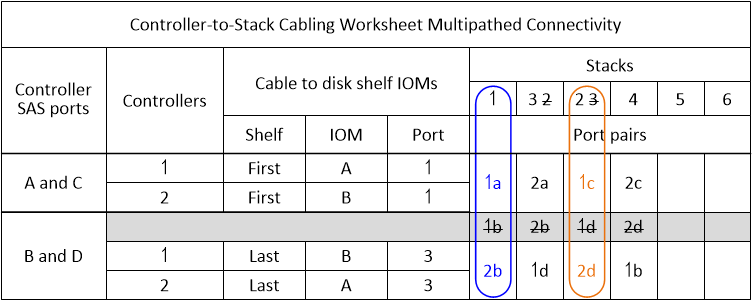
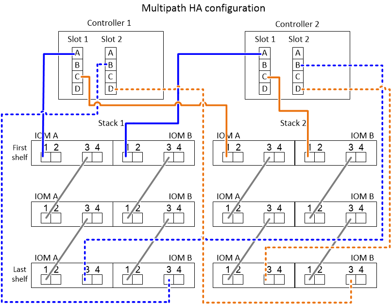

= How to read a worksheet to cable controller-to-stack connections for multipathed connectivity - shelves with IOM12/IOM12B modules
:icons: font
:imagesdir: ../media/

[.lead]
You can use this example to guide you through how to read and apply a completed worksheet to cable controller-to-stack connections for disk shelves with IOM12/IOM12B modules for multipathed connectivity.

.Before you begin

If you have a platform with internal storage, including FAS2600 series, AFF A200, FAS2700 series, AFF A220, and later, use the following (these platforms use a unique worksheet):

link:install-cabling-worksheets-examples-fas2600.html[Controller-to-stack cabling worksheets and cabling examples for platforms with internal storage]

.About this task

* This procedure references the following worksheet and cabling example to demonstrate how to read a worksheet to cable controller-to-stack connections.
+
The configuration used in this example is a multipath HA configuration with two quad-port SAS HBAs (eight SAS ports) on each controller and two stacks of disk shelves with IOM12/IOM12B modules. Port pairs are cabled by skipping every other port pair in the worksheet.
+
NOTE: When you have more port pairs than you need to cable the stacks in your system, the best practice is to skip port pairs to optimize the SAS ports on your system. By optimizing SAS ports, you optimize your system's performance.

* If you have a single-controller configuration, skip substeps b and d for cabling to a second controller.
* If needed, you can refer to link:install-cabling-rules.html[SAS cabling rules] for information about the controller slot numbering convention, shelf-to-shelf connectivity, and controller-to-shelf connectivity (including the use of port pairs).

The port pairs are cabled using every other port pair in the worksheet: 1a/2b and 1c/2d.

.Steps

. Cable port pair 1a/2b on each controller to stack 1:
 .. Cable controller 1 port 1a to stack 1, first shelf IOM A port 1.
 .. Cable controller 2 port 1a to stack 1, first shelf IOM B port 1.
 .. Cable controller 1 port 2b to stack 1, last shelf IOM B port 3.
 .. Cable controller 2 port 2b to stack 1, last shelf IOM A port 3.
. Cable port pair 1c/2d on each controller to stack 2:
 .. Cable controller 1 port 1c to stack 2, first shelf IOM A port 1.
 .. Cable controller 2 port 1c to stack 2, first shelf IOM B port 1.
 .. Cable controller 1 port 2d to stack 2, last shelf IOM B port 3.
 .. Cable controller 2 port 2d to stack 2, last shelf IOM A port 3.
