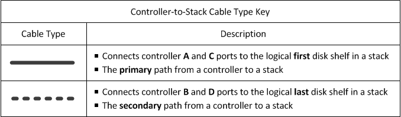
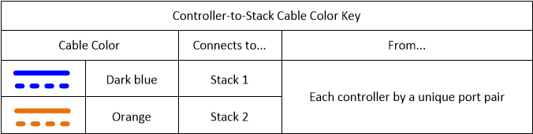
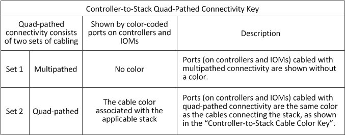
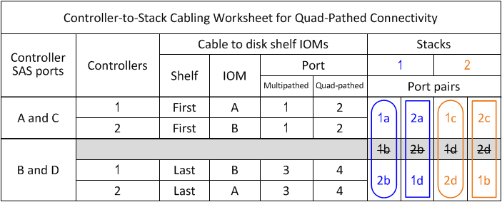
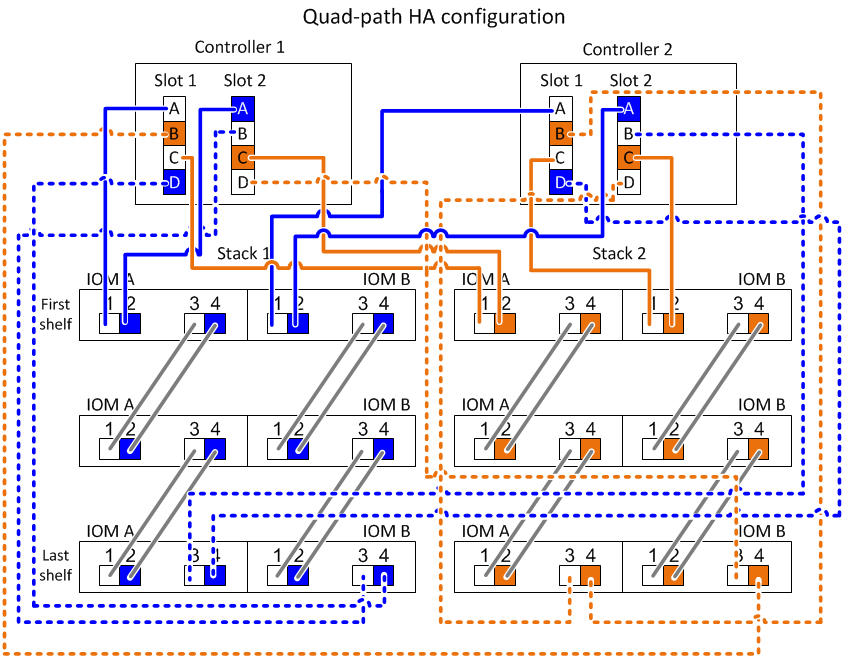

= Controller-to-stack cabling worksheet and cabling example for a quad-path HA configuration with two quad-port SAS HBAs - shelves with IOM12/IOM12B modules
:icons: font
:imagesdir: ../media/

[.lead]
You can use the completed controller-to-stack cabling worksheet and cabling example to cable a quad-path HA configuration that has two quad-port SAS HBAs.

* If needed, you can refer to link:install-cabling-rules.html[SAS cabling rules] for information about supported configurations, the controller slot numbering convention, shelf-to-shelf connectivity, and controller-to-shelf connectivity (including the use of port pairs).
* If needed, you can refer to link:install-cabling-worksheets-how-to-read-quadpath.html[How to read a worksheet to cable controller-to-stack connections for quad-pathed connectivity].
* The cabling example shows controller-to-stack cables as solid or dashed to distinguish controller A and C port connections from controller B and D port connections.
+

* Cables in the cabling examples and their corresponding port pairs in the worksheets are color-coded to distinguish connectivity to each stack in the HA pair.
+

* The cabling example visually distinguishes the two sets of multipathed cabling needed to achieve quad-pathed connectivity for each controller to each stack in an HA pair or single-controller configuration.
+
The first set of multipathed cabling is referred to as "`multipathed`". The second set of multipathed cabling is referred to as "`quad-pathed`". The second set of cabling is referred to as "`quad-pathed`" because completing this set of cabling gives you the quad-pathed connectivity.
+

* The worksheet example shows port pairs designated for multipathed cabling or quad-pathed cabling to the applicable stack.
+
Each port pair designated for multipathed cabling is encircled by an oval that is the color associated with the stack it is cabled to. Each port pair designated for quad-pathed cabling is encircled by a rectangle that is the color associated with the stack it is cabled to.

== Quad-path HA with two quad-port SAS HBAs and two multi-shelf stacks

The following worksheet and cabling example uses port pairs 1a/2b (multipathed) and 2a/1d (quad-pathed) for stack 1, and port pairs 1c/2d (multipathed) and 2c/1b (quad-pathed) for stack2.

