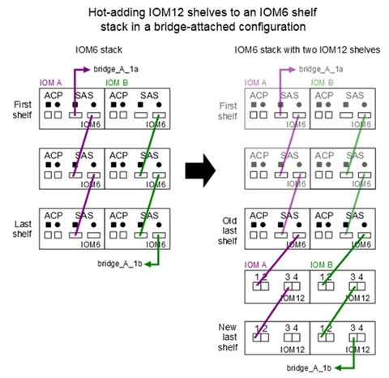

= Hot-add IOM12/IOM12B shelves to a stack of IOM6 shelves
:icons: font
:imagesdir: ../media/

[.lead]
When additional storage is needed, you can hot-add IOM12/IOM12B shelves (SAS shelves with IOM12/IOM12B modules) to a stack of IOM6 shelves (SAS shelves with IOM6 modules), meaning you can mix a stack.

== Requirements for a hot-add

[.lead]
Your HA pair, single-controller or stretch MetroCluster configuration (system) must meet certain requirements before hot-adding IOM12/IOM12B shelves to a stack of IOM6 shelves.

NOTE: For bridge-attached MetroCluster configurations, see <<Requirements for a hot-add in bridge-attached MetroCluster configurations>>.

* Your system and version of ONTAP must support a mix of IOM6 shelves and IOM12/IOM12B shelves in the same stack (a mixed stack).
+
You can verify support by using one of the following methods:

 ** Enter the ``run local sysconfig`` command, at the admin prompt of either controller.
+
If the SAS2/SAS3 Mixed Stack Support field does not appear in the output or has a value of none, then your system does not support mixed stacks.
+
If anything else appears in the SAS2/SAS3 Mixed Stack Support field, such as all or bridge-attached, then your system does support mixed stacks.

 ** Go to Hardware Universe and navigate to your platform information.
+
https://hwu.netapp.com[NetApp Hardware Universe]

* If you are adding a shelf to a MetroCluster configuration, the configuration must meet all requirements in the MetroCluster Installation and Configuration Guides.
+
http://docs.netapp.com/ontap-9/topic/com.netapp.doc.dot-mcc-inst-cnfg-ip/home.html[MetroCluster IP Installation and Configuration Guide]
+
http://docs.netapp.com/ontap-9/topic/com.netapp.doc.dot-mcc-inst-cnfg-stretch/home.html[ONTAP 9 Stretch MetroCluster Installation and Configuration Guide]
+
http://docs.netapp.com/ontap-9/topic/com.netapp.doc.dot-mcc-inst-cnfg-fabric/home.html[ONTAP 9 Fabric-attached MetroCluster Installation and Configuration Guide]

* The stack of IOM6 shelves, to which you are hot-adding an IOM12 shelf, must be cabled with SAS copper cables (for all shelf-to-shelf and controller-to-stack connections).
+
SAS optical cables are not supported in a mixed stack.
+
NOTE: If the IOM6 shelf stack is cabled with any SAS optical cables, you cannot hot-add an IOM12 shelf. Contact your NetApp sales representative.

* Your system must have less than the maximum number of drives supported, by at least the number of drives capable of being installed in the IOM12 shelves you are hot-adding.
+
You cannot have exceeded the maximum number of drives supported for your system after hot-adding IOM12/IOM12B shelves.
+
https://hwu.netapp.com[NetApp Hardware Universe]

* Your system cannot have any SAS cabling error messages.
+
You must correct any cabling errors using the corrective actions provided by the error messages.
+
https://mysupport.netapp.com/site/tools/tool-eula/activeiq-configadvisor[NetApp Downloads: Config Advisor]

* You must have ordered and received the IOM12/IOM12B shelves and appropriate number and types of SAS copper cables.
+
IOM12 shelves use mini-SAS HD connectors. IOM6 shelves use QSFP connectors.

== Requirements for a hot-add in bridge-attached MetroCluster configurations

[.lead]
If you are hot-adding IOM12/IOM12B shelves to a stack of IOM6 shelves that is attached using a pair of ATTO FibreBridge bridges in a MetroCluster configuration, the system must meet certain requirements.

* If bridge SAS ports are available in the current configuration, you should add the IOM12 shelves as a separate stack.
+
Use all bridge ports before mixing IOM12/IOM12B and IOM6 modules in a stack.

* Your system and version of ONTAP must support a mix of IOM6 shelves and IOM12/IOM12B shelves in the same stack (a mixed stack).
+
You can verify support by using one of the following methods:

 ** Enter the ``run local sysconfig`` command at the admin prompt of either controller.
+
If the SAS2/SAS3 Mixed Stack Support field does not appear in the output or has a value of none, then your system does not support mixed stacks.
+
If anything else appears in the SAS2/SAS3 Mixed Stack Support field, such as all or bridge-attached, then your system does support mixed stacks.

 ** Go to Hardware Universe and navigate to your platform information.
+
https://hwu.netapp.com[NetApp Hardware Universe]

* The configuration must meet all requirements in the MetroCluster Installation and Configuration Guides.
+
https://docs.netapp.com/us-en/ontap-metrocluster/install-stretch/index.html[Installing and Configuring a Stretch MetroCluster Configuration]
+
https://docs.netapp.com/us-en/ontap-metrocluster/install-fc/index.html[Installing and Configuring a fabric-attached MetroCluster Configuration]

* The stack of IOM6 shelves, to which you are hot-adding an IOM12/IOM12B shelf, must be cabled with SAS copper cables (for all shelf-to-shelf and controller-to-stack connections).
+
SAS optical cables are not supported in a mixed stack.
+
NOTE: If the IOM6 shelf stack is cabled with any SAS optical cables, you cannot hot-add an IOM12/IOM12B shelf. Contact your NetApp sales representative.

* Your configuration must have less than the maximum number of drives supported for a bridge port.
* You must have ordered and received the IOM12/IOM12B shelves and appropriate number and types of SAS copper cables.
+
IOM12/IOM12B shelves use mini-SAS HD connectors. IOM6 shelves use QSFP connectors.

* The bridge must be running firmware version 3.16/4.16 and later.

== Considerations for a hot-add

[.lead]
You should familiarize yourself with aspects and best practices about this procedure before hot-adding IOM12/IOM12B shelves to a stack of IOM6 shelves.

=== General considerations

* It is highly recommended that the IOM12/IOM12B shelves you are hot-adding are running firmware version 0260 or later, before you cable them to your system.
+
Having a supported version of shelf firmware protects against storage stack access issues if you cabled the hot-added shelf to the stack incorrectly.
+
After you download the IOM12/IOM12B shelf firmware to your shelves, verify the firmware version is 0260 or later by entering the `storage shelf show -module` command at the console of either controller.

* Nondisruptive stack consolidation is not supported.
+
You cannot use this procedure to hot-add disk shelves that were hot-removed from another stack in the same system when the system is powered on and serving data (I/O is in progress).

* You can use this procedure to hot-add disk shelves that were hot-removed within the same MetroCluster system if the affected shelf has mirrored aggregates.
* When you hot-add shelves with IOM12 modules to a stack of shelves with IOM6 modules, the performance of the entire stack operates at 6 Gbps (runs at the lowest common speed).
+
If the shelves you are hot-adding are shelves that have been upgraded from IOM3 or IOM6 modules to IOM12 modules, the stack operates at 12 Gbps; however, the shelf backplane and disk capabilities can limit disk performance to 3 Gbps or 6 Gbps.
* After you have cabled a hot-added shelf, ONTAP recognizes the shelf:
 ** Drive ownership is assigned if automatic drive assignment is enabled.
 ** Shelf (IOM) firmware and drive firmware should be updated automatically, if needed.
+
NOTE: Firmware updates can take up to 30 minutes.

=== Best practice considerations

* *Best practice:* The best practice is to have current versions of shelf (IOM) firmware and drive firmware on your system before hot-adding a shelf.
+
https://mysupport.netapp.com/site/downloads/firmware/disk-shelf-firmware[NetApp Downloads: Disk Shelf Firmware]
+
https://mysupport.netapp.com/site/downloads/firmware/disk-drive-firmware[NetApp Downloads: Disk Drive Firmware]

NOTE: Do not revert firmware to a version that does not support your shelf and its components.

* *Best practice:* The best practice is to have the current version of the Disk Qualification Package (DQP) installed before hot-adding a shelf.
+
Having the current version of the DQP installed allows your system to recognize and use newly qualified drives. This avoids system event messages about having noncurrent drive information and prevention of drive partitioning because drives are not recognized. The DQP also notifies you of noncurrent drive firmware.
+
//30 aug 2022, BURT 1491809: correct the DQP link
https://mysupport.netapp.com/site/downloads/firmware/disk-drive-firmware/download/DISKQUAL/ALL/qual_devices.zip[NetApp Downloads: Disk Qualification Package^]

* *Best practice:* The best practice is to run Active IQ Config Advisor before and after hot-adding a shelf.
+
Running Active IQ Config Advisor before hot-adding a shelf provides a snapshot of the existing SAS connectivity, verifies shelf (IOM) firmware versions, and allows you to verify a shelf ID already in use on your system. Running Active IQ Config Advisor after hot-adding a shelf allows you to verify shelves are cabled correctly and that shelf IDs are unique within your system.
+
https://mysupport.netapp.com/site/tools/tool-eula/activeiq-configadvisor[NetApp Downloads: Config Advisor]

* *Best practice:* The best practice is to have in-band ACP (IBACP) running on your system.
 ** For systems in which IBAP is running, IBACP is automatically enabled on hot-added IOM12 shelves.
 ** For systems in which out-of-band ACP is enabled, ACP capabilities are not available on IOM12 shelves.
+
You should migrate to IBACP and remove the out-of-band ACP cabling.

 ** If your system is not running IBACP, and your system meets the requirements for IBACP, you can migrate your system to IBACP before hot-adding an IOM12 shelf.
+
https://kb.netapp.com/Advice_and_Troubleshooting/Data_Storage_Systems/FAS_Systems/In-Band_ACP_Setup_and_Support[Instructions for migrating to IBACP]
+
NOTE: The migration instructions provide the system requirements for IBACP.

== Prepare to manually assign drive ownership for a hot-add

[.lead]
If you are manually assigning drive ownership for the IOM12 shelves you are hot-adding, then you need to disable automatic drive assignment if it is enabled.

.Before you begin

You must have met the system requirements.

<<Requirements for a hot-add>>

<<Requirements for a hot-add in bridge-attached MetroCluster configurations>>

.About this task

If you have an HA pair, you need to manually assign drive ownership if drives in the shelf will be owned by both controller modules.

.Steps

. Verify whether automatic drive assignment is enabled: `storage disk option show`
+
If you have an HA pair, you can enter the command on either controller module.
+
If automatic drive assignment is enabled, the output shows `on` in the "`Auto Assign`" column (for each controller module).

. If automatic drive assignment is enabled, disable it: `storage disk option modify -node _node_name_ -autoassign off`
+
If you have an HA pair or two-node MetroCluster configuration, you must disable automatic drive assignment on both controller modules.

== Install shelves for a hot-add

[.lead]
For each shelf you are hot-adding, you install the shelf into a rack, connect the power cords, power on the shelf, and set the shelf ID.

. Install the rack mount kit (for two-post or four-post rack installations) that came with your disk shelf using the installation flyer that came with the kit.
+
[NOTE]
====
If you are installing multiple disk shelves, you should install them from the bottom to the top of the rack for the best stability.
====
+
[CAUTION]
====
Do not flange-mount the disk shelf into a telco-type rack; the disk shelf's weight can cause it to collapse in the rack under its own weight.
====

. Install and secure the disk shelf onto the support brackets and rack using the installation flyer that came with the kit.
+
To make a disk shelf lighter and easier to maneuver, remove the power supplies and I/O modules (IOMs).
+
For DS460C disk shelves, although the drives are packaged separately, which makes the shelf lighter, an empty DS460C shelf still weighs approximately 132 lb (60kg); therefore, exercise the following caution when moving a shelf.
+
CAUTION: It is recommended that you use a mechanized lift or four people using the lift handles to safely move an empty DS460C shelf.
+
Your DS460C shipment was packaged with four detachable lift handles (two for each side). To use the lift handles, you install them by inserting the tabs of the handles into the slots in the side of the shelf and pushing up until they click into place. Then, as you slide the disk shelf onto the rails, you detach one set of handles at a time using the thumb latch. The following illustration shows how to attach a lift handle.
+
image::../media/drw_ds460c_handles.gif[]

. Reinstall any power supplies and IOMs you removed prior to installing your disk shelf into the rack.
. If you are installing a DS460C disk shelf, install the drives into the drive drawers; otherwise, go to the next step.
+
[NOTE]
====
Always wear an ESD wrist strap grounded to an unpainted surface on your storage enclosure chassis to prevent static discharges.

If a wrist strap is unavailable, touch an unpainted surface on your storage enclosure chassis before handling the disk drive.
====
+
If you purchased a partially populated shelf, meaning that the shelf has less than the 60 drives it supports, for each drawer, install the drives as follows:

** Install the first four drives into the front slots (0, 3, 6, and 9).
+
NOTE: *Risk of equipment malfunction:* To allow for proper air flow and prevent overheating, always install the first four drives into the front slots (0, 3, 6, and 9).

** For the remaining drives, evenly distribute them across each drawer.

The following illustration shows how the drives are numbered from 0 to 11 in each drive drawer within the shelf.

image::../media/dwg_trafford_drawer_with_hdds_callouts.gif[]

.. Open the top drawer of the shelf.
.. Remove a drive from its ESD bag.
.. Raise the cam handle on the drive to vertical.
.. Align the two raised buttons on each side of the drive carrier with the matching gap in the drive channel on the drive drawer.
+
image::../media/28_dwg_e2860_de460c_drive_cru.gif[]
+
[cols="10,90"]
|===
image:../media/legend_icon_01.png[]|
Raised button on the right side of the drive carrier
|===

.. Lower the drive straight down, and then rotate the cam handle down until the drive snaps into place under the orange release latch.
+
.. Repeat the previous substeps for each drive in the drawer.
+
You must be sure that slots 0, 3, 6, and 9 in each drawer contain drives.
+
.. Carefully push the drive drawer back into the enclosure.
+
|===
a|
image:../media/2860_dwg_e2860_de460c_gentle_close.gif[]
a|
CAUTION: *Possible loss of data access:* Never slam the drawer shut. Push the drawer in slowly to avoid jarring the drawer and causing damage to the storage array.
|===

.. Close the drive drawer by pushing both levers towards the center.
.. Repeat these steps for each drawer in the disk shelf.
.. Attach the front bezel.
. If you are adding multiple disk shelves, repeat the previous steps for each disk shelf you are installing.
. Connect the power supplies for each disk shelf:
.. Connect the power cords first to the disk shelves, securing them in place with the power cord retainer, and then connect the power cords to different power sources for resiliency.
.. Turn on the power supplies for each disk shelf and wait for the disk drives to spin up.
. Set the shelf ID for each shelf you are hot-adding to an ID that is unique within the HA pair or single-controller configuration.
+
A valid shelf ID is 00 through 99. It is recommended that you set the shelf IDs so that IOM6 shelves use lower numbers (1 - 9) and IOM12 shelves use higher numbers (10 and greater).
+
If you have a platform model with onboard storage, shelf IDs must be unique across the internal shelf and externally attached shelves. It is recommended that you set the internal shelf to 0. In MetroCluster IP configurations, only the external shelf names apply, and therefore the shelf names do not need to be unique.

.. If needed, verify shelf IDs already in use by running Active IQ Config Advisor.
+
https://mysupport.netapp.com/site/tools/tool-eula/activeiq-configadvisor[NetApp Downloads: Config Advisor]
+
You can also run the `storage shelf show -fields shelf-id` command to see a list of shelf IDs already in use (and duplicates if present) in your system.

.. Access the shelf ID button behind the left end cap.
.. Change the first number of the shelf ID by pressing and holding the orange button until the first number on the digital display blinks, which can take up to three seconds.
.. Press the button to advance the number until you reach the desired number.
.. Repeat substeps c and d for the second number.
.. Exit the programming mode by pressing and holding the button until the second number stops blinking, which can take up to three seconds.
.. Power cycle the shelf to make the shelf ID take effect.
+
You must turn off both power switches, wait 10 seconds, and then turn them back on to complete the power cycle.

.. Repeat substeps b through g for each shelf you are hot-adding.

== Cable shelves for a hot-add

[.lead]
How you cable an IOM12/IOM12B shelf to a stack of IOM6 shelves depends on whether the IOM12 shelf is the initial IOM12/IOM12B shelf, meaning no other IOM12 shelf exists in the stack, or whether it is an additional IOM12/IOM12B shelf to an existing mixed stack, meaning one or more IOM12/IOM12B shelves already exists in the stack. It also depends on whether the stack has multipath HA, multipath, single-path HA, or single-path connectivity.

.Before you begin

* You must have met the system requirements.
+
<<Requirements for a hot-add>>

* You must have completed the preparation procedure, if applicable.
+
<<Prepare to manually assign drive ownership for a hot-add>>

* You must have installed the shelves, powered them on, and set the shelf IDs.
+
<<Install shelves for a hot-add>>

.About this task

* You always hot-add IOM12/IOM12B shelves to the logical last shelf in a stack to maintain a single speed transition within the stack.
+
By hot-adding IOM12/IOM12B shelves to the logical last shelf in a stack, the IOM6 shelves remain grouped together and the IOM12/IOM12B shelves remain grouped together so that there is a single speed transition between the two groups of shelves.
+
For example:
+
** In an HA pair, a single speed transition within a stack having two IOM6 shelves and two IOM12/IOM12B shelves is depicted as:
+
 Controller <-> IOM6 <-> IOM6 <---> IOM12IOM12B <-> IOM12/IOM12B <-> Controller
+
** In an HA pair with onboard IOM12E storage, a single speed transition within a stack having two IOM12 shelves and two IOM6 shelves is depicted as:
+
 IOM12E 0b <-> IOM12/IOM12B <-> IOM12/IOM12B <---> IOM6 <-> IOM6 <-> IOM12E 0a
+
The onboard storage port 0b is the port from the internal storage (expander) and because it connects to the hot-added IOM12/IOM12B shelf (the last shelf in the stack), the group of IOM12/IOM12B shelves is kept together and a single transition is maintained through the stack and onboard IOM12E storage.
+
* Only a single speed transition is supported in a mixed stack. You cannot have additional speed transitions. For example, you cannot have two speed transitions within a stack, which is depicted as:
+
 Controller <-> IOM6 <-> IOM6 <---> IOM12/IOM12B <-> IOM12/IOM12B <---> IOM6 <-> Controller
+
* You can hot-add IOM6 shelves to a mixed stack. However, you must hot-add them to the side of the stack with the IOM6 shelves (existing group of IOM6 shelves) in order to maintain the single speed transition in the stack.
+
* You cable IOM12/IOM12B shelves by connecting the SAS ports on the IOM A path first, and then repeat the cabling steps for the IOM B path, as applicable to your stack connectivity.
+
NOTE: In a MetroCluster configuration, you cannot use the IOM B path.

* The initial IOM12/IOM12B shelf (the shelf connecting to the logical last IOM6 shelf) always connects to the IOM6 shelf circle ports (not square ports).
* The SAS cable connectors are keyed; when oriented correctly into a SAS port, the connector clicks into place.
+
For shelves, you insert a SAS cable connector with the pull tab oriented down (on the underside of the connector). For controllers, the orientation of SAS ports can vary depending on the platform model; therefore, the correct orientation of the SAS cable connector varies.

* You can reference the following illustration for cabling IOM12/IOM12B shelves to an IOM6 shelf stack in a configuration that is not using FC-to-SAS bridges.
+
This illustration is specific to a stack with multipath HA connectivity; however, the cabling concept can be applied to stacks with multipath, single-path HA, single-path connectivity, and stretch MetroCluster configurations.
+
image::../media/drw_sas2_sas3_mixed_stack.png[]

* You can reference the following illustration for cabling IOM12/IOM12B shelves to an IOM6 shelf stack in a bridge-attached MetroCluster configuration. 

.Steps

. Physically identify the logical last shelf in the stack.
+
Depending on your platform model and stack connectivity (multipath HA, multipath, single-path HA, or single-path), the logical last shelf is the shelf having controller-to-stack connections from controller SAS ports B and D, or it is the shelf having no connections to any controllers (because the controller-to-stack connectivity is to the logical top of the stack, through the controller SAS ports A and C).

. If the IOM12/IOM12B shelf you are hot-adding is the initial IOM12/IOM12B shelf being added to the IOM6 stack, meaning no other IOM12/IOM12B shelf exists in the IOM6 shelf stack, complete the applicable substeps.
+
NOTE: Make sure that you wait at least 70 seconds between disconnecting a cable and reconnecting it, and when you are replacing a cable for another one.
+
Otherwise, go to step 3.
+
[cols="2*",options="header"]
|===
| If your IOM6 stack connectivity is...| Then...
a|
Multipath HA or multipath, or single-path HA with controller connectivity to the logical last shelf (including stretch MetroCluster configurations)
a|

 .. Disconnect the controller-to-stack cable from the last IOM6 shelf IOM A circle port to the controller or bridge.
+
Make note of the controller port.
+
Put the cable aside. It is no longer needed.
+
Otherwise; go to substep e.

 .. Cable the shelf-to-shelf connection between the last IOM6 shelf IOM A circle port (from substep a) to the new IOM12/IOM12B shelf IOM A port 1.
+
Use a SAS copper QSFP-to-Mini-SAS HD cable.

 .. If you are hot-adding another IOM12/IOM12B shelf, cable the shelf-to-shelf connection between the IOM12/IOM12B shelf IOM A port 3, of the shelf you just cabled, and the next IOM12/IOM12B shelf IOM A port 1.
+
Use a SAS copper Mini-SAS HD-to-Mini-SAS HD cable.
+
Otherwise, go to the next substep.

 .. Reestablish the controller-to-stack connection by cabling the same port on the controller or bridge (in substep a) to the new last IOM12 shelf IOM A port 3.
+
Use a SAS copper QSFP-to-Mini-SAS HD cable or Mini-SAS HD-to-Mini-SAS HD cable, as appropriate for the port type on the controller.

 .. Repeat substeps a through d for IOM B.
+
Otherwise, go to step 4.

a|
Bridge-attached connectivity in a MetroCluster configuration
a|

 .. Disconnect the bottom bridge-to-stack cable from the last IOM6 shelf IOM A circle port to the bridge.
+
Make note of the bridge port.
+
Put the cable aside. It is no longer needed.
+
Otherwise; go to substep e.

 .. Cable the shelf-to-shelf connection between the last IOM6 shelf IOM A circle port (from substep a) to the new IOM12 shelf IOM A port 1.
+
Use a SAS copper QSFP-to-Mini-SAS HD cable.

 .. If you are hot-adding another IOM12/IOM12B shelf, cable the shelf-to-shelf connection between the IOM12/IOM12B shelf IOM A port 3, of the shelf you just cabled, and the next IOM12/IOM12B shelf IOM A port 1.
+
Use a SAS copper Mini-SAS HD-to-Mini-SAS HD cable.
+
Otherwise, go to the next substep.

 .. Repeat substeps b and c to cable the shelf-to-shelf connections for IOM B.
 .. Reestablish the bottom bridge-to-stack connection by cabling the same port on the bridge (in substep a) to the new last IOM12 shelf IOM A port 3.
+
Use a SAS copper QSFP-to-Mini-SAS HD cable or Mini-SAS HD-to-Mini-SAS HD cable, as appropriate for the port type on the controller.

 .. Go to step 4.

a|
Single-path HA or single-path with no controller connectivity to the logical last shelf
a|

 .. Cable the shelf-to-shelf connection between the last IOM6 shelf IOM A circle port and the new IOM12/IOM12B shelf IOM A port 1.
+
Use a SAS copper QSFP-to-Mini-SAS HD cable.

 .. Repeat the above substep for IOM B.
 .. If you are hot-adding another IOM12/IOM12B shelf, repeat substeps a and b.
+
Otherwise, go to step 4.

+
|===

. If the IOM12/IOM12B shelf you are hot-adding is an additional IOM12/IOM12B shelf to an existing mixed stack, meaning one or more IOM12/IOM12B shelves already exists in the stack, complete the applicable substeps.
+
NOTE: Make sure that you wait at least 70 seconds between disconnecting a cable and reconnecting it, and if you are replacing a cable for a longer one.
+
[cols="2*",options="header"]
|===
| If your mixed stack connectivity is...| Then...
a|
Multipath HA or multipath, or single-path HA with controller connectivity to the logical last shelf, or bridge-attached connectivity in a MetroCluster configuration
a|

 .. Move the controller-to-stack cable from the last IOM12/IOM12B shelf IOM A port 3 to the same port on the new last IOM12/IOM12B shelf.
 .. If you are hot-adding one IOM12/IOM12B shelf, cable the shelf-to-shelf connection between the old last IOM12/IOM12B shelf IOM A port 3 to the new last IOM12/IOM12B shelf IOM A port 1.
+
Use a SAS copper Mini-SAS HD-to-Mini-SAS HD cable.
+
Otherwise, go to the next substep.

 .. If you are hot-adding more than one IOM12/IOM12B shelf, cable the shelf-to-shelf connection between the old last IOM12/IOM12B shelf IOM A port 3 and the next IOM12/IOM12B shelf IOM A port 1, and then repeat this for any additional IOM12/IOM12B shelves.
+
Use additional SAS copper Mini-SAS HD-to-Mini-SAS HD cables.
+
Otherwise, go to the next substep.

 .. Repeat substeps a through c for IOM B.
+
Otherwise, go to step 4.

a|
Bridge-attached connectivity in a MetroCluster configuration
a|

 .. Move the bottom bridge-to-stack cable from the old last IOM12/IOM12B shelf to the same port on the new last IOM12/IOM12B shelf.
 .. Cable the shelf-to-shelf connection between the old last IOM12/IOM12B shelf IOM A port 3 and the next IOM12/IOM12B shelf IOM A port 1, and then repeat this for any additional IOM12/IOM12B shelves.
+
Use a SAS copper Mini-SAS HD-to-Mini-SAS HD cable.

 .. Cable the shelf-to-shelf connection between the old last IOM12/IOM12B shelf IOM B port 3 and the next IOM12/IOM12B shelf IOM B port 1, and then repeat this for any additional IOM12/IOM12B shelves.
 .. Go to step 4.

a|
Single-path HA or single-path with no controller connectivity to the logical last shelf
a|

 .. Cable the shelf-to-shelf connection between the last IOM12/IOM12B shelf IOM A port 3 and the new last IOM12/IOM12B shelf IOM A port 1.
+
Use a SAS copper Mini-SAS HD-to-Mini-SAS HD cable.

 .. Repeat the above substep for IOM B.
 .. If you are hot-adding another IOM12/IOM12B shelf, repeat substeps a and b.
+
Otherwise, go to step 4.

+
|===

. Verify that the SAS connections are cabled correctly.
+
If any cabling errors are generated, follow the corrective actions provided.
+
https://mysupport.netapp.com/site/tools/tool-eula/activeiq-configadvisor[NetApp Downloads: Config Advisor]

. If you disabled automatic drive assignment as part of the preparation for this procedure, you need to manually assign drive ownership and then re-enable automatic drive assignment, if needed.
+
Otherwise, you are done with this procedure.
+
<<Complete the hot-add>>
+
NOTE: All MetroCluster configurations require manual drive assignment.

== Complete the hot-add

[.lead]
If you disabled automatic drive assignment as part of the preparation for hot-adding the IOM12/IOM12B shelves to the stack of IOM6 shelves, you need to manually assign drive ownership and then reenable automatic drive assignment if needed.

.Before you begin

You must have already cabled your shelf as instructed for your system.

<<Cable shelves for a hot-add>>

.Steps

. Display all unowned drives: `storage disk show -container-type unassigned`
+
If you have an HA pair, you can enter the command on either controller module.

. Assign each drive: `storage disk assign -disk _disk_name_ -owner _owner_name_`
+
If you have an HA pair, you can enter the command on either controller module.
+
You can use the wild card character to assign more than one drive at once.

. Reenable automatic drive assignment if needed: `storage disk option modify -node _node_name_ -autoassign on`
+
If you have an HA pair, you must reenable automatic drive assignment on both controller modules.
