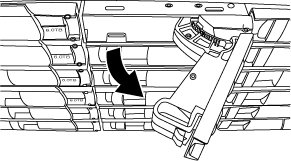
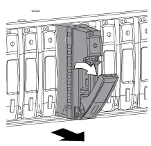

= Hot-swap a disk drive in a DS224C or DS212C disk shelf - shelves with IOM12/IOM12B modules
:icons: font
:imagesdir: ../media/

[.lead]
You can hot-swap a failed disk drive in a DS224C or DS212C disk shelf.

.Before you begin

* The disk drive that you are installing must be supported by the DS224C or DS212C disk shelf.
+
https://hwu.netapp.com[NetApp Hardware Universe]

* All other components in the system must be functioning properly; if not, contact technical support.
* The disk drive you are removing must be failed.
+
You can verify the disk drive is failed by running the `storage disk show -broken` command. The failed disk drive appears in the list of failed disk drives. If it does not, you should wait, and run the command again.
+
NOTE: Depending on the disk drive type and capacity, it can take up to several hours for the disk drive to appear in the list of failed disk drives.

* If you are replacing a self-encrypting disk (SED), you must follow the instructions for Replacing an SED in the ONTAP documentation for your version of ONTAP.
+
Instructions in the ONTAP documentation describe additional steps you must perform before and after replacing an SED.
+
https://docs.netapp.com/us-en/ontap/encryption-at-rest/index.html[NetApp encryption overview with the CLI]

.About this task

* You should take steps to avoid electrostatic discharge (ESD):
 ** Keep the disk drive in the ESD bag until you are ready to install it.
 ** Open the ESD bag by hand or cut the top off with a pair of scissors.
+
NOTE: Do not insert a metal tool or knife into the ESD bag.

 ** Always wear an ESD wrist strap grounded to an unpainted surface on your storage enclosure chassis.
+
If a wrist strap is unavailable, touch an unpainted surface on your storage enclosure chassis before handling the disk drive.
* You should take steps to handle disk drives carefully:
 ** Always use two hands when removing, installing, or carrying a disk drive to support its weight.
+
NOTE: Do not place hands on the disk drive boards exposed on the underside of the disk drive carrier.

 ** You should place disk drives on cushioned surfaces, and never stack disk drives on top of each other.
 ** You should be careful not to bump disk drives against other surfaces.
* Disk drives should be kept away from magnetic devices.
+
NOTE: Magnetic fields can destroy all data on the disk drive and cause irreparable damage to the disk drive circuitry.

* The best practice is to have the current version of the Disk Qualification Package (DQP) installed before hot-swapping a disk drive.
+
Having the current version of the DQP installed allows your system to recognize and utilize newly qualified disk drives; therefore, avoiding system event messages about having non-current disk drive information. You also avoid the possible prevention of disk partitioning because disk drives are not recognized. The DQP also notifies you of non-current disk drive firmware.
+
https://mysupport.netapp.com/NOW/download/tools/diskqual/[NetApp Downloads: Disk Qualification Package]

* The best practice is to have the current versions of disk shelf (IOM) firmware and disk drive firmware on your system before adding new disk shelves, shelf FRU components, or SAS cables.
+
Current versions of firmware can be found on the NetApp Support Site.
+
https://mysupport.netapp.com/site/downloads/firmware/disk-shelf-firmware[NetApp Downloads: Disk Shelf Firmware]
+
https://mysupport.netapp.com/site/downloads/firmware/disk-drive-firmware[NetApp Downloads: Disk Drive Firmware]

* Disk drive firmware is automatically updated (nondisruptively) on new disk drives with non current firmware versions.
+
NOTE: Disk drive firmware checks occur every two minutes.

* If needed, you can turn on the disk shelf's location (blue) LEDs to aid in physically locating the affected disk shelf: `storage shelf location-led modify -shelf-name _shelf_name_ -led-status on`
+
A disk shelf has three location LEDs: one on the operator display panel and one on each IOM12 module. Location LEDs remain illuminated for 30 minutes. You can turn them off by entering the same command, but using the off option.

* If needed, you can refer to the Monitoring disk shelf LEDs section for information about the meaning and location of disk shelf LEDs on the operator display panel and FRU components.

.Steps

. If you want to manually assign disk ownership for the replacement disk drive, you need to disable automatic drive assignment if it is enabled; otherwise, go to the next step.
+
NOTE: You need to manually assign disk ownership if disk drives in the stack are owned by both controllers in an HA pair.
+
NOTE: You manually assign disk ownership and then reenable automatic drive assignment later in this procedure.

 .. Verify if automatic drive assignment is enabled:``storage disk option show``
+
If you have an HA pair, you can enter the command at the console of either controller.
+
If automatic drive assignment is enabled, the output shows "`on`" (for each controller) in the "`Auto Assign`" column.

 .. If automatic drive assignment is enabled, you need to disable it:``storage disk option modify -node _node_name_ -autoassign off``
+
You need to disable automatic drive assignment on both controllers in an HA pair.

. Properly ground yourself.
. Unpack the new disk drive, and set it on a level surface near the disk shelf.
+
Save all packaging materials for use when returning the failed disk drive.
+
NOTE: NetApp requires that all returned disk drives be in a ESD-rated bag.

. Physically identify the failed disk drive from the system console warning message and the illuminated attention (amber) LED on the disk drive.
+
NOTE: The activity (green) LED on a failed disk drive can be illuminated (solid), which indicates the disk drive has power, but should not be blinking, which indicates I/O activity. A failed disk drive has no I/O activity.

. Press the release button on the disk drive face, and then pull the cam handle to its fully open position to release the disk drive from the mid plane.
+
When you press the release button, the cam handle on the disk drive springs open partially.
+
NOTE: Disk drives in a DS212C disk shelf are arranged horizontally with the release button located on the left of the disk drive face. Disk drives in a DS224C disk shelf are arranged vertically with the release button located at the top of the disk drive face.
+
The following shows disk drives in a DS212C disk shelf:
+

+
The following shows disk drives in a DS224C disk shelf:
+

. Slide out the disk drive slightly to allow the disk to safely spin down, and then remove the disk drive from the disk shelf.
+
An HDD can take up to one minute to safely spin down.
+
NOTE: When handling a disk drive, always use two hands to support its weight.

. Using two hands, with the cam handle in the open position, insert the replacement disk drive into the disk shelf, firmly pushing until the disk drive stops.
+
NOTE: Wait a minimum of 10 seconds before inserting a new disk drive. This allows the system to recognize that a disk drive was removed.
+
NOTE: Do not place hands on the disk drive boards that are exposed on the underside of the disk carrier.

. Close the cam handle so that the disk drive is fully seated into the mid plane and the handle clicks into place.
+
Be sure to close the cam handle slowly so that it aligns correctly with the face of the disk drive.

. If you are replacing another disk drive, repeat Steps 3 through 8.
. Verify the disk drive's activity (green) LED is illuminated.
+
When the disk drive's activity LED is solid green, it means the disk drive has power. When the disk drive's activity LED is blinking, it means the disk drive has power and I/O is in progress. If the disk drive firmware is automatically updating, the LED will be blinking.

. If you disabled automatic drive assignment in Step 1, manually assign disk ownership, and then reenable automatic drive assignment if needed:
 .. Display all unowned disks:``storage disk show -container-type unassigned``
 .. Assign each disk:``storage disk assign -disk _disk_name_ -owner _owner_name_``
+
You can use the wildcard character to assign more than one disk at once.

 .. Reenable automatic drive assignment if needed:``storage disk option modify -node _node_name_ -autoassign on``
+
You need to reenable automatic drive assignment on both controllers in an HA pair.
. Return the failed part to NetApp, as described in the RMA instructions shipped with the kit.
+
Contact technical support at https://mysupport.netapp.com/site/global/dashboard[NetApp Support], 888-463-8277 (North America), 00-800-44-638277 (Europe), or +800-800-80-800 (Asia/Pacific) if you need the RMA number or additional help with the replacement procedure.
