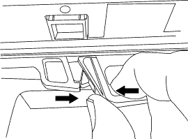
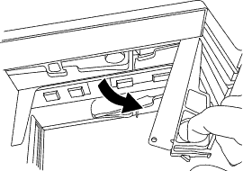

= Hot-swap or replace an IOM12 module - shelves with IOM12 modules
:icons: font
:imagesdir: ../media/

[.lead]
Your system configuration determines whether you can perform a nondisruptive IOM12 module hot-swap or a disruptive IOM12 module replacement when an IOM12 module fails.

*Before you begin*

All other components in the system--including the other IOM12 module--must be functioning properly.

*About this task*

* For multipathed (multipath HA or multipath) and quad-pathed (quad-path HA or quad-path) configurations, you can hot-swap an IOM12 module (nondisruptively replace an IOM12 module in a system that is powered on and serving data--I/O is in progress).
* For FAS2600 series and FAS2700 single-path HA configurations, you must perform a takeover and giveback operation to replace an IOM12 module in a system that is powered on and serving data--I/O is in progress.
* For FAS2600 series single-path configurations, you must halt your system to replace an IOM12 module.
+
NOTE: If you attempt to hot-swap an IOM12 module on a disk shelf with a single-path connection, you will lose all access to the disk drives on the disk shelf as well as any disk shelves beneath. You could also bring down your entire system.

* The best practice is to have the current versions of disk shelf (IOM) firmware and disk drive firmware on your system before adding new disk shelves, shelf FRU components, or SAS cables.
+
Current versions of firmware can be found on the NetApp Support Site.
+
https://mysupport.netapp.com/site/downloads/firmware/disk-shelf-firmware[NetApp Downloads: Disk Shelf Firmware]
+
https://mysupport.netapp.com/site/downloads/firmware/disk-drive-firmware[NetApp Downloads: Disk Drive Firmware]

* Disk shelf (IOM) firmware is automatically updated (nondisruptively) on a new IOM12 module with a non current firmware version.
+
IOM firmware checks occur every ten minutes. An IOM firmware update can take up to 30 minutes.

* If needed, you can turn on the disk shelf's location (blue) LEDs to aid in physically locating the affected disk shelf: `storage shelf location-led modify -shelf-name shelf_name -led-status on`
+
A disk shelf has three location LEDs: one on the operator display panel and one on each IOM12 module. Location LEDs remain illuminated for 30 minutes. You can turn them off by entering the same command, but using the off option.

* If needed, you can refer to the Monitoring disk shelf LEDs section for information about the meaning and location of disk shelf LEDs on the operator display panel and FRU components.

.Steps

. Properly ground yourself.
. Unpack the new IOM12 module, and set it on a level surface near the disk shelf.
+
Save all packaging materials for use when returning the failed IOM12 module.

. Physically identify the failed IOM12 module from the system console warning message and the illuminated attention (amber) LED on the failed IOM12 module.
. Perform one of the following actions based on the type of configuration you have:
+
|===
| If you have a...| Then...
a|
Multipath HA, multipath, quad-path HA, or quad-path configuration
a|
Go to the next step.
a|
FAS2600 series and FAS2700 single-path HA configuration
a|

 .. Determine the target node (the node the failed IOM12 module belongs to).
+
IOM A belongs to Controller 1. IOM B belongs to Controller 2.

 .. Take over the target node: `storage failover takeover -bynode partner HA node`

a|
FAS2600 series single-path configuration
a|

 .. Shut down the system from the system console: `halt`
 .. Verify that your system halted by checking the storage system console.

+
|===

. Disconnect the cabling from the IOM12 module that you are removing.
+
Make note of the IOM12 module ports each cable is connected to.

. Press the orange latch on the IOM12 module cam handle until it releases, and then open the cam handle fully to release the IOM12 module from the mid plane.
+

+

. Use the cam handle to slide the IOM12 module out of the disk shelf.
+
When handling an IOM12 module, always use two hands to support its weight.

. Wait at least 70 seconds after removing the IOM12 module before you install the new IOM12 module.
+
Waiting at least 70 seconds enables the driver to register the shelf ID correctly.

. Using two hands, with the cam handle of the new IOM12 module in the open position, support and align the edges of the new IOM12 module with the opening in the disk shelf, and then firmly push the new IOM12 module until it meets the mid plane.
+
NOTE: Do not use excessive force when sliding the IOM12 module into the disk shelf; you might damage the connectors.

. Close the cam handle so that the latch clicks into the locked position and the IOM12 module is fully seated.
. Reconnect the cabling.
+
The SAS cable connectors are keyed; when oriented correctly into an IOM port, the connector clicks into place and the IOM port LNK LED illuminates green. You insert a SAS cable connector into an IOM port with the pull tab oriented down (on the underside of the connector).

. Perform one of the following actions based on the type of configuration you have:
+
|===
| If you have a...| Then...
a|
Multipath HA, multipath, quad-path HA, or quad-path configuration
a|
Go to the next step.
a|
FAS2600 series and FAS2700 single-path HA configuration
a|
Give back the target node: `storage failover giveback -fromnode partner_HA_node`
a|
FAS2600 series single-path configuration
a|
Reboot your system.
|===

. Verify that the IOM12 module port links have been established.
+
For each module port that you cabled, the LNK (green) LED illuminates when one or more of the four SAS lanes have established a link (with either an adapter or another disk shelf).

. Return the failed part to NetApp, as described in the RMA instructions shipped with the kit.
+
Contact technical support at https://mysupport.netapp.com/site/global/dashboard[NetApp Support], 888-463-8277 (North America), 00-800-44-638277 (Europe), or +800-800-80-800 (Asia/Pacific) if you need the RMA number or additional help with the replacement procedure.
