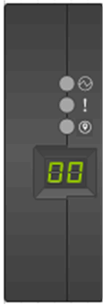
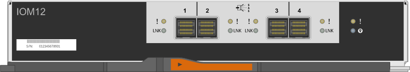
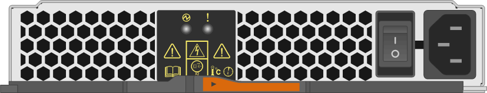
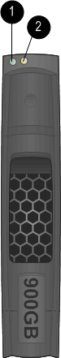
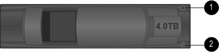
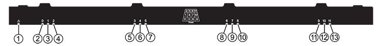

= Monitor disk shelf LEDs - shelves with IOM12/IOM12B modules
:icons: font
:imagesdir: ../media/

[.lead]
You can monitor the health of your disk shelf by understanding the location and status conditions of the LEDs on your disk shelf components.

== Operator display panel LEDs

[.lead]
The LEDs on the disk shelf front operator display panel indicate whether your disk shelf is functioning normally or there are problems with the hardware.

The following table describes the three LEDs on the operator display panel used in DS460C, DS224C, and DS212C disk shelves:

[cols="4*",options="header"]
|===
| LED icon| LED name| State| Description
a|

a|
Power
a|
Solid green
a|
One or more power supplies are supplying power to the disk shelf.
.2+|

.2+|
Attention
a|
Solid amber
a|
An error occurred with the function of one of more FRUs: the disk shelf, disk drives, IOM12 modules, or power supplies.

Check event messages to determine corrective action to take.
a|
Blinking amber
a|
The shelf ID is in a pending state.

Power cycle the disk shelf for the shelf ID to take affect.
a|

a|
Location
a|
Solid blue
a|
The system administrator activated this LED function to aid in physically locating the disk shelf requiring service.

The location LED on the operator display panel and both IOM12 modules illuminate when this LED function is activated. Location LEDs automatically turn off after 30 minutes.
|===
Depending on your disk shelf model, the operator display panel looks different; however, the three LEDs are arranged in the same way.

The following illustration is of a DS224C disk shelf operator display panel with the end cap on:

== IOM12 module LEDs

[.lead]
The LEDs on the IOM12 module indicate whether the module is functioning normally, whether it is ready for I/O traffic, and whether there are any problems with the hardware.

The following table describes IOM12 module LEDs associated with the function of the module and the function of each SAS port on the module.

The IOM12 module is used in DS460C, DS224C, and DS212C disk shelves.

[cols="4*",options="header"]
|===
| LED icon| LED name| State| Description
a|

a|
Attention
a|
Solid amber
a|
IOM12 module function: An error occurred with the function of the IOM12 module.

SAS port function: Less than all four SAS lanes established a link (with either an adapter or another disk shelf).

Check event messages to determine corrective action to take.

a|
LNK
a|
Port link
a|
Solid green
a|
One or more of the four SAS lanes established a link (with either an adapter or another disk shelf).
a|

a|
Location
a|
Solid blue
a|
The system administrator activated this LED function to aid in physically locating the disk shelf with the failed IOM12 module.

The location LED on the operator display panel and both IOM12 modules illuminate when this LED function is activated. Location LEDs automatically turn off after 30 minutes.

|===
The following illustration is for a IOM12 module:

== Power supply LEDs

[.lead]
The LEDs on the power supply indicate whether the power supply is functioning normally or there are hardware problems.

The following table describes the two LEDs on power supplies used in DS460C, DS224C, and DS212C disk shelves:

[cols="4*",options="header"]
|===
| LED icon| LED name| State| Description
.2+|

.2+|
Power
a|
Solid green
a|
The power supply is functioning correctly.
a|
Off
a|
The power supply failed, the AC switch is turned off, the AC power cord is not properly installed, or electricity is not being properly supplied to the power supply.

Check event messages to determine corrective action to take.

a|

a|
Attention
a|
Solid amber
a|
An error occurred with the function of the power supply.

Check event messages to determine corrective action to take.

|===
Depending on your disk shelf model, power supplies can be different, dictating the location of the two LEDs.

The following illustration is for a power supply used in a DS460C disk shelf.

The two LED icons act as the labels and LEDs, meaning the icons themselves illuminate--there are no adjacent LEDs.

image::../media/28_dwg_e2860_de460c_psu.gif[]

The following illustration is for a power supply used in a DS224C or DS212C disk shelf:

== Fan LEDs on DS460C disk shelves

[.lead]
The LEDs on the DS460C fans indicate whether the fan is functioning normally or there are hardware problems.

The following table describes the LEDs on fans used in DS460C disk shelves:

[cols="4*",options="header"]
|===
| Item| LED name| State| Description
a|
image:../media/legend_icon_01.png[]
a|
Attention
a|
Solid amber
a|
An error occurred with the function of the fan.

Check event messages to determine corrective action to take.

|===
image:../media/28_dwg_e2860_de460c_single_fan_canister_with_led_callout.gif[]

== Disk drive LEDs

[.lead]
The LEDs on a disk drive indicates whether it is functioning normally or there are problems with the hardware.

=== Disk drive LEDs for DS224C and DS212C disk shelves

The following table describes the two LEDs on the disk drives used in DS224C and DS212C disk shelves:

[cols="4*",options="header"]
|===
| Callout| LED name| State| Description
.2+|
image:../media/legend_icon_01.png[]
.2+|
Activity
a|
Solid green
a|
The disk drive has power.
a|
Blinking green
a|
The disk drive has power and I/O operations are in progress.
a|
image:../media/legend_icon_02.png[]
a|
Attention
a|
Solid amber
a|
An error occurred with the function of the disk drive.

Check event messages to determine corrective action to take.

|===
Depending on your disk shelf model, disk drives are arranged vertically or horizontally in the disk shelf, dictating the location of the two LEDs.

The following illustration is for a disk drive used in a DS224C disk shelf.

DS224C disk shelves use 2.5-inch disk drives arranged vertically in the disk shelf.

The following illustration is for a disk drive used in a DS212C disk shelf.

DS212C disk shelves use 3.5-inch disk drives or 2.5-inch disk drives in carriers arranged horizontally in the disk shelf.

=== Disk drive LEDs for DS460C disk shelves

The following illustration and table describes the drive activity LEDs on the drive drawer and their operational states:

[cols="4*",options="header"]
|===
| Location| LED| Status indicator| Description
.3+|
1
.3+|
Attention: Drawer attention for each drawer
a|
Solid amber
a|
A component within the drive drawer requires operator attention.
a|
Off
a|
No drive or other component in the drawer requires attention and no drive in the drawer has an active locate operation.
a|
Blinking amber
a|
A locate drive operation is active for any drive within the drawer.
.3+|
2-13
.3+|
Activity: Drive activity for drives 0 through 11 in the drive drawer
a|
Green
a|
The power is turned on and the drive is operating normally.
a|
Blinking green
a|
The drive has power, and I/O operations are in progress.
a|
Off
a|
The power is turned off.
|===
When the drive drawer is open, an attention LED can be seen in front of each drive.

image::../media/2860_dwg_amber_on_drive.gif[]
[cols="10,90"]
|===
a|
image:../media/legend_icon_01.png[]|
Attention LED light on
|===
