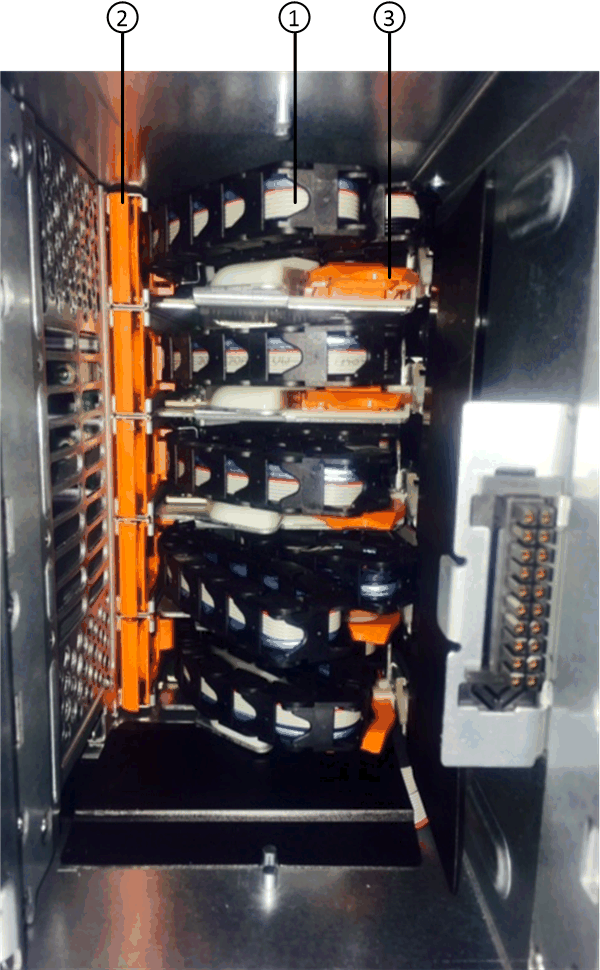
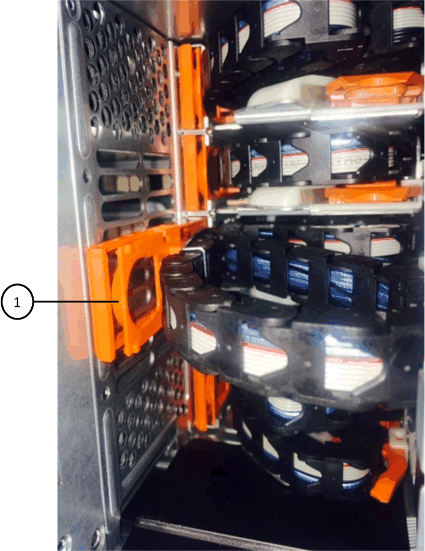
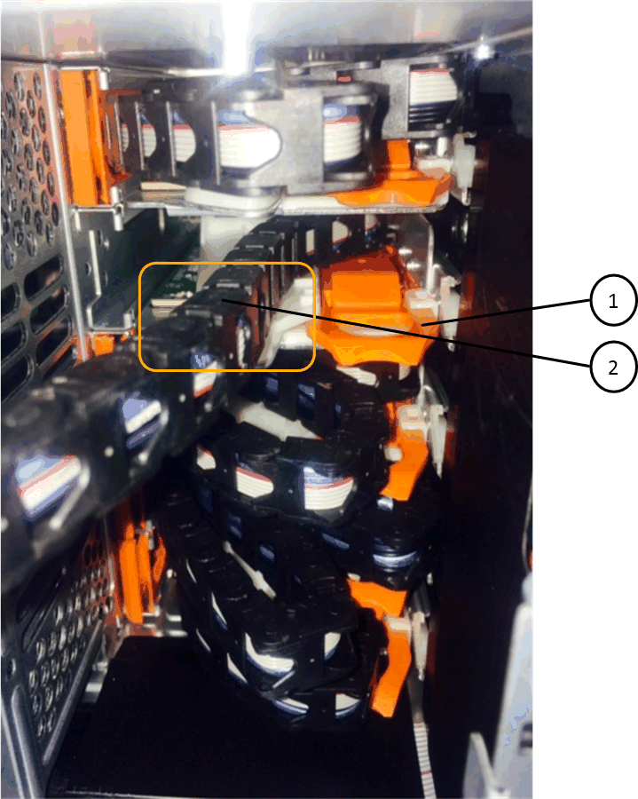
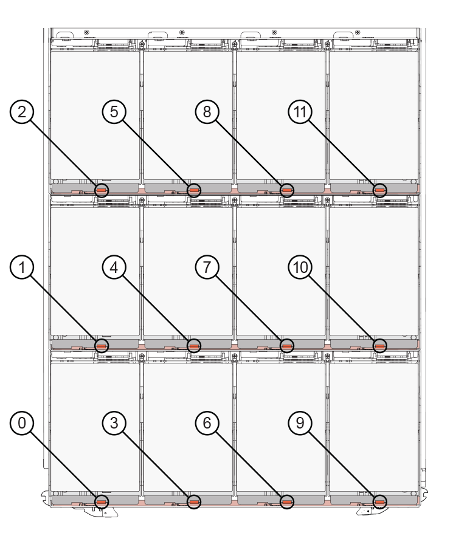
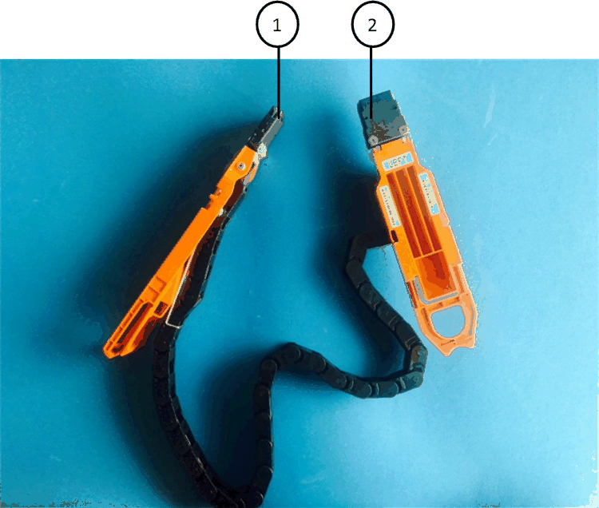
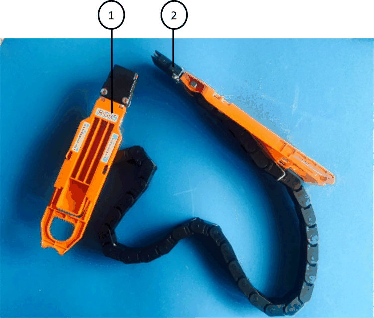
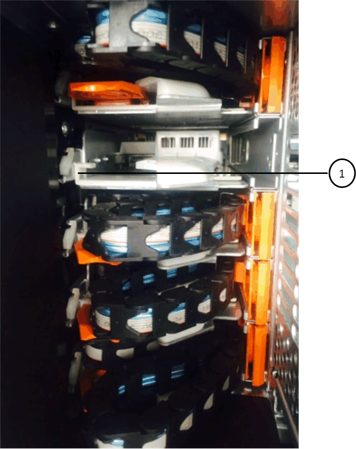

= Replacing a drive drawer in a DS460C disk shelf - shelves with IOM12 modules
:icons: font
:imagesdir: ../media/

[.lead]
You must stop all host I/O activity and power off the shelf before replacing the drive drawer.

Each of these 60-drive shelves has five drive drawers.

image::../media/28_dwg_e2860_de460c_front_no_callouts.gif[]

And each of the five drawers can hold up to 12 drives.

image::../media/92_dwg_de6600_drawer_with_hdds_no_callouts.gif[]

== Before you begin

You need these items for this procedure:

* Antistatic protection
+
NOTE: *Possible hardware damage:* To prevent electrostatic discharge damage to the drive shelf, use proper antistatic protection when handling drive shelf components.

* Replacement drive drawer
* Replacement left and right cable chains
* Flashlight
* Permanent marker

== Removing the cable chains

[.lead]
Left and right cable chains for each drive drawer in the DS460C drive shelf allow the drawers to slide in and out. Before you can remove a drive drawer, you must remove both cable chains.

.Before you begin

* You have stopped host I/O activity and powered off the shelf.
* You have obtained the following items:
 ** Antistatic protection
+
NOTE: *Possible hardware damage:* To prevent electrostatic discharge damage to the shelf, use proper antistatic protection when handling shelf components.

 ** Flashlight

.About this task

Each drive drawer has left and right cable chains. The metal ends on the cable chains slide into corresponding vertical and horizontal brackets inside the enclosure, as follows:

* The left and right vertical brackets connect the cable chain to the enclosure's midplane.
* The left and right horizontal brackets connect the cable chain to the individual drawer.

.Steps

. Put on antistatic protection.
. From the rear of the drive shelf, remove the right fan module, as follows:
 .. Press the orange tab to release the fan module handle.
+
The figure shows the handle for the fan module extended and released from the orange tab on the left.
+
image::../media/28_dwg_e2860_de460c_fan_canister_handle_with_callout.gif[]
+
|===
a|
image:../media/legend_icon_01.gif[]|
Fan module handle
|===

 .. Using the handle, pull the fan module out of the drive shelf, and set it aside.
. Manually determine which of the five cable chains to disconnect.
+
The figure shows the right side of the drive shelf with the fan module removed. With the fan module removed, you can see the five cable chains and the vertical and horizontal connectors for each drawer. The callouts for drive drawer 1 are provided.
+

+
|===
a|
image:../media/legend_icon_01.gif[]|
Cable chain
a|
image:../media/legend_icon_02.gif[]
a|
Vertical connector (connected to the midplane)
a|
image:../media/legend_icon_03.gif[]
a|
Horizontal connector (connected to the drive drawer)
|===
The top cable chain is attached to drive drawer 1. The bottom cable chain is attached to drive drawer 5.

. Use your finger to move the cable chain on the right side to the left.
. Follow these steps to disconnect any of the right cable chains from its corresponding vertical bracket.
 .. Using a flashlight, locate the orange ring on the end of the cable chain that is connected to the vertical bracket in the enclosure.
+

+
|===
a|
image:../media/legend_icon_01.gif[]|
Orange ring on the vertical bracket
|===

 .. Disconnect the vertical connector (connected to the midplane) by gently pressing on the center of the orange ring and pulling the left side of the cable out of the enclosure.
 .. To unplug the cable chain, carefully pull your finger toward you approximately 1 inch (2.5 cm), but leave the cable chain connector within the vertical bracket.
. Follow these steps to disconnect the other end of the cable chain:
 .. Using a flashlight, locate the orange ring on the end of the cable chain that is attached to the horizontal bracket in the enclosure.
+
The figure shows the horizontal connector on the right and the cable chain disconnected and partially pulled out on the left side.
+

+
|===
a|
image:../media/legend_icon_01.gif[]|
Orange ring on horizontal bracket
a|
image:../media/legend_icon_02.gif[]
a|
Cable chain
|===

 .. Gently insert your finger into the orange ring.
+
The figure shows the orange ring on the horizontal bracket being pushed down so that the rest of the cable chain can be pulled out of the enclosure.

 .. Pull your finger toward you to unplug the cable chain.
. Carefully pull the entire cable chain out of the drive shelf.
. From the back of the drive shelf, remove the left fan module.
. Follow these steps to disconnect the left cable chain from its vertical bracket:
 .. Using a flashlight, locate the orange ring on the end of the cable chain attached to the vertical bracket.
 .. Insert your finger into the orange ring.
 .. To unplug the cable chain, pull your finger toward you approximately 1 inch (2.5 cm), but leave the cable chain connector within the vertical bracket.
. Disconnect the left cable chain from the horizontal bracket, and pull the entire cable chain out of the drive shelf.

== Removing a drive drawer

[.lead]
After removing the right and left cable chains, you can remove the drive drawer from the drive shelf. Removing a drive drawer entails sliding the drawer part of the way out, recording the locations of the drives, removing the drives, and removing the drive drawer.

.Before you begin

* You have removed the right and left cable chains for the drive drawer.
* You have replaced the right and left fan modules.
* You have obtained a permanent marker to note the exact location of each drive as you remove the drive from the drawer.

.Steps

. Remove the bezel from the front of the drive shelf.
. Unlatch the drive drawer by pulling out on both levers.
. Using the extended levers, carefully pull the drive drawer out until it stops. Do not completely remove the drive drawer from the drive shelf.
. If logical unit numbers (LUNs) have already been created and assigned, use a permanent marker to note the exact location of each drive. For example, using the following drawing as a reference, write the appropriate slot number on the top of each drive.
+
image::../media/dwg_trafford_drawer_with_hdds_callouts.gif[]
+
NOTE: *Possible loss of data access:* Make sure to record the exact location of each drive before removing it.

. Remove the drives from the drive drawer:
 .. Gently pull back the orange release latch that is visible on the center front of each drive. The following image shows the orange release latch for each of the drives.
+

 .. Raise the drive handle to vertical.
 .. Use the handle to lift the drive from the drive drawer.
+
image::../media/92_dwg_de6600_install_or_remove_drive.gif[]

 .. Place the drive on a flat, static-free surface and away from magnetic devices.
+
NOTE: *Possible loss of data access:* Magnetic fields can destroy all data on the drive and cause irreparable damage to the drive circuitry. To avoid loss of data access and damage to the drives, always keep drives away from magnetic devices.
. Follow these steps to remove the drive drawer:
 .. Locate the plastic release lever on each side of the drive drawer.
+
image::../media/92_pht_de6600_drive_drawer_release_lever.gif[]
+
|===
a|
image:../media/legend_icon_01.gif[]|
Drive drawer release lever
|===

 .. Open both release levers by pulling the latches toward you.
 .. While holding both release levers, pull the drive drawer toward you.
 .. Remove the drive drawer from the drive shelf.

== Installing a drive drawer

[.lead]
Installing a drive drawer into a drive shelf entails sliding the drawer into the empty slot, installing the drives, and replacing the front bezel.

.Before you begin

* You know where to install each drive.
* You have obtained the following items:
 ** Replacement drive drawer
 ** Flashlight

.Steps

. From the front of the drive shelf, shine a flashlight into the empty drawer slot, and locate the lock-out tumbler for that slot.
+
The lock-out tumbler assembly is a safety feature that prevents you from being able to open more than one drive drawer at one time.
+
image::../media/92_pht_de6600_lock_out_tumbler_detail.gif[]
+
|===
a|
image:../media/legend_icon_01.gif[]|
Lock-out tumbler
a|
image:../media/legend_icon_02.gif[]
a|
Drawer guide
|===

. Position the replacement drive drawer in front of the empty slot and slightly to the right of center.
+
Positioning the drawer slightly to the right of center helps to ensure that the lock-out tumbler and the drawer guide are correctly engaged.

. Slide the drive drawer into the slot, and ensure that the drawer guide slides under the lock-out tumbler.
+
NOTE: *Risk of equipment damage:* Damage occurs if the drawer guide does not slide under the lock-out tumbler.

. Carefully push the drive drawer all the way in until the latch fully engages.
+
NOTE: *Risk of equipment damage:* Stop pushing the drive drawer if you feel excessive resistance or binding. Use the release levers at the front of the drawer to slide the drawer back out. Then, reinsert the drawer into the slot, and ensure that it slides in and out freely.

. Follow these steps to reinstall the drives in the drive drawer:
 .. Unlatch the drive drawer by pulling out on both levers at the front of the drawer.
 .. Using the extended levers, carefully pull the drive drawer out until it stops. Do not completely remove the drive drawer from the drive shelf.
 .. Determine which drive to install in each slot by using the notes you made when removing the drives.
+
NOTE: *Possible loss of data access:* You must install each drive in its original location in the drive drawer.
+
image::../media/dwg_trafford_drawer_with_hdds_callouts.gif[]

 .. Raise the handle on the drive to vertical.
 .. Align the two raised buttons on each side of the drive with the notches on the drawer.
+
The figure shows the right side view of a drive, showing the location of the raised buttons.
+
image::../media/28_dwg_e2860_de460c_drive_cru.gif[]
+
|===
a|
image:../media/legend_icon_01.gif[]|
Raised button on the right side of the drive.
|===

 .. Lower the drive straight down, and then rotate the drive handle down until the drive snaps into place.
+
image::../media/92_dwg_de6600_install_or_remove_drive.gif[]

 .. Repeat these substeps to reinstall all of the drives.
. Slide the drawer back into the drive shelf by pushing it from the center and closing both levers.
+
NOTE: *Risk of equipment malfunction:* Make sure to completely close the drive drawer by pushing both levers. You must completely close the drive drawer to allow proper airflow and prevent overheating.

. Attach the bezel to the front of the drive shelf.

== Attaching the cable chains

[.lead]
The final step in installing a drive drawer is attaching the left and right cable chains to the drive shelf. When attaching a cable chain, reverse the order you used when disconnecting the cable chain. You must insert the chain's horizontal connector into the horizontal bracket in the enclosure before inserting the chain's vertical connector into the vertical bracket in the enclosure.

.Before you begin

* You have replaced the drive drawer and all of the drives.
* You have two replacement cable chains, marked as LEFT and RIGHT (on the horizontal connector next to the drive drawer).

[cols="4*",options="header"]
|===
| Callout| Cable chain| Connector| Connects to
a|
image:../media/legend_icon_01.gif[]|
Left
a|
Vertical
a|
Midplane
a|
image:../media/legend_icon_02.gif[]
a|
Left
a|
Horizontal
a|
Drive drawer
|===

[cols="4*",options="header"]
|===
| Callout| Cable chain| Connector| Connects to
a|
image:../media/legend_icon_01.gif[]|
Right
a|
Horizontal
a|
Drive drawer
a|
image:../media/legend_icon_02.gif[]
a|
Right
a|
Vertical
a|
Midplane
|===

.Steps

. Follow these steps to attach the left cable chain:
 .. Locate the horizontal and vertical connectors on the left cable chain and the corresponding horizontal and vertical brackets inside the enclosure.
 .. Align both cable chain connectors with their corresponding brackets.
 .. Slide the cable chain's horizontal connector under the guide rail on the horizontal bracket, and push it in as far as it can go.
+
The figure shows the guide rail on the left side for the second drive drawer in the enclosure.
+

+
|===
a|
image:../media/legend_icon_01.gif[]|
Guide rail
|===
+
[NOTE]
====
*Risk of equipment malfunction:* Make sure to slide the connector underneath the guide rail on the bracket. If the connector rests on the top of the guide rail, problems might occur when the system runs.
====
 .. Slide the vertical connector on the left cable chain into the vertical bracket.
 .. After you have reconnected both ends of the cable chain, carefully pull on the cable chain to verify that both connectors are latched.
+
[NOTE]
====
*Risk of equipment malfunction:* If the connectors are not latched, the cable chain might come loose during drawer operation.
====
. Reinstall the left fan module.
. Follow these steps to reattach the right cable chain:
 .. Locate the horizontal and vertical connectors on the cable chain and their corresponding horizontal and vertical brackets inside the enclosure.
 .. Align both cable chain connectors with their corresponding brackets.
 .. Slide the cable chain's horizontal connector under the guide rail on the horizontal bracket and push it in as far as it will go.
+
[NOTE]
====
*Risk of equipment malfunction:* Make sure to slide the connector underneath the guide rail on the bracket. If the connector rests on the top of the guide rail, problems might occur when the system runs.
====
 .. Slide the vertical connector on the right cable chain into the vertical bracket.
 .. After you reconnect both ends of the cable chain, carefully pull on the cable chain to verify that both connectors are latched.
+
[NOTE]
====
*Risk of equipment malfunction:* If the connectors are not latched, the cable chain might come loose during drawer operation.
====
. Reinstall the right fan module.
. Reapply power:
 .. Turn on both power switches on the drive shelf.
 .. Confirm that both fans come on and that the amber LED on the back of the fans is off.
